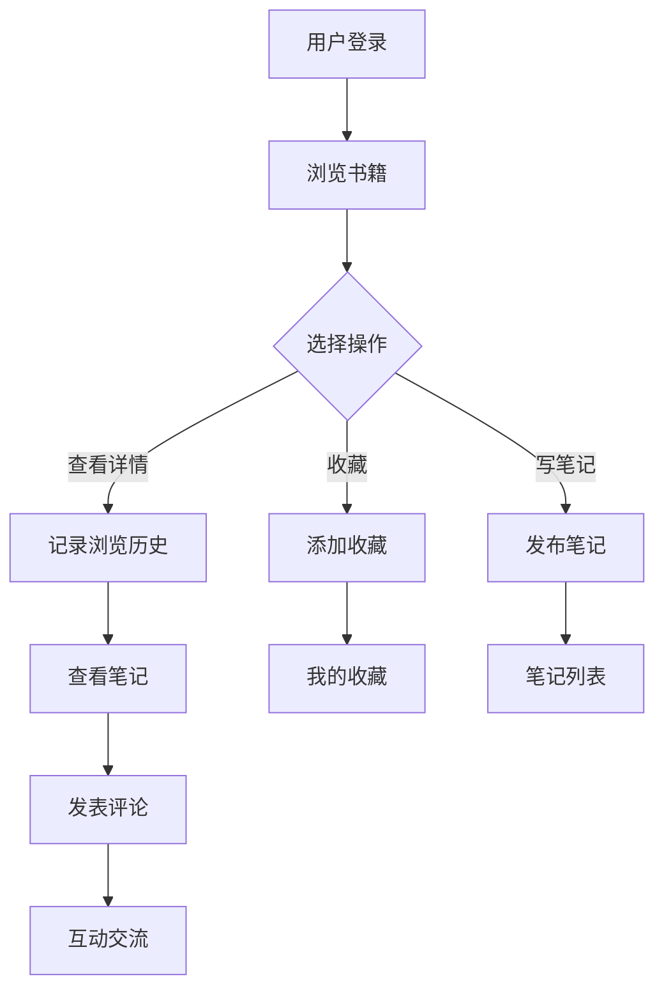

# 读书笔记平台系统课程设计报告

## 1. 概述

### 1.1 课程设计目的

本课程设计旨在通过开发一个读书笔记平台系统，深入理解和掌握Java Web开发技术，特别是内容社区平台的开发模式。通过实际项目开发，学习书籍管理、读书笔记发布、收藏功能、浏览历史、个性化推荐等核心功能，提升系统设计和实现能力。

读书笔记平台系统是一个典型的内容社区平台，主要功能包括书籍推荐、读书笔记发布、笔记交流、收藏管理等。系统采用MVC架构模式，实现了个性化推荐、浏览历史记录等特色功能。

登录界面如下图1所示：


### 1.2 表的描述

数据表user如下表1所示：

**表1 用户表**

| 字段名 | 类型 | 说明 |
|--------|------|------|
| id | INT | 主键，自增 |
| username | VARCHAR(50) | 用户名，唯一 |
| password | VARCHAR(100) | 密码 |
| nickname | VARCHAR(50) | 昵称 |
| email | VARCHAR(100) | 邮箱 |
| avatar | VARCHAR(200) | 头像 |
| preferences | VARCHAR(500) | 喜好分类 |
| create_time | DATETIME | 创建时间 |

数据表book如下表2所示：

**表2 书籍表**

| 字段名 | 类型 | 说明 |
|--------|------|------|
| id | INT | 主键，自增 |
| title | VARCHAR(200) | 书名 |
| author | VARCHAR(100) | 作者 |
| category_id | INT | 分类ID |
| cover | VARCHAR(200) | 封面图片 |
| description | TEXT | 书籍描述 |
| is_recommend | TINYINT(1) | 是否推荐 |
| view_count | INT | 浏览次数 |
| create_time | DATETIME | 创建时间 |

数据表note如下表3所示：

**表3 读书笔记表**

| 字段名 | 类型 | 说明 |
|--------|------|------|
| id | INT | 主键，自增 |
| user_id | INT | 用户ID |
| book_id | INT | 书籍ID |
| title | VARCHAR(200) | 笔记标题 |
| content | TEXT | 笔记内容 |
| view_count | INT | 浏览次数 |
| like_count | INT | 点赞数 |
| create_time | DATETIME | 创建时间 |
| update_time | DATETIME | 更新时间 |

数据表favorite如下表4所示：

**表4 收藏表**

| 字段名 | 类型 | 说明 |
|--------|------|------|
| id | INT | 主键，自增 |
| user_id | INT | 用户ID |
| book_id | INT | 书籍ID |
| create_time | DATETIME | 收藏时间 |

数据表history如下表5所示：

**表5 浏览历史表**

| 字段名 | 类型 | 说明 |
|--------|------|------|
| id | INT | 主键，自增 |
| user_id | INT | 用户ID |
| book_id | INT | 书籍ID |
| view_time | DATETIME | 浏览时间 |

数据表comment如下表6所示：

**表6 评论表**

| 字段名 | 类型 | 说明 |
|--------|------|------|
| id | INT | 主键，自增 |
| note_id | INT | 笔记ID |
| user_id | INT | 用户ID |
| content | TEXT | 评论内容 |
| create_time | DATETIME | 创建时间 |

### 1.3 课程设计内容

本课程设计完成了一个完整的读书笔记平台系统，包括用户管理、书籍管理、读书笔记发布、收藏功能、浏览历史、评论互动等核心功能。系统实现了个性化推荐、分类管理等特色功能，为用户提供了便捷的读书笔记分享和交流体验。

## 2. 需求分析

### 2.1 系统目标

读书笔记平台系统旨在为读书爱好者提供一个便捷的书籍推荐和笔记分享平台，主要目标包括：

1. 提供丰富的书籍展示，支持分类浏览和推荐
2. 实现个性化推荐功能，根据用户喜好推荐相关书籍
3. 支持用户发布和管理读书笔记
4. 实现收藏和浏览历史功能，方便用户管理感兴趣的书籍
5. 提供评论互动功能，增强用户交流
6. 提供管理员后台，方便书籍、笔记、用户的管理

### 2.2 主体功能

系统主要功能模块包括：

1. **用户管理模块**：用户注册、登录、个人信息管理、用户中心
2. **书籍管理模块**：书籍列表、书籍详情、推荐书籍、个性化推荐、分类浏览
3. **读书笔记模块**：笔记发布、笔记编辑、笔记删除、笔记列表、笔记详情
4. **收藏管理模块**：收藏书籍、查看我的收藏
5. **浏览历史模块**：记录浏览历史、查看浏览历史
6. **评论模块**：发表评论、查看评论列表
7. **后台管理模块**：书籍管理、分类管理、笔记管理、用户管理

### 2.3 开发环境

- **开发工具**：IntelliJ IDEA
- **JDK版本**：JDK 8
- **Web服务器**：Tomcat 9.0
- **数据库**：MySQL 8.0
- **构建工具**：Maven
- **前端技术**：JSP、HTML、CSS、JavaScript

## 3. 系统概要设计

### 3.1 系统的功能模块介绍

系统采用MVC三层架构设计：

1. **表示层（View）**：JSP页面，负责用户界面展示
2. **控制层（Controller）**：Servlet，负责请求处理和业务逻辑调用
3. **模型层（Model）**：Bean实体类、DAO数据访问层

主要功能模块：

- **用户模块**：UserLoginServlet、UserRegisterServlet处理用户登录注册，UserCenterServlet处理用户中心
- **书籍模块**：BookServlet处理书籍浏览和推荐请求
- **笔记模块**：NoteServlet处理笔记相关请求
- **收藏模块**：FavoriteServlet处理收藏相关请求
- **历史模块**：HistoryServlet处理浏览历史请求
- **评论模块**：CommentServlet处理评论相关请求
- **管理模块**：AdminBookServlet、AdminNoteServlet、AdminUserServlet等处理后台管理请求

### 3.2 系统流程图

系统主要业务流程如下：



## 4. 系统详细设计

### 4.1 主要代码

#### 书籍浏览Servlet

```java
public class BookServlet extends HttpServlet {
    private BookDAO bookDAO = new BookDAO();
    private HistoryDAO historyDAO = new HistoryDAO();

    protected void doGet(HttpServletRequest request, HttpServletResponse response)
            throws ServletException, IOException {
        String action = request.getParameter("action");
        HttpSession session = request.getSession();
        User user = (User) session.getAttribute("user");

        if ("detail".equals(action)) {
            int id = Integer.parseInt(request.getParameter("id"));
            Book book = bookDAO.getById(id);
            if (book != null) {
                bookDAO.incrementViewCount(id);
                if (user != null) {
                    historyDAO.add(user.getId(), id);
                }
                request.setAttribute("book", book);
                request.getRequestDispatcher("/book_detail.jsp").forward(request, response);
            }
        } else if ("personalized".equals(action)) {
            if (user != null) {
                List<Book> books = bookDAO.getPersonalized(user.getId());
                request.setAttribute("books", books);
                request.setAttribute("title", "个性化推荐");
            }
            request.getRequestDispatcher("/book_list.jsp").forward(request, response);
        }
    }
}
```

#### 读书笔记Servlet

```java
public class NoteServlet extends HttpServlet {
    private NoteDAO noteDAO = new NoteDAO();
    private BookDAO bookDAO = new BookDAO();
    
    protected void doPost(HttpServletRequest request, HttpServletResponse response)
            throws ServletException, IOException {
        HttpSession session = request.getSession();
        User user = (User) session.getAttribute("user");
        
        String action = request.getParameter("action");
        
        if ("add".equals(action)) {
            Note note = new Note();
            note.setUserId(user.getId());
            note.setBookId(Integer.parseInt(request.getParameter("book_id")));
            note.setTitle(request.getParameter("title"));
            note.setContent(request.getParameter("content"));
            
            if (noteDAO.add(note)) {
                out.print("<script>alert('发布成功');location.href='note?action=my';</script>");
            }
        } else if ("update".equals(action)) {
            int id = Integer.parseInt(request.getParameter("id"));
            Note note = noteDAO.getById(id);
            if (note != null && note.getUserId() == user.getId()) {
                note.setTitle(request.getParameter("title"));
                note.setContent(request.getParameter("content"));
                noteDAO.update(note);
            }
        }
    }
}
```

#### 书籍实体类

```java
public class Book {
    private int id;
    private String title;
    private String author;
    private int categoryId;
    private String categoryName;
    private String cover;
    private String description;
    private int isRecommend;
    private int viewCount;
    private Date createTime;
    
    // getter和setter方法
}
```

#### 读书笔记实体类

```java
public class Note {
    private int id;
    private int userId;
    private String username;
    private String nickname;
    private int bookId;
    private String bookTitle;
    private String title;
    private String content;
    private int viewCount;
    private int likeCount;
    private Date createTime;
    private Date updateTime;
    
    // getter和setter方法
}
```

### 4.2 具体实现

系统实现了以下关键技术：

1. **个性化推荐**：根据用户的喜好分类和浏览历史，推荐相关书籍
2. **浏览历史记录**：自动记录用户浏览的书籍，方便用户查看历史记录
3. **收藏功能**：实现了用户对书籍的收藏功能，使用唯一索引防止重复收藏
4. **笔记管理**：支持笔记的发布、编辑、删除，只有笔记作者可以编辑和删除
5. **评论功能**：实现了用户对笔记的评论功能，支持评论列表展示
6. **权限控制**：通过UserFilter和AdminFilter过滤器控制访问权限，区分普通用户和管理员

## 5. 测试

### 5.1 测试方案

测试采用黑盒测试方法，主要测试以下方面：

1. **功能测试**：测试用户注册、登录、书籍浏览、笔记发布、收藏等核心功能
2. **个性化推荐测试**：测试根据用户喜好推荐书籍的功能
3. **浏览历史测试**：测试浏览历史记录和查看功能
4. **权限测试**：测试普通用户和管理员的功能权限
5. **界面测试**：测试页面布局、样式显示、交互效果

### 5.2 测试结果

经过全面测试，系统各项功能运行正常：

1. 用户注册登录功能正常
2. 书籍浏览功能正常，推荐和个性化推荐功能正常
3. 读书笔记发布、编辑、删除功能正常
4. 收藏功能正常，可以正常添加和查看收藏
5. 浏览历史记录正常，可以正常查看历史记录
6. 评论功能正常，可以正常发表和查看评论
7. 管理员后台功能正常，可正常管理书籍、笔记、用户

## 6. 小结

通过本次课程设计，深入学习了内容社区平台的开发模式，掌握了书籍管理、笔记发布、个性化推荐、收藏管理等核心功能。在开发过程中，学会了如何处理用户喜好、浏览历史、个性化推荐等实际业务场景。

本次课程设计不仅提升了编程能力，也加深了对内容社区平台的理解。在今后的学习中，将继续深入学习推荐算法、用户画像、数据分析等相关技术，不断提升自己的技术水平。

## 参考文献

1. 孙卫琴. Java面向对象编程[M]. 电子工业出版社, 2017.
2. 王珊, 萨师煊. 数据库系统概论[M]. 高等教育出版社, 2014.
3. 张孝祥. Java Web从入门到精通[M]. 清华大学出版社, 2018.
4. 明日科技. Java Web从入门到精通[M]. 清华大学出版社, 2019.

