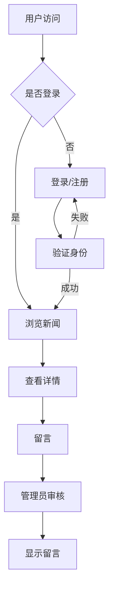

# 企业新闻网站系统课程设计报告

## 1. 概述

### 1.1 课程设计目的

本课程设计旨在通过开发一个企业新闻网站系统，深入理解和掌握Java Web开发技术，包括Servlet、JSP、JDBC等核心技术。通过实际项目开发，提升系统分析、设计和实现能力，培养良好的编程习惯和团队协作精神。

企业新闻网站系统是一个典型的内容管理系统，主要功能包括新闻发布、新闻浏览、留言管理等。系统采用MVC架构模式，实现了前后端分离，具有良好的可维护性和扩展性。

登录界面如下图1所示：


### 1.2 表的描述

数据表user如下表1所示：

**表1 用户表**

| 字段名 | 类型 | 说明 |
|--------|------|------|
| id | INT | 主键，自增 |
| username | VARCHAR(50) | 用户名，唯一 |
| nickname | VARCHAR(50) | 昵称 |
| password | VARCHAR(50) | 密码 |
| email | VARCHAR(100) | 邮箱 |
| phone | VARCHAR(20) | 手机号 |
| role | VARCHAR(20) | 角色（user/admin） |
| create_time | DATETIME | 创建时间 |

数据表news如下表2所示：

**表2 新闻表**

| 字段名 | 类型 | 说明 |
|--------|------|------|
| id | INT | 主键，自增 |
| title | VARCHAR(200) | 标题 |
| content | TEXT | 内容 |
| image_url | VARCHAR(500) | 图片URL |
| category | VARCHAR(50) | 分类 |
| status | INT | 状态（1-发布，0-下架） |
| view_count | INT | 浏览次数 |
| create_time | DATETIME | 创建时间 |
| update_time | DATETIME | 更新时间 |

数据表message如下表3所示：

**表3 留言表**

| 字段名 | 类型 | 说明 |
|--------|------|------|
| id | INT | 主键，自增 |
| user_id | INT | 用户ID |
| content | TEXT | 留言内容 |
| create_time | DATETIME | 创建时间 |

### 1.3 课程设计内容

本课程设计完成了一个完整的企业新闻网站系统，包括用户注册登录、新闻浏览、新闻管理、留言管理等核心功能。系统采用Java Web技术栈开发，使用MySQL数据库存储数据，实现了前后端交互、文件上传、分页查询等功能。

## 2. 需求分析

### 2.1 系统目标

企业新闻网站系统旨在为企业提供一个便捷的新闻发布和管理平台，主要目标包括：

1. 提供友好的用户界面，方便用户浏览新闻
2. 实现新闻的分类管理和搜索功能
3. 支持用户留言功能，增强用户互动
4. 提供管理员后台，方便新闻和留言的管理
5. 实现用户权限控制，区分普通用户和管理员

### 2.2 主体功能

系统主要功能模块包括：

1. **用户管理模块**：用户注册、登录、个人信息管理
2. **新闻浏览模块**：新闻列表展示、新闻详情查看、分类筛选、关键词搜索
3. **留言管理模块**：用户留言、留言列表查看、管理员回复
4. **后台管理模块**：新闻发布、编辑、删除，留言管理，用户管理

### 2.3 开发环境

- **开发工具**：IntelliJ IDEA
- **JDK版本**：JDK 8
- **Web服务器**：Tomcat 9.0
- **数据库**：MySQL 8.0
- **构建工具**：Maven
- **前端技术**：JSP、HTML、CSS、JavaScript

## 3. 系统概要设计

### 3.1 系统的功能模块介绍

系统采用MVC三层架构设计：

1. **表示层（View）**：JSP页面，负责用户界面展示
2. **控制层（Controller）**：Servlet，负责请求处理和业务逻辑调用
3. **模型层（Model）**：Entity实体类、DAO数据访问层、Service业务逻辑层

主要功能模块：

- **用户模块**：UserServlet处理用户相关请求，包括登录、注册、个人信息管理
- **新闻模块**：NewsServlet处理新闻浏览相关请求，支持分页、搜索、分类筛选
- **留言模块**：MessageServlet处理留言相关请求
- **管理模块**：AdminNewsServlet、AdminMessageServlet处理后台管理请求

### 3.2 系统流程图

系统主要业务流程如下：



## 4. 系统详细设计

### 4.1 主要代码

#### 用户登录Servlet

```java
@WebServlet("/user/*")
public class UserServlet extends HttpServlet {
    private UserService userService = new UserService();
    
    private void login(HttpServletRequest request, HttpServletResponse response, HttpSession session)
            throws ServletException, IOException {
        String username = request.getParameter("username");
        String password = request.getParameter("password");
        
        User user = userService.login(username, password);
        if (user != null) {
            session.setAttribute("user", user);
            if ("admin".equals(user.getRole())) {
                response.sendRedirect(request.getContextPath() + "/admin/news/action/list");
            } else {
                response.sendRedirect(request.getContextPath() + "/news/action/list");
            }
        } else {
            request.setAttribute("error", "用户名或密码错误");
            request.getRequestDispatcher("/login.jsp").forward(request, response);
        }
    }
}
```

#### 新闻列表Servlet

```java
@WebServlet("/news/action/*")
public class NewsServlet extends HttpServlet {
    private NewsService newsService = new NewsService();
    
    private void list(HttpServletRequest request, HttpServletResponse response)
            throws ServletException, IOException {
        String pageStr = request.getParameter("page");
        String keyword = request.getParameter("keyword");
        String category = request.getParameter("category");
        
        int currentPage = 1;
        if (pageStr != null && !pageStr.isEmpty()) {
            currentPage = Integer.parseInt(pageStr);
        }
        
        PageUtil<News> page = newsService.findPage(currentPage, 10, keyword, category);
        List<String> categories = newsService.findAllCategories();
        
        request.setAttribute("page", page);
        request.setAttribute("categories", categories);
        request.getRequestDispatcher("/news/list.jsp").forward(request, response);
    }
}
```

#### 新闻实体类

```java
public class News {
    private Integer id;
    private String title;
    private String content;
    private String imageUrl;
    private String category;
    private Integer status;
    private Integer viewCount;
    private Date createTime;
    private Date updateTime;
    
    // getter和setter方法
}
```

### 4.2 具体实现

系统实现了以下关键技术：

1. **用户认证**：使用Session机制实现用户登录状态管理，通过LoginFilter过滤器进行权限控制
2. **分页查询**：实现了通用的分页工具类PageUtil，支持分页参数传递和页面导航
3. **文件上传**：使用FileUploadUtil工具类处理图片上传，支持文件类型验证和存储路径管理
4. **数据库连接**：使用DBUtil工具类管理数据库连接，采用连接池技术提高性能
5. **字符编码**：通过CharacterEncodingFilter过滤器统一处理请求和响应的字符编码

## 5. 测试

### 5.1 测试方案

测试采用黑盒测试方法，主要测试以下方面：

1. **功能测试**：测试用户注册、登录、新闻浏览、留言等核心功能
2. **界面测试**：测试页面布局、样式显示、交互效果
3. **性能测试**：测试系统响应时间、并发处理能力
4. **安全测试**：测试SQL注入、XSS攻击等安全漏洞

### 5.2 测试结果

经过全面测试，系统各项功能运行正常：

1. 用户注册登录功能正常，密码验证有效
2. 新闻浏览功能正常，分页、搜索、分类筛选均能正常工作
3. 留言功能正常，用户可正常提交留言
4. 管理员后台功能正常，可正常管理新闻和留言
5. 系统响应速度良好，无明显性能问题

## 6. 小结

通过本次课程设计，深入学习了Java Web开发技术，掌握了Servlet、JSP、JDBC等核心技术。在开发过程中，学会了系统分析、数据库设计、前后端交互等技能。同时，也遇到了一些问题，如字符编码、文件上传、分页查询等，通过查阅资料和不断调试，最终都得到了解决。

本次课程设计不仅提升了编程能力，也培养了系统思维和解决问题的能力。在今后的学习中，将继续深入学习Web开发相关技术，不断提升自己的技术水平。

## 参考文献

1. 孙卫琴. Java面向对象编程[M]. 电子工业出版社, 2017.
2. 王珊, 萨师煊. 数据库系统概论[M]. 高等教育出版社, 2014.
3. 张孝祥. Java就业培训教程[M]. 清华大学出版社, 2018.
4. 明日科技. Java Web从入门到精通[M]. 清华大学出版社, 2019.

