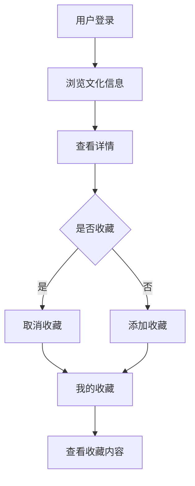

# 地区文化宣传平台系统课程设计报告

## 1. 概述

### 1.1 课程设计目的

本课程设计旨在通过开发一个地区文化宣传平台系统，深入理解和掌握Java Web开发技术，特别是内容管理系统的开发模式。通过实际项目开发，学习文化信息管理、收藏功能、分类管理等核心功能，提升系统设计和实现能力。

地区文化宣传平台系统是一个典型的内容管理系统，主要功能包括文化信息发布、文化信息浏览、收藏管理等。系统采用MVC架构模式，实现了文化信息的分类展示和用户收藏功能。

登录界面如下图1所示：


### 1.2 表的描述

数据表user如下表1所示：

**表1 用户表**

| 字段名 | 类型 | 说明 |
|--------|------|------|
| id | INT | 主键，自增 |
| username | VARCHAR(50) | 用户名，唯一 |
| nickname | VARCHAR(50) | 昵称 |
| password | VARCHAR(50) | 密码 |
| email | VARCHAR(100) | 邮箱 |
| phone | VARCHAR(20) | 手机号 |
| role | VARCHAR(20) | 角色（user/admin） |
| create_time | DATETIME | 创建时间 |

数据表culture_info如下表2所示：

**表2 文化信息表**

| 字段名 | 类型 | 说明 |
|--------|------|------|
| id | INT | 主键，自增 |
| title | VARCHAR(200) | 标题 |
| content | TEXT | 内容 |
| image_url | VARCHAR(500) | 图片URL |
| category | VARCHAR(50) | 分类 |
| status | INT | 状态（1-发布，0-下架） |
| view_count | INT | 浏览次数 |
| create_time | DATETIME | 创建时间 |
| update_time | DATETIME | 更新时间 |

数据表favorite如下表3所示：

**表3 收藏表**

| 字段名 | 类型 | 说明 |
|--------|------|------|
| id | INT | 主键，自增 |
| user_id | INT | 用户ID |
| culture_id | INT | 文化信息ID |
| create_time | DATETIME | 收藏时间 |

### 1.3 课程设计内容

本课程设计完成了一个完整的地区文化宣传平台系统，包括用户管理、文化信息发布、文化信息浏览、收藏管理等核心功能。系统实现了文化信息的分类展示、搜索功能、收藏功能等，为用户提供了便捷的文化信息浏览和收藏体验。

## 2. 需求分析

### 2.1 系统目标

地区文化宣传平台系统旨在为地区文化宣传提供一个便捷的信息发布和管理平台，主要目标包括：

1. 提供丰富的文化信息展示，支持分类浏览和搜索
2. 实现用户收藏功能，方便用户保存感兴趣的文化信息
3. 提供浏览次数统计，了解文化信息的受欢迎程度
4. 提供管理员后台，方便文化信息的管理
5. 实现分类管理，方便文化信息的分类展示

### 2.2 主体功能

系统主要功能模块包括：

1. **用户管理模块**：用户注册、登录、个人信息管理
2. **文化信息模块**：文化信息列表、文化信息详情、分类筛选、关键词搜索
3. **收藏管理模块**：收藏文化信息、查看我的收藏
4. **后台管理模块**：文化信息发布、编辑、删除、分类管理

### 2.3 开发环境

- **开发工具**：IntelliJ IDEA
- **JDK版本**：JDK 8
- **Web服务器**：Tomcat 9.0
- **数据库**：MySQL 8.0
- **构建工具**：Maven
- **前端技术**：JSP、HTML、CSS、JavaScript

## 3. 系统概要设计

### 3.1 系统的功能模块介绍

系统采用MVC三层架构设计：

1. **表示层（View）**：JSP页面，负责用户界面展示
2. **控制层（Controller）**：Servlet，负责请求处理和业务逻辑调用
3. **模型层（Model）**：Entity实体类、DAO数据访问层、Service业务逻辑层

主要功能模块：

- **用户模块**：UserServlet处理用户相关请求
- **文化信息模块**：CultureInfoServlet处理文化信息浏览请求
- **收藏模块**：FavoriteServlet处理收藏相关请求
- **管理模块**：AdminCultureInfoServlet处理文化信息管理请求

### 3.2 系统流程图

系统主要业务流程如下：



## 4. 系统详细设计

### 4.1 主要代码

#### 文化信息详情Servlet

```java
@WebServlet("/culture/action/*")
public class CultureInfoServlet extends HttpServlet {
    private CultureInfoService cultureInfoService = new CultureInfoService();
    private FavoriteService favoriteService = new FavoriteService();

    private void detail(HttpServletRequest request, HttpServletResponse response)
            throws ServletException, IOException {
        String idStr = request.getParameter("id");
        Integer id = Integer.parseInt(idStr);
        CultureInfo info = cultureInfoService.findById(id);

        // 增加浏览次数
        cultureInfoService.increaseViewCount(id);
        info = cultureInfoService.findById(id);

        // 检查是否已收藏
        HttpSession session = request.getSession();
        User user = (User) session.getAttribute("user");
        if (user != null) {
            request.setAttribute("isFavorited", favoriteService.isFavorited(user.getId(), id));
        }

        request.setAttribute("info", info);
        request.getRequestDispatcher("/culture/detail.jsp").forward(request, response);
    }
}
```

#### 文化信息列表Servlet

```java
private void list(HttpServletRequest request, HttpServletResponse response)
        throws ServletException, IOException {
    String pageStr = request.getParameter("page");
    String keyword = request.getParameter("keyword");
    String category = request.getParameter("category");

    int currentPage = 1;
    if (pageStr != null && !pageStr.isEmpty()) {
        currentPage = Integer.parseInt(pageStr);
    }

    PageUtil<CultureInfo> page = cultureInfoService.findPage(currentPage, 10, keyword, category);
    List<String> categories = cultureInfoService.findAllCategories();

    request.setAttribute("page", page);
    request.setAttribute("categories", categories);
    request.getRequestDispatcher("/culture/list.jsp").forward(request, response);
}
```

#### 收藏服务类

```java
public class FavoriteService {
    private FavoriteDao favoriteDao = new FavoriteDao();
    
    public boolean isFavorited(Integer userId, Integer cultureId) {
        return favoriteDao.findByUserIdAndCultureId(userId, cultureId) != null;
    }
    
    public boolean addFavorite(Integer userId, Integer cultureId) {
        if (isFavorited(userId, cultureId)) {
            return false;
        }
        Favorite favorite = new Favorite();
        favorite.setUserId(userId);
        favorite.setCultureId(cultureId);
        return favoriteDao.save(favorite);
    }
}
```

### 4.2 具体实现

系统实现了以下关键技术：

1. **收藏功能**：实现了用户对文化信息的收藏和取消收藏功能，使用唯一索引防止重复收藏
2. **浏览次数统计**：在查看详情时自动增加浏览次数，用于统计文化信息的受欢迎程度
3. **分类管理**：支持文化信息的分类展示和筛选，方便用户查找感兴趣的内容
4. **搜索功能**：支持关键词搜索，提高用户查找信息的效率
5. **权限控制**：通过LoginFilter过滤器控制访问权限，区分普通用户和管理员

## 5. 测试

### 5.1 测试方案

测试采用黑盒测试方法，主要测试以下方面：

1. **功能测试**：测试用户注册、登录、文化信息浏览、收藏等核心功能
2. **收藏测试**：测试收藏和取消收藏功能，验证重复收藏的处理
3. **搜索测试**：测试关键词搜索和分类筛选功能
4. **界面测试**：测试页面布局、样式显示、交互效果

### 5.2 测试结果

经过全面测试，系统各项功能运行正常：

1. 用户注册登录功能正常
2. 文化信息浏览功能正常，分类筛选和搜索功能正常
3. 收藏功能正常，可以正常添加和取消收藏
4. 浏览次数统计正常，每次查看详情都会增加浏览次数
5. 管理员后台功能正常，可正常管理文化信息

## 6. 小结

通过本次课程设计，深入学习了内容管理系统的开发模式，掌握了信息发布、浏览、收藏等核心功能。在开发过程中，学会了如何处理用户收藏、浏览次数统计、分类管理等实际业务场景。

本次课程设计不仅提升了编程能力，也加深了对内容管理系统的理解。在今后的学习中，将继续深入学习推荐算法、内容分析等相关技术，不断提升自己的技术水平。

## 参考文献

1. 孙卫琴. Java面向对象编程[M]. 电子工业出版社, 2017.
2. 王珊, 萨师煊. 数据库系统概论[M]. 高等教育出版社, 2014.
3. 张孝祥. Java Web从入门到精通[M]. 清华大学出版社, 2018.
4. 明日科技. Java Web从入门到精通[M]. 清华大学出版社, 2019.


