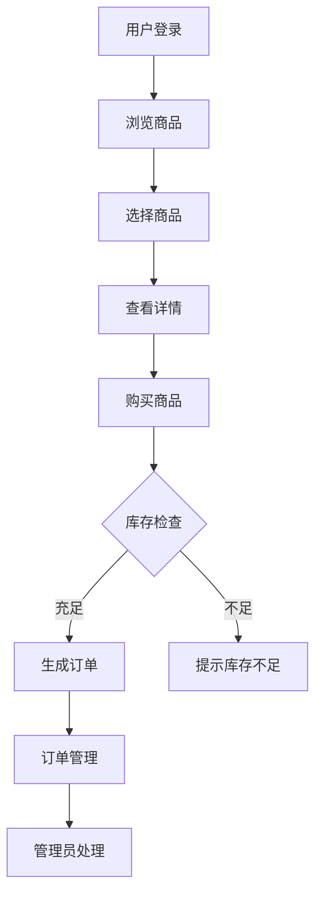

# 农产品交易平台系统课程设计报告

## 1. 概述

### 1.1 课程设计目的

本课程设计旨在通过开发一个农产品交易平台系统，深入理解和掌握Java Web开发技术，特别是电商系统的开发模式。通过实际项目开发，学习商品管理、订单处理、库存管理等电商核心功能，提升系统设计和实现能力。

农产品交易平台系统是一个典型的B2C电商系统，主要功能包括商品展示、商品购买、订单管理等。系统采用MVC架构模式，实现了商品分类、库存管理、订单处理等核心业务逻辑。

登录界面如下图1所示：


### 1.2 表的描述

数据表user如下表1所示：

**表1 用户表**

| 字段名 | 类型 | 说明 |
|--------|------|------|
| id | INT | 主键，自增 |
| username | VARCHAR(50) | 用户名，唯一 |
| nickname | VARCHAR(50) | 昵称 |
| password | VARCHAR(50) | 密码 |
| email | VARCHAR(100) | 邮箱 |
| phone | VARCHAR(20) | 手机号 |
| role | VARCHAR(20) | 角色（user/admin） |
| create_time | DATETIME | 创建时间 |

数据表product如下表2所示：

**表2 商品表**

| 字段名 | 类型 | 说明 |
|--------|------|------|
| id | INT | 主键，自增 |
| name | VARCHAR(200) | 商品名称 |
| description | TEXT | 商品描述 |
| image_url | VARCHAR(500) | 图片URL |
| category | VARCHAR(50) | 分类 |
| price | DECIMAL(10,2) | 价格 |
| stock | INT | 库存 |
| status | INT | 状态（1-上架，0-下架） |
| create_time | DATETIME | 创建时间 |
| update_time | DATETIME | 更新时间 |

数据表order如下表3所示：

**表3 订单表**

| 字段名 | 类型 | 说明 |
|--------|------|------|
| id | INT | 主键，自增 |
| user_id | INT | 用户ID |
| product_id | INT | 商品ID |
| quantity | INT | 数量 |
| total_price | DECIMAL(10,2) | 总价 |
| status | VARCHAR(20) | 状态（pending/completed） |
| create_time | DATETIME | 创建时间 |

### 1.3 课程设计内容

本课程设计完成了一个完整的农产品交易平台系统，包括用户管理、商品展示、商品购买、订单管理等核心功能。系统实现了商品分类管理、库存控制、订单处理等电商核心业务逻辑，为用户提供了便捷的农产品购买体验。

## 2. 需求分析

### 2.1 系统目标

农产品交易平台系统旨在为农产品销售提供一个便捷的在线交易平台，主要目标包括：

1. 提供丰富的农产品展示，支持分类浏览和搜索
2. 实现便捷的购买流程，支持库存验证
3. 提供订单管理功能，方便用户查看订单状态
4. 提供管理员后台，方便商品和订单的管理
5. 实现库存管理，防止超卖问题

### 2.2 主体功能

系统主要功能模块包括：

1. **用户管理模块**：用户注册、登录、个人信息管理
2. **商品展示模块**：商品列表、商品详情、分类筛选、关键词搜索
3. **购物模块**：商品购买、库存验证、订单生成
4. **订单管理模块**：订单列表查看、订单状态管理
5. **后台管理模块**：商品管理、订单管理、用户管理

### 2.3 开发环境

- **开发工具**：IntelliJ IDEA
- **JDK版本**：JDK 8
- **Web服务器**：Tomcat 9.0
- **数据库**：MySQL 8.0
- **构建工具**：Maven
- **前端技术**：JSP、HTML、CSS、JavaScript

## 3. 系统概要设计

### 3.1 系统的功能模块介绍

系统采用MVC三层架构设计：

1. **表示层（View）**：JSP页面，负责用户界面展示
2. **控制层（Controller）**：Servlet，负责请求处理和业务逻辑调用
3. **模型层（Model）**：Entity实体类、DAO数据访问层、Service业务逻辑层

主要功能模块：

- **用户模块**：UserServlet处理用户相关请求
- **商品模块**：ProductServlet处理商品浏览和购买请求
- **订单模块**：OrderServlet处理订单相关请求
- **管理模块**：AdminProductServlet处理商品管理请求

### 3.2 系统流程图

系统主要业务流程如下：



## 4. 系统详细设计

### 4.1 主要代码

#### 商品购买Servlet

```java
@WebServlet("/product/action/*")
public class ProductServlet extends HttpServlet {
    private ProductService productService = new ProductService();

    private void buy(HttpServletRequest request, HttpServletResponse response)
            throws IOException {
        HttpSession session = request.getSession();
        User user = (User) session.getAttribute("user");

        if (user == null) {
            response.sendRedirect(request.getContextPath() + "/login.jsp");
            return;
        }

        String idStr = request.getParameter("id");
        String quantityStr = request.getParameter("quantity");

        if (idStr != null && quantityStr != null) {
            Integer productId = Integer.parseInt(idStr);
            Integer quantity = Integer.parseInt(quantityStr);

            OrderService orderService = new OrderService();
            if (orderService.createOrder(user.getId(), productId, quantity)) {
                response.sendRedirect(request.getContextPath() + "/order/action/my");
            } else {
                response.sendRedirect(request.getContextPath() + "/product/detail?id=" + productId + "&error=库存不足");
            }
        }
    }
}
```

#### 订单列表Servlet

```java
@WebServlet("/order/action/*")
public class OrderServlet extends HttpServlet {
    private OrderService orderService = new OrderService();

    private void my(HttpServletRequest request, HttpServletResponse response, User user)
            throws ServletException, IOException {
        String pageStr = request.getParameter("page");
        int currentPage = 1;
        if (pageStr != null && !pageStr.isEmpty()) {
            currentPage = Integer.parseInt(pageStr);
        }

        PageUtil<Order> page = orderService.findPageByUserId(user.getId(), currentPage, 10);
        request.setAttribute("page", page);
        request.getRequestDispatcher("/order/my.jsp").forward(request, response);
    }
}
```

#### 商品实体类

```java
public class Product {
    private Integer id;
    private String name;
    private String description;
    private String imageUrl;
    private String category;
    private BigDecimal price;
    private Integer stock;
    private Integer status;
    private Date createTime;
    private Date updateTime;
    
    // getter和setter方法
}
```

### 4.2 具体实现

系统实现了以下关键技术：

1. **库存管理**：在订单创建时进行库存验证，防止超卖问题
2. **价格计算**：自动计算订单总价，确保价格准确性
3. **订单状态管理**：支持订单状态流转，从pending到completed
4. **分页查询**：商品列表和订单列表都支持分页显示
5. **权限控制**：通过LoginFilter过滤器控制访问权限，区分普通用户和管理员

## 5. 测试

### 5.1 测试方案

测试采用黑盒测试方法，主要测试以下方面：

1. **功能测试**：测试用户注册、登录、商品浏览、购买、订单管理等核心功能
2. **库存测试**：测试库存不足时的处理逻辑
3. **订单测试**：测试订单创建、查询、状态更新等功能
4. **界面测试**：测试页面布局、样式显示、交互效果

### 5.2 测试结果

经过全面测试，系统各项功能运行正常：

1. 用户注册登录功能正常
2. 商品浏览功能正常，分类筛选和搜索功能正常
3. 商品购买功能正常，库存验证有效
4. 订单管理功能正常，订单列表显示正确
5. 管理员后台功能正常，可正常管理商品和订单

## 6. 小结

通过本次课程设计，深入学习了电商系统的开发模式，掌握了商品管理、订单处理、库存管理等核心业务逻辑。在开发过程中，学会了如何处理并发问题、库存控制、订单状态管理等实际业务场景。

本次课程设计不仅提升了编程能力，也加深了对电商业务的理解。在今后的学习中，将继续深入学习分布式系统、高并发处理等相关技术，不断提升自己的技术水平。

## 参考文献

1. 孙卫琴. Java面向对象编程[M]. 电子工业出版社, 2017.
2. 王珊, 萨师煊. 数据库系统概论[M]. 高等教育出版社, 2014.
3. 张孝祥. Java Web从入门到精通[M]. 清华大学出版社, 2018.
4. 明日科技. Java Web从入门到精通[M]. 清华大学出版社, 2019.

