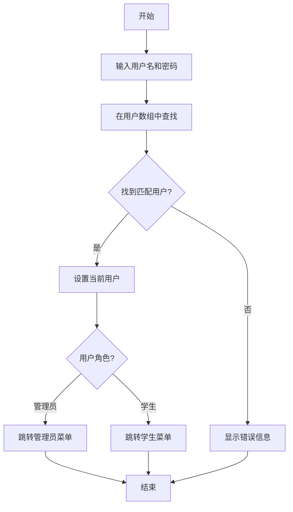
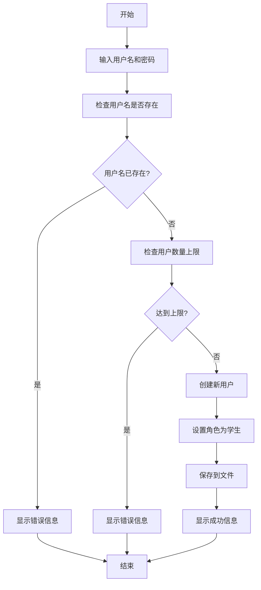
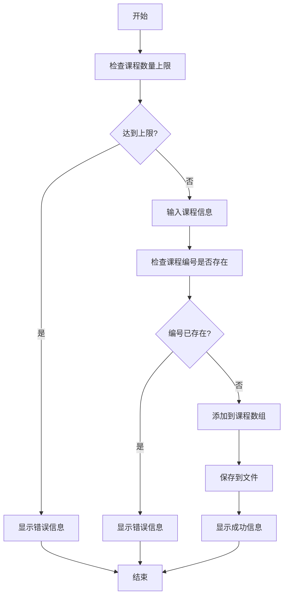
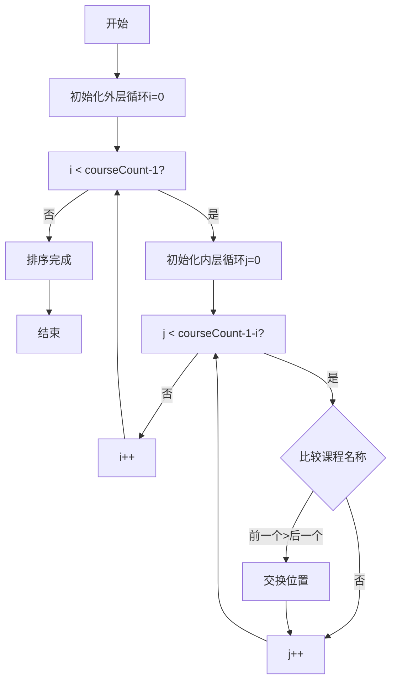
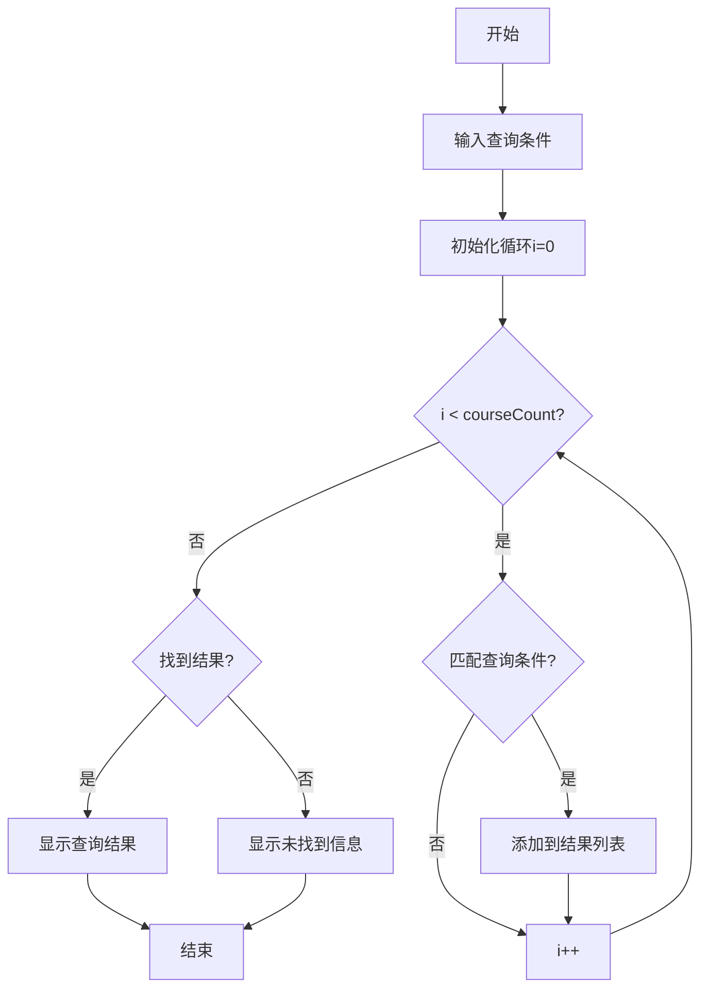
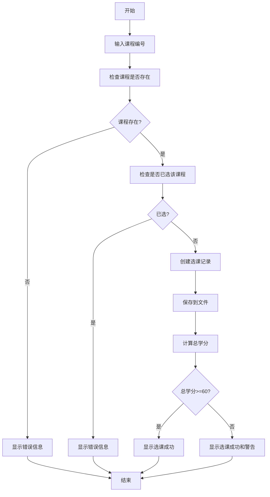
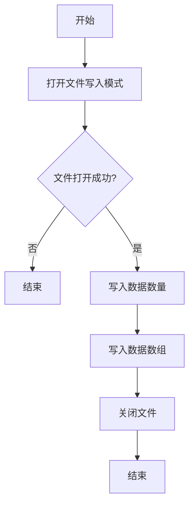
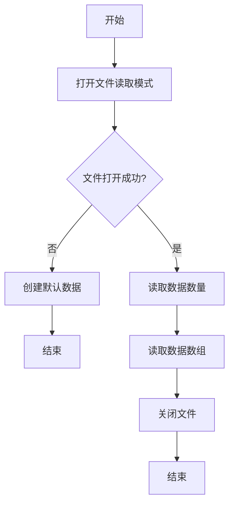

# 子系统主要程序流程图

## 成员A：登录注册模块流程图

### 登录流程

登录功能是系统安全的第一道防线，用户需要输入正确的用户名和密码才能进入系统。系统会遍历用户数组，查找匹配的用户信息。如果找到匹配的用户，系统会根据用户的角色（管理员或学生）跳转到相应的功能菜单；如果未找到匹配的用户，系统会提示错误信息，要求用户重新输入。

### 注册流程

注册功能允许新用户创建账户。系统首先检查输入的用户名是否已经存在，如果存在则提示错误；如果不存在，系统会检查用户数量是否达到上限。在通过所有检查后，系统会创建一个新的用户记录，默认角色为学生，并将新用户信息保存到文件中。

---

## 成员B：课程管理和查询模块流程图

### 添加课程流程

添加课程是管理员的核心功能之一。系统首先检查课程数量是否达到上限，然后要求管理员输入课程的所有信息。在保存之前，系统会检查课程编号是否已经存在，确保课程编号的唯一性。如果课程编号已存在，系统会提示错误；如果不存在，系统会将新课程添加到课程数组中并保存到文件。

### 按课程名排序流程

排序功能使用冒泡排序算法，按照课程名称的字典序对课程数组进行排序。算法通过比较相邻两个课程的名称，如果前一个课程名称大于后一个，则交换它们的位置。这个过程会重复进行，直到所有课程都按照名称顺序排列。

### 查询流程

查询功能支持按课程名和按学分两种查询方式。系统遍历课程数组，对每个课程进行条件匹配。如果课程满足查询条件，则将其添加到结果列表中。遍历完成后，系统会显示所有匹配的课程信息。如果没有找到匹配的课程，系统会提示用户未找到相关课程。

---

## 成员C：选课管理模块流程图

### 选课流程

选课功能是学生使用系统的核心功能。学生首先输入要选择的课程编号，系统会检查该课程是否存在。如果课程不存在，系统会提示错误。如果课程存在，系统会进一步检查学生是否已经选择过该课程，避免重复选课。通过所有检查后，系统会创建选课记录并保存到文件。最后，系统会计算学生的总学分，如果总学分不足60，系统会给出警告提示。

### 文件保存流程

文件保存功能实现了数据的持久化存储。系统首先以二进制写入模式打开文件，如果文件打开失败，则结束流程。文件打开成功后，系统首先写入数据的数量（记录数），然后写入整个数据数组。写入完成后，系统关闭文件，确保数据被正确保存到磁盘。

### 文件读取流程

文件读取功能在系统启动时自动执行，用于恢复之前保存的数据。系统首先以二进制读取模式打开文件。如果文件不存在或打开失败，系统会创建默认数据（如创建默认管理员账户）。如果文件打开成功，系统会先读取数据的数量，然后读取整个数据数组。读取完成后，系统关闭文件，数据加载完成。

