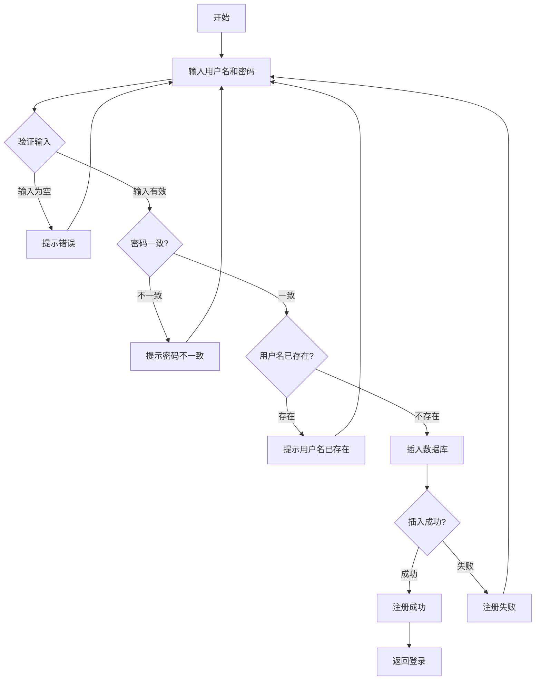
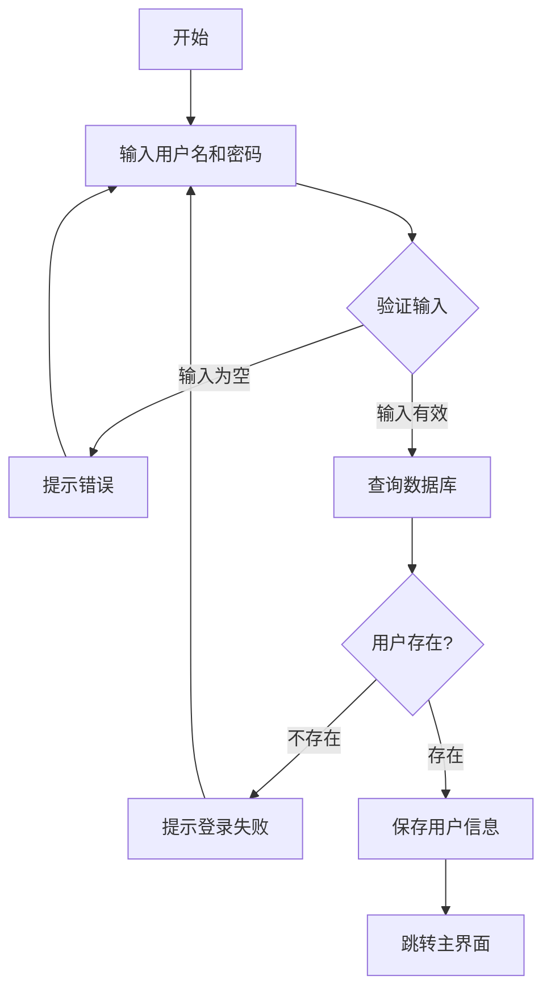
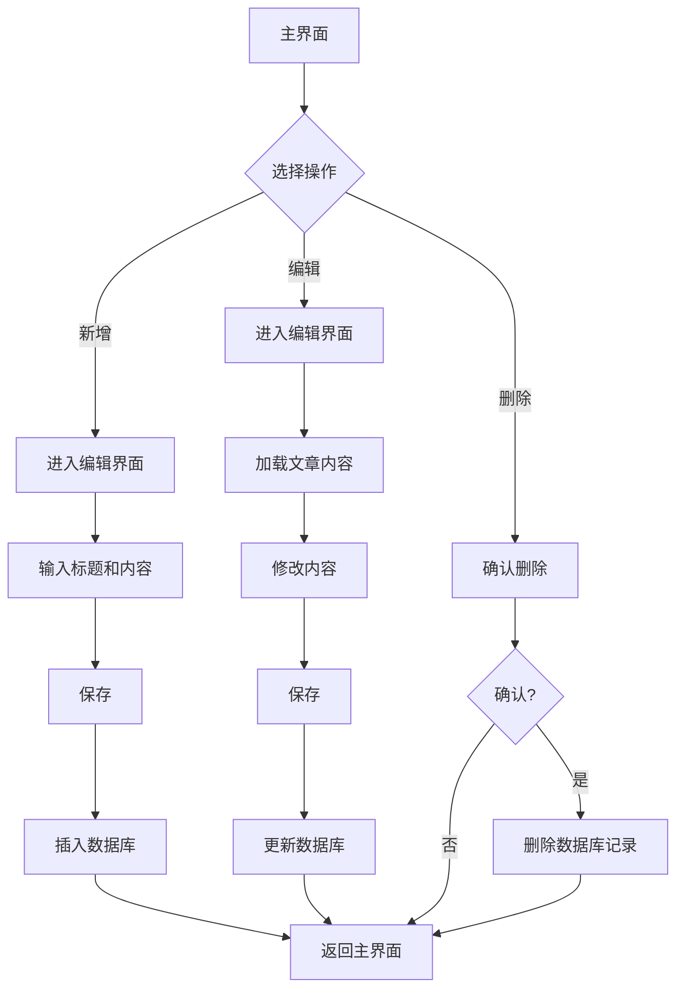

# 《移动终端系统实训》实训报告

## 一、项目概述

### 1.1 项目名称
个人博客应用

### 1.2 项目简介
个人博客应用是一个基于Android平台的移动应用，采用现代化卡片式布局设计，以蓝色为主题色，为用户提供简洁优雅的博客写作和管理体验。用户可以注册登录，创建、编辑、删除自己的博客文章，记录生活点滴和技术感悟。

### 1.3 开发环境
- 开发工具：Android Studio
- 开发语言：Java
- 最低SDK版本：25
- 目标SDK版本：34
- 数据库：Room Database
- UI框架：Material Design Components

## 二、需求分析

### 2.1 功能需求
1. **用户管理**
   - 用户注册
   - 用户登录
   - 用户退出登录

2. **博客管理**
   - 新增博客文章
   - 编辑博客文章
   - 删除博客文章
   - 查看博客列表

### 2.2 非功能需求
- 界面美观，符合现代化审美
- 主题色清雅大方（蓝色系）
- 操作流畅，用户体验良好
- 数据持久化存储

## 三、系统设计

### 3.1 系统架构
系统采用经典的MVC架构模式：
- **Model层**：实体类（User、BlogPost）、数据访问对象（DAO）、数据库（Room）
- **View层**：Activity、布局文件（XML）
- **Controller层**：Activity中的业务逻辑处理

### 3.2 数据库设计

#### 3.2.1 用户表（users）
| 字段名 | 类型 | 说明 |
|--------|------|------|
| id | Long | 主键，自增 |
| username | String | 用户名 |
| password | String | 密码 |

#### 3.2.2 博客文章表（blog_posts）
| 字段名 | 类型 | 说明 |
|--------|------|------|
| id | Long | 主键，自增 |
| userId | Long | 用户ID，外键 |
| title | String | 文章标题 |
| content | String | 文章内容 |
| createTime | String | 创建时间 |

### 3.3 功能模块设计

#### 3.3.1 登录模块
- LoginActivity：处理用户登录逻辑
- 验证用户名和密码
- 登录成功后跳转到主界面

#### 3.3.2 注册模块
- RegisterActivity：处理用户注册逻辑
- 验证用户名唯一性
- 验证密码一致性

#### 3.3.3 主界面模块
- MainActivity：显示博客列表
- 使用RecyclerView展示博客文章
- 提供添加、编辑、删除功能入口

#### 3.3.4 编辑模块
- AddEditPostActivity：新增或编辑博客文章
- 根据传入参数判断是新增还是编辑模式

## 四、系统实现

### 4.1 核心功能实现

#### 4.1.1 用户注册
```java
private void register() {
    String username = binding.etUsername.getText().toString().trim();
    String password = binding.etPassword.getText().toString().trim();
    String confirmPassword = binding.etConfirmPassword.getText().toString().trim();
    
    // 验证输入
    if (username.isEmpty() || password.isEmpty()) {
        Toast.makeText(this, "请输入完整信息", Toast.LENGTH_SHORT).show();
        return;
    }
    
    if (!password.equals(confirmPassword)) {
        Toast.makeText(this, "两次输入的密码不一致", Toast.LENGTH_SHORT).show();
        return;
    }
    
    // 检查用户名是否已存在
    if (database.userDao().findByUsername(username) != null) {
        Toast.makeText(this, "用户名已存在", Toast.LENGTH_SHORT).show();
        return;
    }
    
    // 插入新用户
    User user = new User(username, password);
    long userId = database.userDao().insertUser(user);
    
    if (userId > 0) {
        Toast.makeText(this, "注册成功", Toast.LENGTH_SHORT).show();
        finish();
    }
}
```

#### 4.1.2 用户登录
```java
private void login() {
    String username = binding.etUsername.getText().toString().trim();
    String password = binding.etPassword.getText().toString().trim();
    
    User user = database.userDao().login(username, password);
    
    if (user != null) {
        prefsHelper.saveUser(user.getId(), user.getUsername());
        Intent intent = new Intent(LoginActivity.this, MainActivity.class);
        startActivity(intent);
        finish();
    } else {
        Toast.makeText(this, "用户名或密码错误", Toast.LENGTH_SHORT).show();
    }
}
```

#### 4.1.3 博客文章管理
- **新增**：创建新的BlogPost对象，设置userId、title、content、createTime，调用DAO的insertPost方法
- **编辑**：根据postId查询文章，修改字段后调用updatePost方法
- **删除**：调用deletePost方法删除指定文章

### 4.2 UI设计特点
- **现代化卡片式布局**：使用MaterialCardView实现卡片效果
- **蓝色主题**：主色调为#2196F3，营造清新专业的氛围
- **圆角设计**：卡片和按钮采用圆角设计，更加柔和
- **层次分明**：通过阴影和间距营造视觉层次

## 五、系统测试

### 5.1 测试数据
系统提供了4篇示例博客文章作为测试数据：
1. 我的第一篇博客
2. Android开发心得
3. 关于Material Design
4. 编程的乐趣

### 5.2 功能测试
- ✅ 用户注册功能正常
- ✅ 用户登录功能正常
- ✅ 新增博客文章功能正常
- ✅ 编辑博客文章功能正常
- ✅ 删除博客文章功能正常
- ✅ 博客列表显示正常

## 六、系统流程图

### 6.1 用户注册流程图


### 6.2 用户登录流程图


### 6.3 博客管理流程图


## 七、总结

### 7.1 项目完成情况
本项目成功实现了个人博客应用的所有核心功能，包括用户注册、登录、博客文章的增删改查等。界面设计采用现代化卡片式布局，蓝色主题清雅大方，用户体验良好。

### 7.2 技术要点
1. **Room数据库**：使用Room进行数据持久化，简化了数据库操作
2. **ViewBinding**：使用ViewBinding简化视图绑定，提高代码可读性
3. **Material Design**：采用Material Design组件，提升界面美观度
4. **RecyclerView**：使用RecyclerView高效展示列表数据

### 7.3 心得体会
通过本次实训，深入学习了Android开发的核心技术，特别是Room数据库的使用和Material Design的设计理念。在开发过程中，注重用户体验和界面美观，使应用更加现代化和易用。

### 7.4 改进方向
1. 可以添加文章分类功能
2. 可以添加文章搜索功能
3. 可以添加文章分享功能
4. 可以优化数据加载性能


