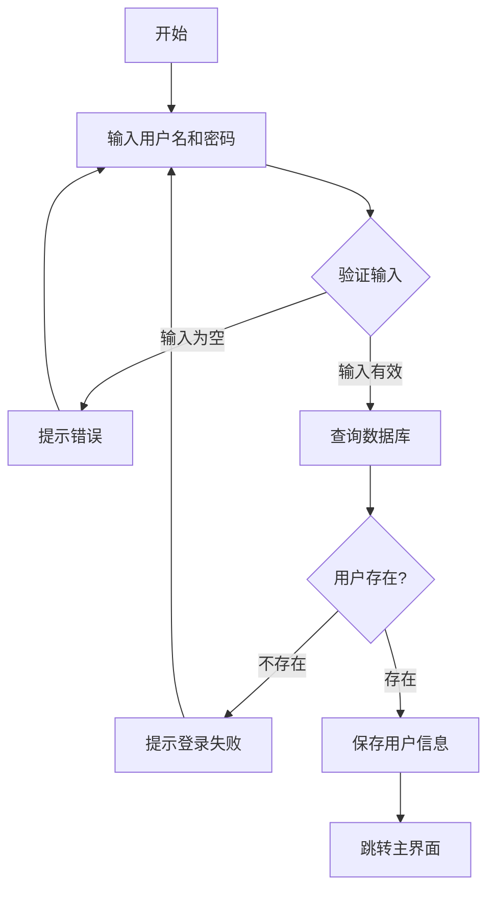
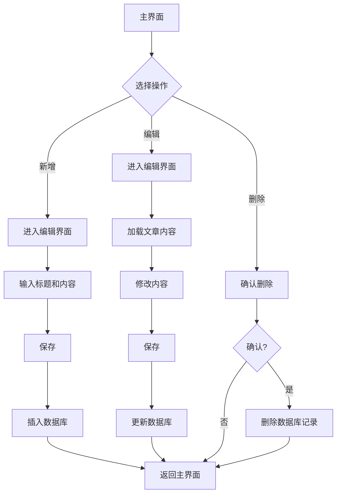

# 《移动终端系统实训》实训报告

## 1.1概述

### 1.1.1背景和意义

随着移动互联网的快速发展和智能手机的普及，移动应用已经成为人们日常生活中不可或缺的一部分。个人博客作为记录生活、分享感悟、展示思想的重要平台，传统的网页博客已经无法满足现代人移动化、碎片化的阅读和写作需求。因此，开发一款功能完善、界面美观、操作便捷的移动博客应用具有重要的现实意义。

### 1.1.2任务概述

本课题主要研究内容包括：

(1) 用户认证系统：实现用户注册、登录功能，确保数据安全性和用户隐私。

(2) 博客文章管理：实现博客文章的增、删、改、查功能，支持标题、内容、创建时间等信息。

(3) 用户界面设计：采用Material Design设计规范，打造现代化、美观的用户界面，使用蓝色主题色，营造清新专业的氛围。

(4) 数据持久化：使用Room数据库实现数据的本地存储。

### 1.1.3设计环境

(1) 硬件：Windows 11

(2) 软件：Android Studio

## 1.2需求分析

### 1.2.1需求描述

随着移动互联网的快速发展，个人博客写作需求日益增长。传统的网页博客存在需要网络连接、操作复杂、移动端体验不佳等问题。因此，开发一款基于Android平台的个人博客应用系统，能够帮助用户便捷地记录和分享生活感悟，实现个人思想的数字化管理，具有重要的实用价值。

本系统旨在为用户提供一个简洁、易用的移动端博客写作解决方案，支持用户注册登录、创建博客文章、查看历史文章、编辑和删除文章等核心功能。系统采用Android原生开发技术，使用Room数据库进行本地数据持久化存储，确保数据安全可靠。通过Material Design设计规范，提供良好的用户体验，让用户能够轻松管理个人博客，培养良好的写作习惯。

### 1.2.2功能需求

系统主要功能需求包括以下几个方面：

**用户管理功能**：系统需要支持用户注册和登录功能。新用户可以通过输入用户名和密码进行注册，系统会验证用户名唯一性。已注册用户可以通过用户名和密码登录系统，登录状态通过SharedPreferences进行持久化保存。

**博客文章管理功能**：用户能够添加新的博客文章，每篇文章包含标题、内容、创建时间等信息。用户可以查看所有历史文章，文章按创建时间倒序排列。用户可以对已有文章进行编辑修改，也可以删除不需要的文章。

**数据持久化功能**：所有用户数据和博客文章需要持久化存储在本地数据库中，使用Room数据库框架实现。数据库设计包含用户表和博客文章表，通过外键关联确保数据完整性。

**界面交互功能**：系统界面需要遵循Material Design设计规范，提供流畅的动画效果和友好的交互体验。主界面采用CollapsingToolbarLayout实现折叠工具栏效果，使用RecyclerView展示文章列表，支持空状态提示。使用FloatingActionButton快速添加新文章。

## 2 系统设计与实现报告

### 2.1功能设计

#### 2.1.1功能模块

系统功能模块结构如下：

```
个人博客应用
├── 用户管理模块
│   ├── 用户注册
│   └── 用户登录
└── 博客管理模块
    ├── 文章列表展示
    ├── 新增文章
    ├── 编辑文章
    └── 删除文章
```

#### 2.1.2系统架构设计

系统采用经典的Android MVC架构模式，主要分为以下几个层次：

**表现层（View Layer）**：包括所有Activity和布局文件，负责用户界面的展示和交互。主要Activity包括LoginActivity（登录界面）、RegisterActivity（注册界面）、MainActivity（主界面）、AddEditPostActivity（添加/编辑文章界面）。

**控制层（Controller Layer）**：各Activity作为控制器，处理用户交互逻辑，调用数据访问层进行数据操作，并将结果反馈给用户界面。

**数据层（Data Layer）**：包括数据库、DAO接口、实体类和SharedPreferences工具类，负责数据的持久化存储和访问。

#### 2.1.3数据库设计

系统使用Room数据库框架，包含两个主要实体：

**User实体**：存储用户信息，包含id（主键，自增）、username（用户名）、password（密码）字段。

**BlogPost实体**：存储博客文章，包含id（主键，自增）、userId（外键，关联User表）、title（标题）、content（内容）、createTime（创建时间）字段。

#### 2.1.4流程设计

**(1)用户登录流程：**



**(2)博客文章管理流程：**



### 2.2 系统详细设计与实现

#### 2.2.1 登录功能实现

LoginActivity是应用的启动Activity，用户首次打开应用会进入登录界面。登录界面采用渐变蓝色背景，右侧大卡片登录表单设计，界面简洁美观。

核心登录逻辑在login()方法中实现：

```java
private void login() {
    String username = binding.etUsername.getText().toString().trim();
    String password = binding.etPassword.getText().toString().trim();
    
    if (username.isEmpty()) {
        Toast.makeText(this, "请输入用户名", Toast.LENGTH_SHORT).show();
        return;
    }
    
    if (password.isEmpty()) {
        Toast.makeText(this, "请输入密码", Toast.LENGTH_SHORT).show();
        return;
    }
    
    User user = database.userDao().login(username, password);
    
    if (user != null) {
        prefsHelper.saveUser(user.getId(), user.getUsername());
        Toast.makeText(this, "登录成功", Toast.LENGTH_SHORT).show();
        
        Intent intent = new Intent(LoginActivity.this, MainActivity.class);
        startActivity(intent);
        finish();
    } else {
        Toast.makeText(this, "用户名或密码错误", Toast.LENGTH_SHORT).show();
    }
}
```

登录流程首先进行输入验证，确保用户名和密码不为空。然后通过UserDao查询数据库，验证用户凭据。如果验证成功，将用户ID和用户名保存到SharedPreferences，并跳转到主界面；否则显示登录失败提示。

#### 2.2.2 注册功能实现

RegisterActivity提供用户注册功能，界面包含用户名、密码和确认密码输入框。注册逻辑在register()方法中实现：

```java
private void register() {
    String username = binding.etUsername.getText().toString().trim();
    String password = binding.etPassword.getText().toString().trim();
    String confirmPassword = binding.etConfirmPassword.getText().toString().trim();
    
    // 验证输入
    if (username.isEmpty()) {
        Toast.makeText(this, "请输入用户名", Toast.LENGTH_SHORT).show();
        return;
    }
    
    if (password.isEmpty()) {
        Toast.makeText(this, "请输入密码", Toast.LENGTH_SHORT).show();
        return;
    }
    
    if (!password.equals(confirmPassword)) {
        Toast.makeText(this, "两次输入的密码不一致", Toast.LENGTH_SHORT).show();
        return;
    }
    
    // 检查用户名是否已存在
    if (database.userDao().findByUsername(username) != null) {
        Toast.makeText(this, "用户名已存在", Toast.LENGTH_SHORT).show();
        return;
    }
    
    // 创建新用户
    User user = new User(username, password);
    long userId = database.userDao().insertUser(user);
    
    if (userId > 0) {
        Toast.makeText(this, "注册成功", Toast.LENGTH_SHORT).show();
        finish();
    } else {
        Toast.makeText(this, "注册失败", Toast.LENGTH_SHORT).show();
    }
}
```

注册流程包括输入验证、密码确认验证、用户名唯一性检查和用户创建。所有验证通过后，将新用户信息插入数据库，并返回注册结果。

SharedPreferencesHelper工具类负责管理用户登录状态，提供保存用户信息、获取用户ID、清除用户信息和判断登录状态等方法。登录成功后，用户信息会被持久化保存，应用重启后仍能保持登录状态。

#### 2.2.3 文章列表展示

文章列表通过BlogPostAdapter适配器实现，使用RecyclerView展示。适配器在onBindViewHolder()方法中绑定数据：

```java
@Override
public void onBindViewHolder(@NonNull ViewHolder holder, int position) {
    BlogPost post = posts.get(position);
    holder.tvTitle.setText(post.getTitle());
    holder.tvContent.setText(post.getContent());
    holder.tvTime.setText(post.getCreateTime());
    
    holder.cardView.setOnClickListener(v -> {
        if (listener != null) {
            listener.onEditClick(post);
        }
    });
    
    holder.btnEdit.setOnClickListener(v -> {
        if (listener != null) {
            listener.onEditClick(post);
        }
    });
    
    holder.btnDelete.setOnClickListener(v -> {
        if (listener != null) {
            listener.onDeleteClick(post);
        }
    });
}
```

数据加载：

loadPosts()方法负责从数据库加载当前用户的所有文章，并按创建时间倒序排列：

```java
private void loadPosts() {
    List<BlogPost> posts = postDao.getAllPostsByUser(userId);
    
    binding.tvPostCount.setText("共 " + posts.size() + " 篇文章");
    
    if (posts.isEmpty()) {
        binding.rvPosts.setVisibility(View.GONE);
        binding.tvEmpty.setVisibility(View.VISIBLE);
    } else {
        binding.rvPosts.setVisibility(View.VISIBLE);
        binding.tvEmpty.setVisibility(View.GONE);
        adapter.updatePosts(posts);
    }
}
```

当文章列表为空时，显示空状态提示；否则显示文章列表。在onResume()生命周期方法中调用loadPosts()，确保从其他界面返回时数据能够及时更新。

#### 2.2.4 删除文章功能

删除功能通过AlertDialog确认对话框实现，防止误操作：

```java
private void deletePost(BlogPost post) {
    new AlertDialog.Builder(this)
        .setTitle("确认删除")
        .setMessage("确定要删除这篇文章吗？")
        .setPositiveButton("删除", (dialog, which) -> {
            postDao.deletePost(post);
            Toast.makeText(this, "删除成功", Toast.LENGTH_SHORT).show();
            loadPosts();
        })
        .setNegativeButton("取消", null)
        .show();
}
```

用户点击删除按钮后，弹出确认对话框，确认后调用DAO的deletePost()方法删除文章，并刷新列表。

#### 2.2.5 编辑文章模块

AddEditPostActivity实现了添加和编辑文章的统一界面，通过Intent参数区分是新增还是编辑模式。

Activity通过Intent获取post_id参数判断是否为编辑模式：

```java
postId = getIntent().getLongExtra("post_id", -1);

if (postId != -1) {
    loadPost();
    binding.toolbar.setTitle("编辑文章");
} else {
    binding.toolbar.setTitle("新建文章");
}
```

如果是编辑模式，调用loadPost()方法从数据库加载文章数据并填充到界面；如果是新增模式，显示空白表单。

#### 2.2.6 数据保存

savePost()方法实现文章的保存逻辑，包含完整的数据验证：

```java
private void savePost() {
    String title = binding.etTitle.getText().toString().trim();
    String content = binding.etContent.getText().toString().trim();
    
    if (title.isEmpty()) {
        Toast.makeText(this, "请输入标题", Toast.LENGTH_SHORT).show();
        return;
    }
    
    if (content.isEmpty()) {
        Toast.makeText(this, "请输入内容", Toast.LENGTH_SHORT).show();
        return;
    }
    
    String currentTime = new SimpleDateFormat("yyyy-MM-dd HH:mm:ss", 
        Locale.getDefault()).format(new Date());
    
    if (postId != -1) {
        // 更新文章
        BlogPost post = postDao.getPostById(postId);
        if (post != null) {
            post.setTitle(title);
            post.setContent(content);
            post.setCreateTime(currentTime);
            postDao.updatePost(post);
            Toast.makeText(this, "更新成功", Toast.LENGTH_SHORT).show();
        }
    } else {
        // 新增文章
        BlogPost post = new BlogPost(userId, title, content, currentTime);
        postDao.insertPost(post);
        Toast.makeText(this, "保存成功", Toast.LENGTH_SHORT).show();
    }
    
    finish();
}
```

保存流程包括数据验证、时间生成、数据库操作和结果反馈。所有必填字段都进行验证，确保数据完整性。

## 3 总结

本系统成功实现了一个功能完整的Android个人博客应用，采用Room数据库进行本地数据持久化，使用Material Design设计规范提供良好的用户体验。系统主要功能包括用户注册登录、博客文章的增删改查等核心功能，满足了个人博客写作的基本需求。

系统架构设计合理，采用MVC模式分层清晰，代码结构良好，便于维护和扩展。数据库设计遵循关系型数据库规范，通过外键约束保证数据完整性。用户界面简洁美观，采用渐变蓝色背景和现代化卡片设计，交互流畅，符合现代移动应用的设计标准。

在开发过程中，系统实现了完整的输入验证机制，确保数据的正确性和完整性。通过SharedPreferences实现登录状态持久化，提升了用户体验。使用RecyclerView高效展示大量数据，使用FloatingActionButton提供便捷的操作入口，使用CollapsingToolbarLayout实现折叠工具栏效果，这些都是Android开发的最佳实践。

未来可以考虑增加的功能包括：文章分类管理、文章搜索功能、文章分享功能、富文本编辑、图片上传、文章草稿功能等高级功能，进一步提升系统的实用价值。同时，可以考虑添加数据备份和恢复功能，以及云端同步功能，提高数据安全性。

## 参考文献

[1] Google Developers. Room Persistence Library[EB/OL]. https://developer.android.com/training/data-storage/room, 2024.

[2] Google Developers. Material Design Guidelines[EB/OL]. https://material.io/design, 2024.

[3] 郭霖. 第一行代码Android（第3版）[M]. 北京：人民邮电出版社，2020:156-189.

[4] 任玉刚. Android开发艺术探索[M]. 北京：电子工业出版社，2015:234-267.

[5] 李宁. Android应用开发实战[M]. 北京：清华大学出版社，2018:312-345.

[6] 欧阳燊. Android Room数据库框架应用研究[J]. 计算机工程与应用，2019,55(12):89-94.

[7] 张明. 基于Android的个人博客应用设计与实现[D]. 北京：北京理工大学，2021:45-67.

[8] Android Developers. RecyclerView Guide[EB/OL]. https://developer.android.com/guide/components/recyclerview, 2024.

