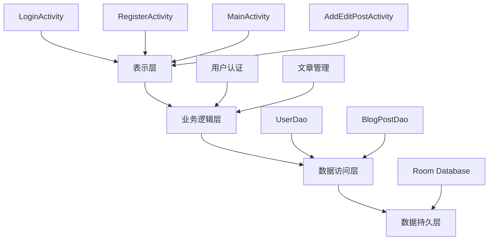
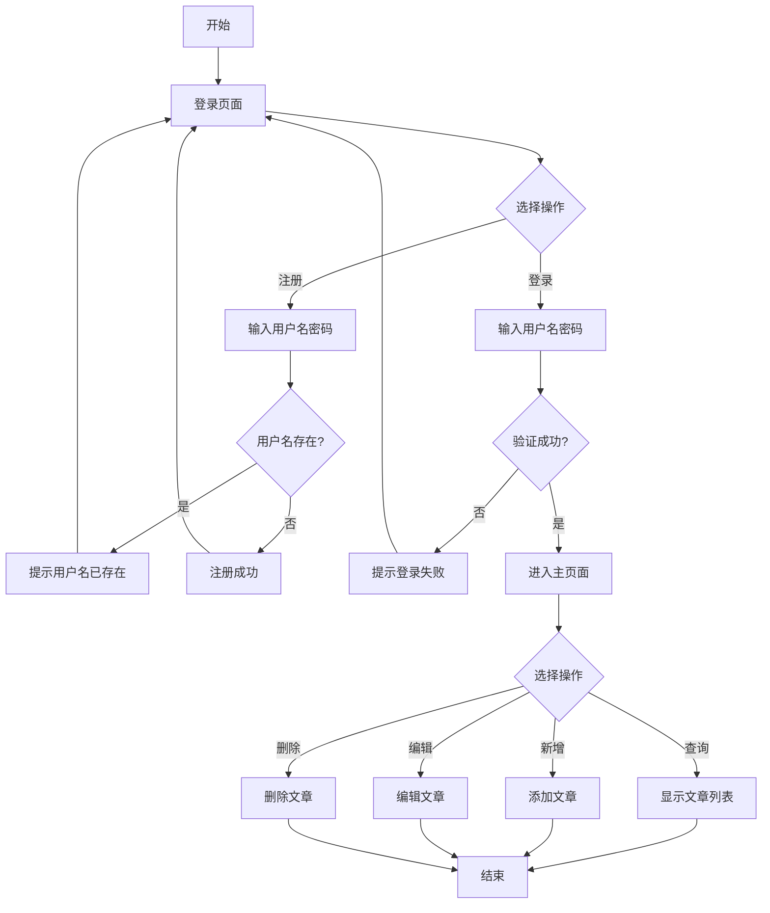

# 《移动终端系统实训》实训报告

## 第1章 绪论

### 1.1 研究背景

随着移动互联网的快速发展和智能手机的普及，移动应用已经成为人们日常生活中不可或缺的一部分。个人博客作为记录生活、分享感悟、展示思想的重要平台，传统的网页博客已经无法满足现代人移动化、碎片化的阅读和写作需求。因此，开发一款功能完善、界面美观、操作便捷的移动博客应用具有重要的现实意义。

### 1.2 研究目的与意义

本课题旨在开发一款基于Android平台的个人博客应用，主要目的包括：

- 提高写作效率：通过移动应用实现随时随地的博客写作功能，帮助用户更好地记录和分享生活。
- 技术实践：通过实际项目开发，深入理解Android开发技术栈，包括Room数据库、Material Design设计规范等。

本应用的意义在于：

- 为用户提供便捷的博客写作工具
- 培养良好的写作习惯
- 通过移动端实现随时记录和分享

### 1.3 研究内容

本课题主要研究内容包括：

(1) 用户认证系统：实现用户注册、登录功能，确保数据安全性和用户隐私。

(2) 博客文章管理：实现博客文章的增、删、改、查功能，支持标题、内容、创建时间等信息。

(3) 用户界面设计：采用Material Design设计规范，打造现代化、美观的用户界面，使用蓝色主题色，营造清新专业的氛围。

(4) 数据持久化：使用Room数据库实现数据的本地存储。

### 1.4 开发技术

#### 1、开发工具

- 开发平台：Android Studio
- 目标SDK版本：API 34 (Android 14)
- 最低SDK版本：API 25 (Android 7.1)
- 数据库：Room Persistence Library
- 数据绑定：ViewBinding

#### 2、开发语言

- 开发语言：Java

## 第2章 总体设计

### 2.1 总体结构设计

本博客APP采用分层架构设计，将系统分为表示层、业务逻辑层、数据访问层和数据持久层四个层次。表示层负责用户界面的展示和交互，包括登录注册页面、主页面和添加编辑文章页面；业务逻辑层处理用户操作和业务规则，包括用户认证、博客文章的增删改查等功能；数据访问层通过DAO接口提供数据操作抽象，隔离业务逻辑和数据库实现；数据持久层使用Room数据库框架实现数据的本地存储。各层之间通过接口和依赖注入实现松耦合，便于维护和扩展。总体结构图如图2-1所示。



图2-1 总体结构图

### 2.2 文件结构框架

本项目的文件结构采用标准的Android项目组织方式，按照功能模块和层次进行划分。Java源代码位于app/src/main/java/com/example/code/目录下，按照包结构组织：entity包包含实体类（User、BlogPost），dao包包含数据访问接口（UserDao、BlogPostDao），database包包含数据库配置（AppDatabase），adapter包包含RecyclerView适配器（BlogPostAdapter），util包包含工具类（SharedPreferencesHelper、DataInitializer），根目录包含所有Activity类。资源文件位于app/src/main/res/目录下，包括布局文件、字符串资源、颜色资源等。文件结构图如图2-2所示。

```
com.example.code/
├── entity/
│   ├── User.java
│   └── BlogPost.java
├── dao/
│   ├── UserDao.java
│   └── BlogPostDao.java
├── database/
│   └── AppDatabase.java
├── adapter/
│   └── BlogPostAdapter.java
├── util/
│   ├── SharedPreferencesHelper.java
│   └── DataInitializer.java
├── LoginActivity.java
├── RegisterActivity.java
├── MainActivity.java
└── AddEditPostActivity.java
```

图2-2 文件结构图

## 第3章 详细设计

### 3.1 详细设计

#### 3.1.1 类详细设计

1. User实体类

User类用于存储用户信息，包含id、username和password三个属性。id为主键，自动增长；username为用户名，唯一标识用户；password为密码，用于用户认证。

主要方法：
- getId(): 获取用户ID
- setId(long id): 设置用户ID
- getUsername(): 获取用户名
- setUsername(String username): 设置用户名
- getPassword(): 获取密码
- setPassword(String password): 设置密码

2. BlogPost实体类

BlogPost类用于存储博客文章信息，包含id、userId、title、content、createTime等属性。id为主键，自动增长；userId为外键，关联到User表；title为文章标题；content为文章内容；createTime为创建时间。

主要方法：
- 标准的getter和setter方法
- BlogPost(): 无参构造函数（Room使用）
- BlogPost(...): 带参构造函数（@Ignore注解，Room不使用）

3. LoginActivity类

LoginActivity负责用户登录功能，验证用户名和密码，登录成功后保存用户信息并跳转到主页面。

主要方法：
- onCreate(Bundle): 初始化界面，设置点击事件监听器，启动进入动画
- login(): 验证用户输入，查询数据库，执行登录逻辑
- animateEntry(): 实现页面元素的淡入动画效果

4. RegisterActivity类

RegisterActivity负责用户注册功能，验证输入信息，检查用户名是否已存在，创建新用户。

主要方法：
- onCreate(Bundle): 初始化界面，设置注册按钮点击事件
- register(): 验证输入，检查用户名唯一性，创建新用户

5. MainActivity类

MainActivity是应用的主页面，显示博客文章列表，提供添加、编辑、删除文章的功能。

主要方法：
- onCreate(Bundle): 初始化界面，设置RecyclerView，加载数据
- setupRecyclerView(): 创建适配器，设置布局管理器
- loadPosts(): 从数据库加载文章，更新列表显示
- editPost(BlogPost): 启动编辑页面
- deletePost(BlogPost): 显示确认对话框，删除文章

6. AddEditPostActivity类

AddEditPostActivity负责添加和编辑博客文章，支持输入标题、内容等信息。

主要方法：
- onCreate(Bundle): 初始化界面，判断新增/编辑模式，加载现有数据
- loadPost(): 从数据库加载文章数据，填充表单
- savePost(): 验证输入，保存或更新文章

7. BlogPostAdapter类

BlogPostAdapter是RecyclerView的适配器，负责将博客文章数据绑定到列表项视图。

主要方法：
- onCreateViewHolder(): 创建ViewHolder
- onBindViewHolder(): 绑定数据到视图
- updatePosts(): 更新文章列表

#### 3.1.2 流程图设计

系统启动后进入登录页面，用户可以选择登录或注册。注册流程：先检查用户名是否存在，若存在则提示异常信息并结束；若不存在则注册成功。登录流程：用户输入账号密码提交，验证是否正确：若不正确则显示登录失败；若正确则进入博客管理模块，可以查询文章、新增文章、删除文章或编辑文章，完成后结束流程。



### 3.2 数据库设计

本应用使用Room数据库框架，共设计两个数据表：users表和blog_posts表。users表用于存储用户信息，blog_posts表用于存储博客文章，两个表通过外键关联，实现一对多的关系。

#### 3.2.1 users表

users表用于存储用户的基本信息，包括用户ID、用户名和密码。用户ID作为主键，自动增长，确保每个用户都有唯一标识。用户名用于登录认证，密码用于验证用户身份。

| 字段名 | 数据类型 | 约束 | 说明 |
|--------|----------|------|------|
| id | INTEGER | PRIMARY KEY, AUTOINCREMENT | 用户ID，主键，自增 |
| username | TEXT | NOT NULL | 用户名，唯一标识 |
| password | TEXT | NOT NULL | 用户密码 |

#### 3.2.2 blog_posts表

blog_posts表用于存储用户的博客文章，包含文章的详细信息。每篇文章都关联到一个用户，通过userId外键实现关联。当用户被删除时，相关的博客文章也会被级联删除。

| 字段名 | 数据类型 | 约束 | 说明 |
|--------|----------|------|------|
| id | INTEGER | PRIMARY KEY, AUTOINCREMENT | 文章ID，主键，自增 |
| userId | INTEGER | FOREIGN KEY, NOT NULL | 用户ID，外键关联users表 |
| title | TEXT | NOT NULL | 文章标题 |
| content | TEXT | NOT NULL | 文章内容 |
| createTime | TEXT | NOT NULL | 创建时间，格式：yyyy-MM-dd HH:mm:ss |

## 第4章 实现及结果分析

### 4.1 实现

#### 1、UI界面

本应用的UI界面采用蓝色主题色，界面美观现代。主要包含以下界面：

- 登录页面：渐变蓝色背景，右侧大卡片登录表单，现代化设计
- 注册页面：渐变背景，大卡片表单，带图标
- 主页面：CollapsingToolbarLayout折叠工具栏，渐变头部，统计卡片带渐变背景
- 添加/编辑文章页面：完整的文章编辑表单，支持标题和内容输入

#### 2、各个文件核心代码

⑴ LoginActivity.java

LoginActivity的核心代码实现了用户登录验证：

```java
private void login() {
    String username = binding.etUsername.getText().toString().trim();
    String password = binding.etPassword.getText().toString().trim();
    
    if (username.isEmpty()) {
        Toast.makeText(this, "请输入用户名", Toast.LENGTH_SHORT).show();
        return;
    }
    
    if (password.isEmpty()) {
        Toast.makeText(this, "请输入密码", Toast.LENGTH_SHORT).show();
        return;
    }
    
    User user = database.userDao().login(username, password);
    
    if (user != null) {
        prefsHelper.saveUser(user.getId(), user.getUsername());
        Toast.makeText(this, "登录成功", Toast.LENGTH_SHORT).show();
        Intent intent = new Intent(LoginActivity.this, MainActivity.class);
        startActivity(intent);
        finish();
    } else {
        Toast.makeText(this, "用户名或密码错误", Toast.LENGTH_SHORT).show();
    }
}
```

⑵ MainActivity.java

MainActivity的核心代码实现了数据加载和文章管理：

```java
private void loadPosts() {
    List<BlogPost> posts = postDao.getAllPostsByUser(userId);
    
    binding.tvPostCount.setText("共 " + posts.size() + " 篇文章");
    
    if (posts.isEmpty()) {
        binding.rvPosts.setVisibility(View.GONE);
        binding.tvEmpty.setVisibility(View.VISIBLE);
    } else {
        binding.rvPosts.setVisibility(View.VISIBLE);
        binding.tvEmpty.setVisibility(View.GONE);
        adapter.updatePosts(posts);
    }
}
```

⑶ AddEditPostActivity.java

AddEditPostActivity的核心代码实现了文章的保存和更新：

```java
private void savePost() {
    String title = binding.etTitle.getText().toString().trim();
    String content = binding.etContent.getText().toString().trim();
    
    if (title.isEmpty()) {
        Toast.makeText(this, "请输入标题", Toast.LENGTH_SHORT).show();
        return;
    }
    
    if (content.isEmpty()) {
        Toast.makeText(this, "请输入内容", Toast.LENGTH_SHORT).show();
        return;
    }
    
    String currentTime = new SimpleDateFormat("yyyy-MM-dd HH:mm:ss", 
        Locale.getDefault()).format(new Date());
    
    if (postId != -1) {
        BlogPost post = postDao.getPostById(postId);
        if (post != null) {
            post.setTitle(title);
            post.setContent(content);
            post.setCreateTime(currentTime);
            postDao.updatePost(post);
            Toast.makeText(this, "更新成功", Toast.LENGTH_SHORT).show();
        }
    } else {
        BlogPost post = new BlogPost(userId, title, content, currentTime);
        postDao.insertPost(post);
        Toast.makeText(this, "保存成功", Toast.LENGTH_SHORT).show();
    }
    
    finish();
}
```

⑷ AppDatabase.java

AppDatabase的核心代码实现了数据库的单例模式：

```java
@Database(entities = {User.class, BlogPost.class}, version = 1, exportSchema = false)
public abstract class AppDatabase extends RoomDatabase {
    private static AppDatabase instance;
    
    public abstract UserDao userDao();
    public abstract BlogPostDao blogPostDao();
    
    public static synchronized AppDatabase getInstance(Context context) {
        if (instance == null) {
            instance = Room.databaseBuilder(
                context.getApplicationContext(),
                AppDatabase.class,
                "blog_database"
            ).allowMainThreadQueries()
             .fallbackToDestructiveMigration()
             .build();
        }
        return instance;
    }
}
```

### 4.2 运行结果及分析

⑴ 主界面如图4-1所示

主界面展示了博客文章列表。顶部使用CollapsingToolbarLayout实现折叠工具栏效果，带有渐变蓝色背景。统计卡片显示文章总数，使用渐变背景和图标装饰。文章列表使用RecyclerView展示，每条文章显示标题、内容预览、创建时间和操作按钮，整体布局清晰美观。

图4-1 主界面

⑵ 用户登录界面如图4-2所示

登录界面采用渐变蓝色背景，右侧大卡片登录表单设计，界面简洁美观。包含用户名和密码输入框，以及登录和注册按钮。输入框采用Material Design风格，按钮采用圆角设计，整体视觉效果现代优雅。

图4-2 用户登录界面

⑶ 添加/编辑文章界面如图4-3所示

添加文章界面包含完整的文章编辑表单，支持输入标题和内容。表单采用Material Design设计规范，输入框采用OutlinedBox样式，整体布局清晰，用户体验良好。

图4-3 添加/编辑文章界面

⑷ 博客文章列表如图4-4所示

博客文章列表使用卡片式设计，每条文章显示完整信息。左侧使用蓝色装饰条，标题使用大字体显示，内容预览使用多行显示，创建时间使用图标标识，整体布局清晰易读。

图4-4 博客文章列表

## 第5章 测试

### 5.1 测试方法

#### 1、黑盒测试

黑盒测试也称为功能测试或行为测试，是一种测试方法，测试人员不需要了解程序内部的代码结构和实现细节，只需要根据软件的功能需求规格说明，设计测试用例，验证软件的功能是否符合预期。

在本项目中，黑盒测试主要用于测试用户界面的功能，如用户注册、登录、添加文章、编辑文章、删除文章等功能是否正常工作。

#### 2、白盒测试

白盒测试也称为结构测试或逻辑驱动测试，是一种测试方法，测试人员需要了解程序内部的代码结构、逻辑流程和实现细节，根据程序的内部结构设计测试用例，验证程序的逻辑是否正确。

在本项目中，白盒测试主要用于测试数据库操作、业务逻辑处理等核心功能的正确性。

### 5.2 测试用例分析

#### 1、功能测试

测试用例1：用户注册功能
- 测试步骤：输入用户名和密码，点击注册按钮
- 预期结果：注册成功，返回登录页面
- 实际结果：功能正常

测试用例2：用户登录功能
- 测试步骤：输入正确的用户名和密码，点击登录按钮
- 预期结果：登录成功，跳转到主页面
- 实际结果：功能正常

测试用例3：添加文章功能
- 测试步骤：点击添加按钮，输入标题和内容，点击保存
- 预期结果：文章保存成功，显示在列表中
- 实际结果：功能正常

测试用例4：编辑文章功能
- 测试步骤：点击文章列表中的编辑按钮，修改内容，点击保存
- 预期结果：文章更新成功，列表显示最新内容
- 实际结果：功能正常

测试用例5：删除文章功能
- 测试步骤：点击文章列表中的删除按钮，确认删除
- 预期结果：文章删除成功，从列表中移除
- 实际结果：功能正常

#### 2、数据测试

测试用例6：测试数据初始化
- 测试步骤：首次登录后查看文章列表
- 预期结果：显示4篇示例文章
- 实际结果：功能正常，示例数据正确显示

## 第6章 总结与展望

### 6.1 总结

本课题成功开发了一款基于Android平台的个人博客应用，实现了以下主要功能：

- 用户认证系统：完成了用户注册和登录功能，使用SharedPreferences保存登录状态，确保用户体验的连续性。
- 博客文章管理：实现了博客文章的完整CRUD操作（增、删、改、查），数据持久化到本地Room数据库。
- 用户界面设计：采用Material Design设计规范，使用蓝色主题色，打造了现代化、美观的用户界面。
- 技术实现：使用Room数据库框架简化了数据库操作，采用ViewBinding简化视图绑定，代码结构清晰，便于维护。

技术收获：

- 深入理解了Android开发的基本流程和架构设计
- 掌握了Room数据库的使用方法
- 学会了Material Design设计规范的应用
- 提高了Java编程和Android开发能力

项目亮点：

- 界面设计美观，采用渐变背景和现代化卡片设计
- 功能完整，满足基本博客写作需求
- 代码结构清晰，易于扩展
- 用户体验良好，操作便捷

### 6.2 展望

虽然本应用已经实现了基本功能，但仍有很大的改进和扩展空间：

**功能扩展：**
- 添加文章分类功能，支持多分类管理
- 添加文章搜索功能，支持关键词搜索
- 添加文章分享功能，支持分享到其他平台
- 添加文章草稿功能，支持保存未完成的文章

**界面优化：**
- 添加文章预览功能
- 支持富文本编辑
- 添加图片上传功能
- 优化列表加载性能

**数据分析：**
- 添加写作统计功能
- 支持按时间查看文章
- 添加文章阅读量统计

本博客APP项目从需求分析到最终实现，完整地走过了Android应用开发的整个流程。通过这个项目，不仅掌握了Android开发的核心技术，还培养了系统性的软件开发思维。虽然当前版本功能相对基础，但为后续的功能扩展和技术优化奠定了良好的基础。

未来将继续完善和优化这个应用，使其成为一个功能完善、用户体验优秀的博客写作工具。
