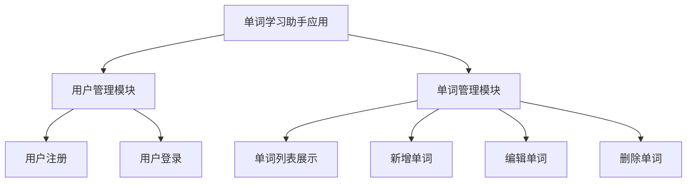
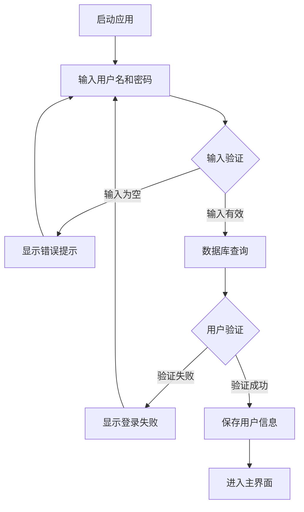
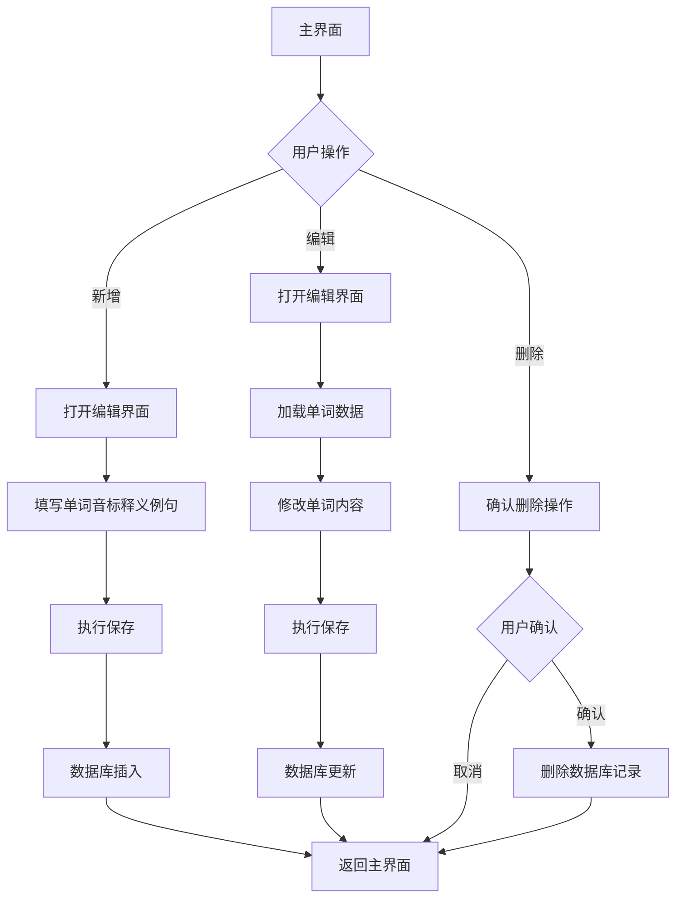

# 《移动终端系统实训》实训报告

## 1.1概述

### 1.1.1背景和意义

在移动互联网快速发展的今天，智能手机已成为人们日常生活的重要工具。英语学习作为现代人提升自我能力的重要途径，传统纸质单词本在移动场景下存在诸多不便。开发一款专为移动设备设计的单词学习应用，能够满足用户随时随地学习单词的需求，具有重要的应用价值。

### 1.1.2任务概述

本项目的核心研究内容涵盖以下方面：

(1) 用户身份验证：构建用户注册与登录机制，保障用户数据的安全性和隐私保护。

(2) 单词内容管理：实现单词的创建、修改、删除和查询功能，记录单词、音标、释义和例句等关键信息。

(3) 视觉界面设计：遵循Material Design设计理念，构建简洁学习风格的用户界面，采用绿色系配色方案，营造清新自然的学习氛围。

(4) 数据存储方案：利用Room数据库技术实现数据的本地持久化存储。

### 1.1.3设计环境

(1) 硬件：Windows 11

(2) 软件：Android Studio

## 1.2需求分析

### 1.2.1需求描述

在移动互联网快速发展的背景下，个人英语学习需求不断增长。传统纸质单词本存在易丢失、查询不便、携带不便等局限性。开发一款基于Android系统的单词学习助手应用，能够帮助用户便捷地管理和学习单词，实现个人学习的数字化管理，具有显著的实用价值。

本系统致力于构建一个简洁、高效的移动端单词学习平台，提供用户注册登录、单词添加、历史单词浏览、单词编辑和删除等核心功能。系统基于Android原生技术开发，采用Room数据库实现本地数据持久化，确保数据安全可靠。通过Material Design设计理念和绿色主题配色，打造良好的用户体验，帮助用户轻松管理个人单词库，培养持续学习的习惯。

### 1.2.2功能需求

系统需要实现的主要功能包括：

**用户身份管理**：系统应提供用户注册和登录服务。新用户可通过输入用户名和密码完成注册，系统需校验用户名的唯一性。已注册用户可通过用户名和密码登录系统，登录状态通过SharedPreferences实现持久化存储。

**单词内容管理**：用户可添加新的单词，每个单词包含单词、音标、释义、例句等要素。用户可浏览所有历史单词，单词按字母顺序排列。用户可对已有单词进行修改，也可删除不需要的单词。

**数据持久化存储**：所有用户数据和单词内容需持久化保存在本地数据库中，采用Room数据库框架实现。数据库设计包含用户表和单词表，通过外键关系确保数据完整性。

**界面交互体验**：系统界面需遵循Material Design设计规范，提供流畅的动画效果和友好的交互体验。主界面使用RecyclerView展示单词列表，支持空状态提示。使用FloatingActionButton快速添加新单词。

## 2 系统设计与实现报告

### 2.1功能设计

#### 2.1.1功能模块

系统功能模块结构如下：



#### 2.1.2系统架构设计

系统采用Android经典的MVC架构模式，主要划分为以下层次：

**视图层（View Layer）**：涵盖所有Activity和布局资源，负责用户界面的呈现和交互。主要Activity包括LoginActivity（登录界面）、RegisterActivity（注册界面）、MainActivity（主界面）、AddEditWordActivity（单词编辑界面）。

**控制层（Controller Layer）**：各Activity充当控制器角色，处理用户交互逻辑，调用数据访问层完成数据操作，并将处理结果反馈到用户界面。

**数据层（Data Layer）**：包括数据库、DAO接口、实体类和SharedPreferences工具类，负责数据的持久化存储和访问操作。

#### 2.1.3数据库设计

系统采用Room数据库框架，包含两个核心实体：

**User实体**：存储用户基本信息，包含id（主键，自增）、username（用户名）、password（密码）字段。

**Word实体**：存储单词信息，包含id（主键，自增）、userId（外键，关联User表）、word（单词）、phonetic（音标）、meaning（释义）、example（例句）字段。

#### 2.1.4流程设计

**(1)用户登录流程：**



**(2)单词管理流程：**



### 2.2 系统详细设计与实现

#### 2.2.1 登录功能实现

LoginActivity作为应用的入口Activity，用户首次启动应用将进入登录界面。登录界面采用简洁学习风格设计，顶部渐变绿色条，居中卡片布局，界面设计清新自然。

登录功能的核心逻辑在login()方法中实现：

```java
private void login() {
    String username = binding.etUsername.getText().toString().trim();
    String password = binding.etPassword.getText().toString().trim();
    
    if (username.isEmpty()) {
        Toast.makeText(this, "请输入用户名", Toast.LENGTH_SHORT).show();
        return;
    }
    
    if (password.isEmpty()) {
        Toast.makeText(this, "请输入密码", Toast.LENGTH_SHORT).show();
        return;
    }
    
    User user = database.userDao().login(username, password);
    
    if (user != null) {
        prefsHelper.saveUser(user.getId(), user.getUsername());
        Toast.makeText(this, "登录成功", Toast.LENGTH_SHORT).show();
        
        Intent intent = new Intent(LoginActivity.this, MainActivity.class);
        startActivity(intent);
        finish();
    } else {
        Toast.makeText(this, "用户名或密码错误", Toast.LENGTH_SHORT).show();
    }
}
```

登录流程首先执行输入校验，确保用户名和密码非空。随后通过UserDao查询数据库，验证用户凭证。验证成功后，将用户ID和用户名存入SharedPreferences，并导航至主界面；验证失败则显示错误提示。

#### 2.2.2 注册功能实现

RegisterActivity提供用户注册服务，界面包含用户名、密码和确认密码输入控件。注册逻辑在register()方法中实现：

```java
private void register() {
    String username = binding.etUsername.getText().toString().trim();
    String password = binding.etPassword.getText().toString().trim();
    String confirmPassword = binding.etConfirmPassword.getText().toString().trim();
    
    // 输入校验
    if (username.isEmpty()) {
        Toast.makeText(this, "请输入用户名", Toast.LENGTH_SHORT).show();
        return;
    }
    
    if (password.isEmpty()) {
        Toast.makeText(this, "请输入密码", Toast.LENGTH_SHORT).show();
        return;
    }
    
    if (!password.equals(confirmPassword)) {
        Toast.makeText(this, "两次输入的密码不一致", Toast.LENGTH_SHORT).show();
        return;
    }
    
    // 用户名唯一性检查
    if (database.userDao().findByUsername(username) != null) {
        Toast.makeText(this, "用户名已存在", Toast.LENGTH_SHORT).show();
        return;
    }
    
    // 创建用户
    User user = new User(username, password);
    long userId = database.userDao().insertUser(user);
    
    if (userId > 0) {
        Toast.makeText(this, "注册成功", Toast.LENGTH_SHORT).show();
        finish();
    } else {
        Toast.makeText(this, "注册失败", Toast.LENGTH_SHORT).show();
    }
}
```

注册流程包括输入校验、密码一致性验证、用户名唯一性检查和用户创建。所有验证通过后，将新用户信息写入数据库，并返回注册结果。

SharedPreferencesHelper工具类负责管理用户登录状态，提供保存用户信息、获取用户ID、清除用户信息和判断登录状态等方法。登录成功后，用户信息会被持久化保存，应用重启后仍能保持登录状态。

#### 2.2.3 单词列表展示功能

单词列表通过WordAdapter适配器实现，使用RecyclerView组件展示。适配器在onBindViewHolder()方法中完成数据绑定：

```java
@Override
public void onBindViewHolder(@NonNull ViewHolder holder, int position) {
    Word word = words.get(position);
    holder.tvWord.setText(word.getWord());
    holder.tvPhonetic.setText(word.getPhonetic());
    holder.tvMeaning.setText(word.getMeaning());
    holder.tvExample.setText(word.getExample());
    
    holder.cardView.setOnClickListener(v -> {
        if (listener != null) {
            listener.onEditClick(word);
        }
    });
    
    holder.btnEdit.setOnClickListener(v -> {
        if (listener != null) {
            listener.onEditClick(word);
        }
    });
    
    holder.btnDelete.setOnClickListener(v -> {
        if (listener != null) {
            listener.onDeleteClick(word);
        }
    });
}
```

数据加载：

loadWords()方法负责从数据库获取当前用户的所有单词，并按字母顺序排列：

```java
private void loadWords() {
    List<Word> words = wordDao.getAllWordsByUser(userId);
    
    binding.tvWordCount.setText("共 " + words.size() + " 个单词");
    
    if (words.isEmpty()) {
        binding.rvWords.setVisibility(View.GONE);
        binding.tvEmpty.setVisibility(View.VISIBLE);
    } else {
        binding.rvWords.setVisibility(View.VISIBLE);
        binding.tvEmpty.setVisibility(View.GONE);
        adapter.updateWords(words);
    }
}
```

当单词列表为空时，显示空状态提示；否则显示单词列表。在onResume()生命周期方法中调用loadWords()，确保从其他界面返回时数据能够及时刷新。

#### 2.2.4 新增单词功能

新增单词功能通过AddEditWordActivity实现，用户点击FloatingActionButton进入新增界面。新增功能的实现逻辑如下：

```java
binding.fabAdd.setOnClickListener(v -> {
    Intent intent = new Intent(MainActivity.this, AddEditWordActivity.class);
    startActivity(intent);
});
```

在AddEditWordActivity中，通过判断wordId是否为-1来识别新增模式：

```java
wordId = getIntent().getLongExtra("word_id", -1);

if (wordId != -1) {
    loadWord();
    binding.toolbar.setTitle("编辑单词");
} else {
    binding.toolbar.setTitle("添加单词");
}
```

新增模式下，界面显示空白表单，用户填写单词、音标、释义和例句后保存。

#### 2.2.5 编辑单词功能

编辑单词功能同样通过AddEditWordActivity实现，用户从单词列表点击编辑按钮进入编辑界面。编辑功能的实现逻辑如下：

```java
private void editWord(Word word) {
    Intent intent = new Intent(MainActivity.this, AddEditWordActivity.class);
    intent.putExtra("word_id", word.getId());
    startActivity(intent);
}
```

在AddEditWordActivity中，通过Intent获取word_id参数，如果wordId不为-1，则进入编辑模式：

```java
if (wordId != -1) {
    loadWord();
    binding.toolbar.setTitle("编辑单词");
}
```

编辑模式下，调用loadWord()方法从数据库加载单词数据并填充到界面：

```java
private void loadWord() {
    Word word = wordDao.getWordById(wordId);
    if (word != null) {
        binding.etWord.setText(word.getWord());
        binding.etPhonetic.setText(word.getPhonetic());
        binding.etMeaning.setText(word.getMeaning());
        binding.etExample.setText(word.getExample());
    }
}
```

用户修改内容后，点击保存按钮执行更新操作。

#### 2.2.6 删除单词功能

删除功能通过AlertDialog确认对话框实现，避免误操作：

```java
private void deleteWord(Word word) {
    new AlertDialog.Builder(this)
        .setTitle("确认删除")
        .setMessage("确定要删除这个单词吗？")
        .setPositiveButton("删除", (dialog, which) -> {
            wordDao.deleteWord(word);
            Toast.makeText(this, "删除成功", Toast.LENGTH_SHORT).show();
            loadWords();
        })
        .setNegativeButton("取消", null)
        .show();
}
```

用户点击删除按钮后，弹出确认对话框，确认后调用DAO的deleteWord()方法删除单词，并刷新列表显示。

#### 2.2.7 数据保存功能

saveWord()方法实现单词的保存逻辑，包含完整的数据校验：

```java
private void saveWord() {
    String word = binding.etWord.getText().toString().trim();
    String phonetic = binding.etPhonetic.getText().toString().trim();
    String meaning = binding.etMeaning.getText().toString().trim();
    String example = binding.etExample.getText().toString().trim();
    
    if (word.isEmpty()) {
        Toast.makeText(this, "请输入单词", Toast.LENGTH_SHORT).show();
        return;
    }
    
    if (meaning.isEmpty()) {
        Toast.makeText(this, "请输入释义", Toast.LENGTH_SHORT).show();
        return;
    }
    
    if (wordId != -1) {
        // 更新操作
        Word wordObj = wordDao.getWordById(wordId);
        if (wordObj != null) {
            wordObj.setWord(word);
            wordObj.setPhonetic(phonetic);
            wordObj.setMeaning(meaning);
            wordObj.setExample(example);
            wordDao.updateWord(wordObj);
            Toast.makeText(this, "更新成功", Toast.LENGTH_SHORT).show();
        }
    } else {
        // 新增操作
        Word wordObj = new Word(userId, word, phonetic, meaning, example);
        wordDao.insertWord(wordObj);
        Toast.makeText(this, "保存成功", Toast.LENGTH_SHORT).show();
    }
    
    finish();
}
```

保存流程包括数据校验、数据库操作和结果反馈。单词和释义为必填字段，音标和例句为可选字段，确保数据完整性。

## 3 总结

本系统成功构建了一个功能完善的Android单词学习助手应用，采用Room数据库实现本地数据持久化，使用Material Design设计规范提供良好的用户体验。系统实现了用户注册登录、单词的增删改查等核心功能，满足了个人单词学习的基本需求。

系统架构设计合理，采用MVC模式实现层次分离，代码结构清晰，便于维护和扩展。数据库设计遵循关系型数据库规范，通过外键约束保证数据完整性。用户界面设计简洁美观，采用绿色主题和现代化设计，交互流畅，符合现代移动应用的设计标准。

在开发过程中，系统实现了完整的输入校验机制，确保数据的正确性和完整性。通过SharedPreferences实现登录状态持久化，提升了用户体验。使用RecyclerView高效展示大量数据，使用FloatingActionButton提供便捷的操作入口，这些都是Android开发的最佳实践。

未来可以考虑增加的功能包括：单词发音功能、单词复习功能、单词测试功能、学习进度统计、记忆曲线算法、单词收藏功能等高级功能，进一步提升系统的实用价值。同时，可以考虑添加数据备份和恢复功能，以及云端同步功能，提高数据安全性。

## 参考文献

[1] Google Developers. Room Persistence Library[EB/OL]. https://developer.android.com/training/data-storage/room, 2024.

[2] Google Developers. Material Design Guidelines[EB/OL]. https://material.io/design, 2024.

[3] 郭霖. 第一行代码Android（第3版）[M]. 北京：人民邮电出版社，2020:156-189.

[4] 任玉刚. Android开发艺术探索[M]. 北京：电子工业出版社，2015:234-267.

[5] 李宁. Android应用开发实战[M]. 北京：清华大学出版社，2018:312-345.

[6] 欧阳燊. Android Room数据库框架应用研究[J]. 计算机工程与应用，2019,55(12):89-94.

[7] 张明. 基于Android的单词学习应用设计与实现[D]. 北京：北京理工大学，2021:45-67.

[8] Android Developers. RecyclerView Guide[EB/OL]. https://developer.android.com/guide/components/recyclerview, 2024.
