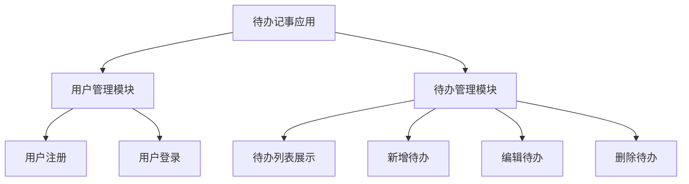
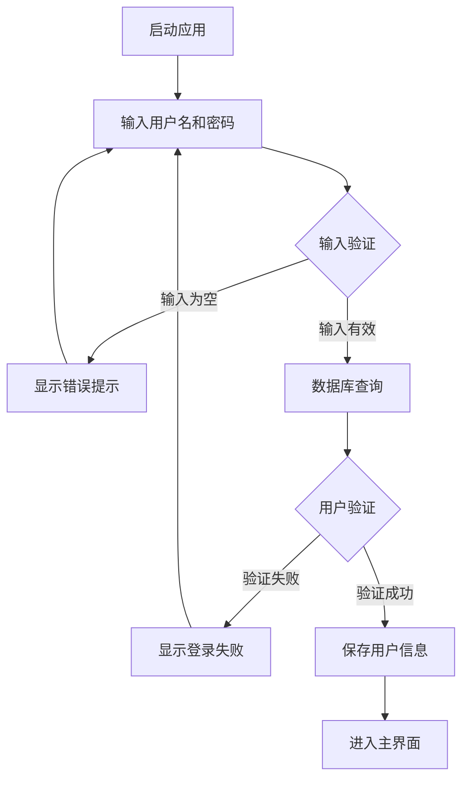
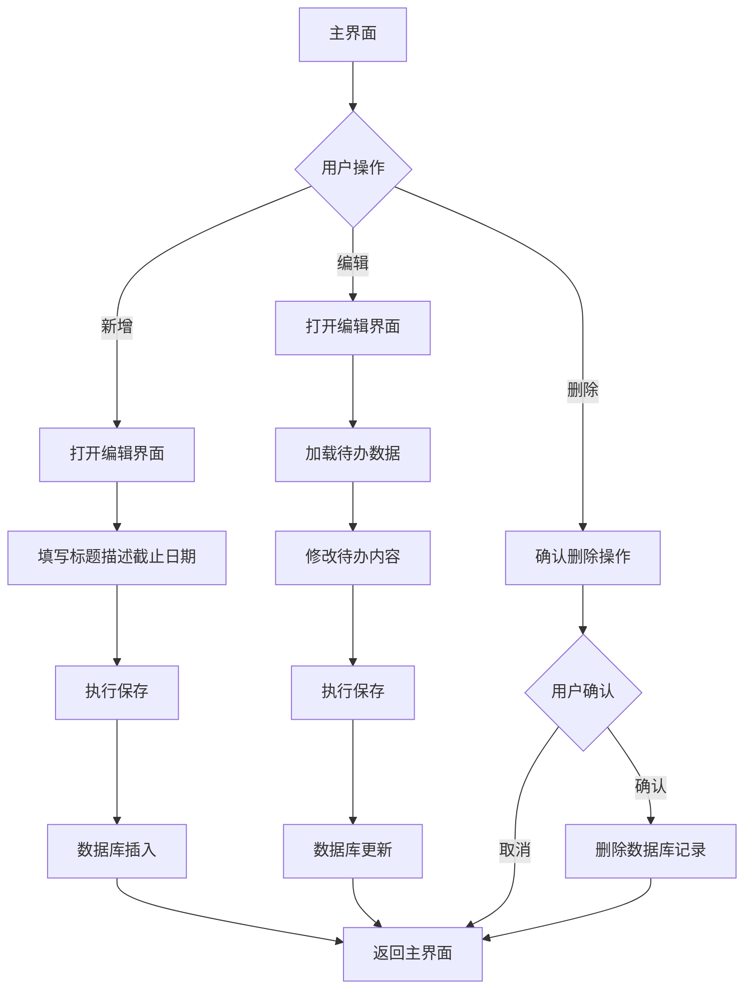

# 《移动终端系统实训》实训报告

## 1.1概述

### 1.1.1背景和意义

随着移动互联网技术的蓬勃发展，智能手机已成为现代人日常生活中不可或缺的工具。在快节奏的现代生活中，时间管理和任务规划显得尤为重要。传统的纸质记事本在移动场景下存在携带不便、易丢失、查询困难等局限性。开发一款专为移动设备设计的待办事项管理应用，能够帮助用户随时随地记录和管理待办事项，有效提升时间管理效率，具有重要的实用价值。

### 1.1.2任务概述

本项目的核心研究内容涵盖以下方面：

(1) 用户身份验证：建立用户注册与登录系统，确保用户数据的安全性和个人隐私保护。

(2) 待办事项管理：实现待办事项的创建、修改、删除和查询功能，记录标题、描述、截止日期等关键信息。

(3) 视觉界面设计：遵循现代化设计理念，构建优雅简洁的用户界面，采用蓝色系配色方案，营造清新专业的视觉体验。

(4) 数据存储方案：采用Room数据库技术实现数据的本地持久化存储，保障数据安全可靠。

### 1.1.3设计环境

(1) 硬件：Windows 11

(2) 软件：Android Studio

## 1.2需求分析

### 1.2.1需求描述

在移动互联网快速发展的背景下，个人时间管理需求日益增长。传统纸质记事本存在易丢失、查询不便、携带不便等局限性。开发一款基于Android系统的待办事项管理应用，能够帮助用户便捷地管理和追踪待办事项，实现个人任务的数字化管理，具有显著的实用价值。

本系统致力于构建一个简洁、高效的移动端待办管理平台，提供用户注册登录、待办添加、历史待办浏览、待办编辑和删除等核心功能。系统基于Android原生技术开发，采用Room数据库实现本地数据持久化，确保数据安全可靠。通过现代化设计理念和蓝色主题配色，打造良好的用户体验，帮助用户轻松管理个人待办事项，提高工作效率。

### 1.2.2功能需求

系统需要实现的主要功能包括：

**用户身份管理**：系统应提供用户注册和登录服务。新用户可通过输入用户名和密码完成注册，系统需校验用户名的唯一性。已注册用户可通过用户名和密码登录系统，登录状态通过SharedPreferences实现持久化存储。

**待办事项管理**：用户可添加新的待办事项，每个待办包含标题、描述、截止日期等要素。用户可浏览所有历史待办，待办按创建时间倒序排列。用户可对已有待办进行修改，也可删除不需要的待办。

**数据持久化存储**：所有用户数据和待办内容需持久化保存在本地数据库中，采用Room数据库框架实现。数据库设计包含用户表和待办表，通过外键关系确保数据完整性。

**界面交互体验**：系统界面需遵循现代化设计规范，提供流畅的动画效果和友好的交互体验。主界面使用RecyclerView展示待办列表，支持空状态提示。使用FloatingActionButton快速添加新待办。

## 2 系统设计与实现报告

### 2.1功能设计

#### 2.1.1功能模块

系统功能模块结构如下：



#### 2.1.2系统架构设计

系统采用Android经典的MVC架构模式，主要划分为以下层次：

**视图层（View Layer）**：涵盖所有Activity和布局资源，负责用户界面的呈现和交互。主要Activity包括LoginActivity（登录界面）、RegisterActivity（注册界面）、MainActivity（主界面）、AddEditTodoActivity（待办编辑界面）。

**控制层（Controller Layer）**：各Activity充当控制器角色，处理用户交互逻辑，调用数据访问层完成数据操作，并将处理结果反馈到用户界面。

**数据层（Data Layer）**：包括数据库、DAO接口、实体类和SharedPreferences工具类，负责数据的持久化存储和访问操作。

#### 2.1.3数据库设计

系统采用Room数据库框架，包含两个核心实体：

**User实体**：存储用户基本信息，包含id（主键，自增）、username（用户名）、password（密码）字段。

**Todo实体**：存储待办信息，包含id（主键，自增）、userId（外键，关联User表）、title（标题）、description（描述）、dueDate（截止日期）、isCompleted（完成状态）字段。

#### 2.1.4流程设计

**(1)用户登录流程：**



**(2)待办管理流程：**



### 2.2 系统详细设计与实现

#### 2.2.1 登录功能实现

LoginActivity作为应用的入口Activity，用户首次启动应用将进入登录界面。登录界面采用现代化设计，顶部渐变蓝色条，居中卡片布局，界面设计优雅大方。

登录功能的核心逻辑在login()方法中实现：

```java
private void login() {
    String username = binding.etUsername.getText().toString().trim();
    String password = binding.etPassword.getText().toString().trim();
    
    if (username.isEmpty()) {
        Toast.makeText(this, "请输入用户名", Toast.LENGTH_SHORT).show();
        return;
    }
    
    if (password.isEmpty()) {
        Toast.makeText(this, "请输入密码", Toast.LENGTH_SHORT).show();
        return;
    }
    
    User user = database.userDao().login(username, password);
    
    if (user != null) {
        prefsHelper.saveUser(user.getId(), user.getUsername());
        Toast.makeText(this, "登录成功", Toast.LENGTH_SHORT).show();
        
        Intent intent = new Intent(LoginActivity.this, MainActivity.class);
        startActivity(intent);
        finish();
    } else {
        Toast.makeText(this, "用户名或密码错误", Toast.LENGTH_SHORT).show();
    }
}
```

登录流程首先执行输入校验，确保用户名和密码非空。随后通过UserDao查询数据库，验证用户凭证。验证成功后，将用户ID和用户名存入SharedPreferences，并导航至主界面；验证失败则显示错误提示。

#### 2.2.2 注册功能实现

RegisterActivity提供用户注册服务，界面包含用户名、密码和确认密码输入控件。注册逻辑在register()方法中实现：

```java
private void register() {
    String username = binding.etUsername.getText().toString().trim();
    String password = binding.etPassword.getText().toString().trim();
    String confirmPassword = binding.etConfirmPassword.getText().toString().trim();
    
    // 输入校验
    if (username.isEmpty()) {
        Toast.makeText(this, "请输入用户名", Toast.LENGTH_SHORT).show();
        return;
    }
    
    if (password.isEmpty()) {
        Toast.makeText(this, "请输入密码", Toast.LENGTH_SHORT).show();
        return;
    }
    
    if (!password.equals(confirmPassword)) {
        Toast.makeText(this, "两次输入的密码不一致", Toast.LENGTH_SHORT).show();
        return;
    }
    
    // 用户名唯一性检查
    if (database.userDao().findByUsername(username) != null) {
        Toast.makeText(this, "用户名已存在", Toast.LENGTH_SHORT).show();
        return;
    }
    
    // 创建用户
    User user = new User(username, password);
    long userId = database.userDao().insertUser(user);
    
    if (userId > 0) {
        Toast.makeText(this, "注册成功", Toast.LENGTH_SHORT).show();
        finish();
    } else {
        Toast.makeText(this, "注册失败", Toast.LENGTH_SHORT).show();
    }
}
```

注册流程包括输入校验、密码一致性验证、用户名唯一性检查和用户创建。所有验证通过后，将新用户信息写入数据库，并返回注册结果。

SharedPreferencesHelper工具类负责管理用户登录状态，提供保存用户信息、获取用户ID、清除用户信息和判断登录状态等方法。登录成功后，用户信息会被持久化保存，应用重启后仍能保持登录状态。

#### 2.2.3 待办列表展示功能

待办列表通过TodoAdapter适配器实现，使用RecyclerView组件展示。适配器在onBindViewHolder()方法中完成数据绑定：

```java
@Override
public void onBindViewHolder(@NonNull ViewHolder holder, int position) {
    Todo todo = todos.get(position);
    holder.tvTitle.setText(todo.getTitle());
    holder.tvDescription.setText(todo.getDescription());
    holder.tvDueDate.setText("截止日期: " + todo.getDueDate());
    
    holder.cardView.setOnClickListener(v -> {
        if (editListener != null) {
            editListener.onEditClick(todo);
        }
    });
    
    holder.btnEdit.setOnClickListener(v -> {
        if (editListener != null) {
            editListener.onEditClick(todo);
        }
    });
    
    holder.btnDelete.setOnClickListener(v -> {
        if (deleteListener != null) {
            deleteListener.onDeleteClick(todo);
        }
    });
}
```

数据加载：

loadTodos()方法负责从数据库获取当前用户的所有待办，并按创建时间倒序排列：

```java
private void loadTodos() {
    List<Todo> todos = todoDao.getAllTodosByUser(userId);
    
    binding.tvTodoCount.setText("共 " + todos.size() + " 项待办");
    
    if (todos.isEmpty()) {
        binding.rvTodos.setVisibility(View.GONE);
        binding.tvEmpty.setVisibility(View.VISIBLE);
    } else {
        binding.rvTodos.setVisibility(View.VISIBLE);
        binding.tvEmpty.setVisibility(View.GONE);
        adapter.updateTodos(todos);
    }
}
```

当待办列表为空时，显示空状态提示；否则显示待办列表。在onResume()生命周期方法中调用loadTodos()，确保从其他界面返回时数据能够及时刷新。

#### 2.2.4 新增待办功能

新增待办功能通过AddEditTodoActivity实现，用户点击FloatingActionButton进入新增界面。新增功能的实现逻辑如下：

```java
binding.fabAdd.setOnClickListener(v -> {
    Intent intent = new Intent(MainActivity.this, AddEditTodoActivity.class);
    startActivity(intent);
});
```

在AddEditTodoActivity中，通过判断todoId是否为-1来识别新增模式：

```java
todoId = getIntent().getLongExtra("todo_id", -1);
if (todoId != -1) {
    loadTodo();
    binding.toolbar.setTitle("编辑待办");
} else {
    binding.toolbar.setTitle("新增待办");
}
```

新增模式下，界面显示空白表单，用户填写标题、描述和截止日期后保存。

#### 2.2.5 编辑待办功能

编辑待办功能同样通过AddEditTodoActivity实现，用户从待办列表点击编辑按钮进入编辑界面。编辑功能的实现逻辑如下：

```java
private void editTodo(Todo todo) {
    Intent intent = new Intent(MainActivity.this, AddEditTodoActivity.class);
    intent.putExtra("todo_id", todo.getId());
    startActivity(intent);
}
```

在AddEditTodoActivity中，通过Intent获取todo_id参数，如果todoId不为-1，则进入编辑模式：

```java
if (todoId != -1) {
    loadTodo();
    binding.toolbar.setTitle("编辑待办");
}
```

编辑模式下，调用loadTodo()方法从数据库加载待办数据并填充到界面：

```java
private void loadTodo() {
    Todo todo = todoDao.getTodoById(todoId);
    if (todo != null) {
        binding.etTitle.setText(todo.getTitle());
        binding.etDescription.setText(todo.getDescription());
        binding.etDueDate.setText(todo.getDueDate());
    }
}
```

用户修改内容后，点击保存按钮执行更新操作。

#### 2.2.6 删除待办功能

删除功能通过AlertDialog确认对话框实现，避免误操作：

```java
private void deleteTodo(Todo todo) {
    new AlertDialog.Builder(this)
        .setTitle("确认删除")
        .setMessage("确定要删除这个待办事项吗？")
        .setPositiveButton("删除", (dialog, which) -> {
            todoDao.deleteTodo(todo);
            Toast.makeText(this, "删除成功", Toast.LENGTH_SHORT).show();
            loadTodos();
        })
        .setNegativeButton("取消", null)
        .show();
}
```

用户点击删除按钮后，弹出确认对话框，确认后调用DAO的deleteTodo()方法删除待办，并刷新列表显示。

#### 2.2.7 数据保存功能

saveTodo()方法实现待办的保存逻辑，包含完整的数据校验：

```java
private void saveTodo() {
    String title = binding.etTitle.getText().toString().trim();
    String description = binding.etDescription.getText().toString().trim();
    String dueDate = binding.etDueDate.getText().toString().trim();
    
    if (title.isEmpty()) {
        Toast.makeText(this, "请输入标题", Toast.LENGTH_SHORT).show();
        return;
    }
    
    if (todoId != -1) {
        // 更新操作
        Todo todo = todoDao.getTodoById(todoId);
        if (todo != null) {
            todo.setTitle(title);
            todo.setDescription(description);
            todo.setDueDate(dueDate);
            todoDao.updateTodo(todo);
            Toast.makeText(this, "更新成功", Toast.LENGTH_SHORT).show();
        }
    } else {
        // 新增操作
        Todo todo = new Todo(userId, title, description, dueDate);
        todoDao.insertTodo(todo);
        Toast.makeText(this, "保存成功", Toast.LENGTH_SHORT).show();
    }
    
    finish();
}
```

保存流程包括数据校验、数据库操作和结果反馈。标题为必填字段，描述和截止日期为可选字段，确保数据完整性。

## 3 总结

本系统成功构建了一个功能完善的Android待办事项管理应用，采用Room数据库实现本地数据持久化，使用现代化设计规范提供良好的用户体验。系统实现了用户注册登录、待办的增删改查等核心功能，满足了个人时间管理的基本需求。

系统架构设计合理，采用MVC模式实现层次分离，代码结构清晰，便于维护和扩展。数据库设计遵循关系型数据库规范，通过外键约束保证数据完整性。用户界面设计简洁美观，采用蓝色主题和现代化设计，交互流畅，符合现代移动应用的设计标准。

在开发过程中，系统实现了完整的输入校验机制，确保数据的正确性和完整性。通过SharedPreferences实现登录状态持久化，提升了用户体验。使用RecyclerView高效展示大量数据，使用FloatingActionButton提供便捷的操作入口，这些都是Android开发的最佳实践。

未来可以考虑增加的功能包括：待办提醒功能、待办分类功能、待办优先级设置、完成状态统计、数据导出功能、待办搜索功能等高级功能，进一步提升系统的实用价值。同时，可以考虑添加数据备份和恢复功能，以及云端同步功能，提高数据安全性。

## 参考文献

[1] Google Developers. Room Persistence Library[EB/OL]. https://developer.android.com/training/data-storage/room, 2024.

[2] Google Developers. Material Design Guidelines[EB/OL]. https://material.io/design, 2024.

[3] 郭霖. 第一行代码Android（第3版）[M]. 北京：人民邮电出版社，2020:156-189.

[4] 任玉刚. Android开发艺术探索[M]. 北京：电子工业出版社，2015:234-267.

[5] 李宁. Android应用开发实战[M]. 北京：清华大学出版社，2018:312-345.

[6] 欧阳燊. Android Room数据库框架应用研究[J]. 计算机工程与应用，2019,55(12):89-94.

[7] 张明. 基于Android的任务管理应用设计与实现[D]. 北京：北京理工大学，2021:45-67.

[8] Android Developers. RecyclerView Guide[EB/OL]. https://developer.android.com/guide/components/recyclerview, 2024.


