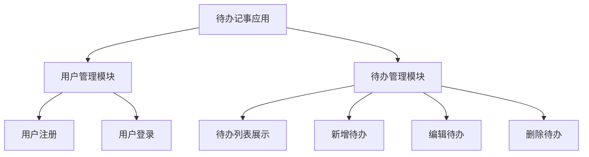
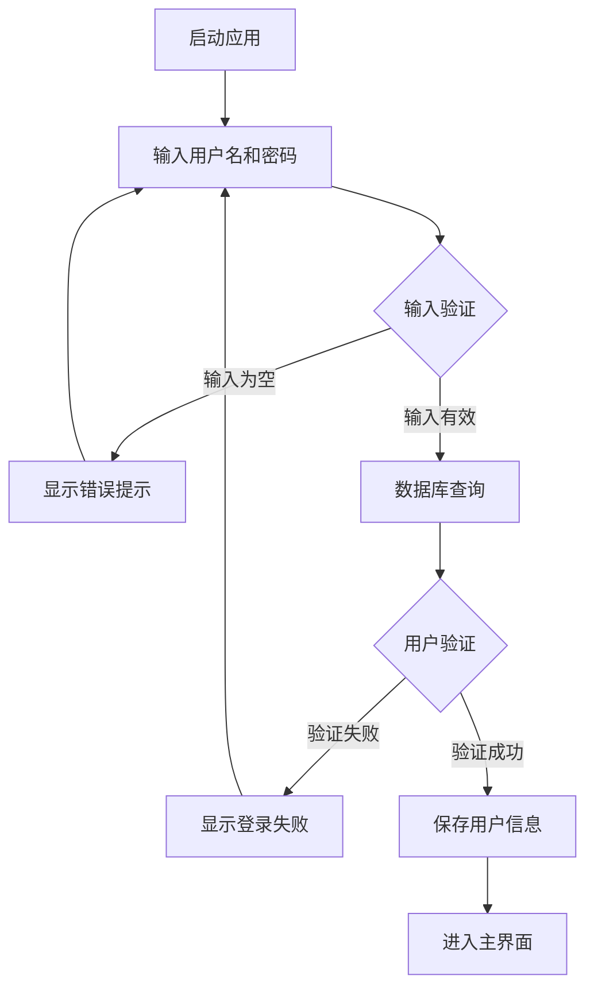
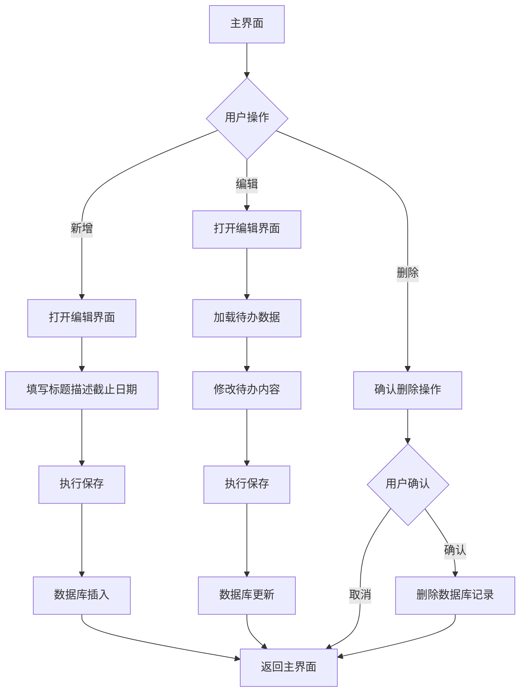

# 《移动终端系统实训》实训报告

## 1.1概述

### 1.1.1背景和意义

当前移动设备普及，人们越来越依赖手机处理日常事务。任务管理是提升个人效率的关键环节，传统方式存在明显不足。纸质记录方式难以随时查阅和更新，电子表格缺乏移动端便捷性。因此，开发一款移动端任务管理工具具有现实意义，能够帮助用户高效组织工作与生活。

### 1.1.2任务概述

本项目重点研究以下技术要点：

(1) 用户认证体系：设计并实现用户注册登录功能模块，保护用户隐私和数据安全。

(2) 任务信息维护：开发任务的增加、更新、移除和查看功能，支持任务标题、详细说明、完成期限等属性管理。

(3) UI视觉呈现：应用当代设计原则，打造简约美观的交互界面，运用蓝色调色板，呈现清爽专业的视觉效果。

(4) 本地数据管理：运用Room持久化框架完成数据的本地化存储，保证数据稳定可靠。

### 1.1.3设计环境

(1) 硬件：Windows 11

(2) 软件：Android Studio

## 1.2需求分析

### 1.2.1需求描述

移动互联网时代，个人效率管理需求持续上升。传统任务记录方式存在数据易丢失、检索效率低、移动性差等问题。构建基于Android平台的任务管理工具，可协助用户高效管理个人任务，推进任务管理的数字化进程，具有明显的应用价值。

本系统旨在打造一个易用、高效的移动任务管理工具，集成用户认证、任务创建、任务查看、任务修改和任务移除等基础功能。系统基于Android平台开发，运用Room数据库完成本地数据存储，保证数据安全稳定。结合现代设计理念和蓝色主题，创造优质的用户体验，助力用户高效管理个人任务，提升工作生活效率。

### 1.2.2功能需求

系统核心功能模块如下：

**用户认证模块**：系统需支持用户注册和登录功能。新用户注册时输入用户名和密码，系统验证用户名唯一性。已注册用户通过用户名密码登录，登录状态通过SharedPreferences进行持久化。

**任务管理模块**：用户可创建新任务，任务包含标题、详细说明、完成期限等属性。用户可查看所有历史任务，任务按创建时间降序显示。用户可修改已有任务，也可移除不需要的任务。

**数据存储模块**：所有用户数据和任务信息需保存在本地数据库，采用Room框架实现。数据库包含用户表和任务表，通过外键关联保证数据一致性。

**交互体验模块**：系统界面需符合现代设计标准，提供流畅的动画和友好的交互。主界面采用RecyclerView展示任务列表，支持空数据提示。使用FloatingActionButton提供快速创建入口。

## 2 系统设计与实现报告

### 2.1功能设计

#### 2.1.1功能模块

系统功能模块结构如下：



#### 2.1.2系统架构设计

系统采用经典的MVC架构，分为三个主要层次：

**视图层（View Layer）**：包含所有Activity和布局文件，负责界面展示和用户交互。核心Activity有LoginActivity（登录页）、RegisterActivity（注册页）、MainActivity（主页）、AddEditTodoActivity（任务编辑页）。

**控制层（Controller Layer）**：各Activity作为控制器，处理用户操作，调用数据层完成业务逻辑，并将结果反馈到界面。

**数据层（Data Layer）**：包含数据库、DAO接口、实体类和SharedPreferences辅助类，负责数据的存储和访问。

#### 2.1.3数据库设计

系统使用Room数据库，定义两个核心实体：

**User实体**：保存用户基础信息，字段包括id（主键，自增）、username（用户名）、password（密码）。

**Todo实体**：保存任务信息，字段包括id（主键，自增）、userId（外键，关联User表）、title（标题）、description（说明）、dueDate（期限）、isCompleted（完成标记）。

#### 2.1.4流程设计

**(1)用户登录流程：**



**(2)待办管理流程：**



### 2.2 系统详细设计与实现

#### 2.2.1 登录功能实现

LoginActivity是应用的启动Activity，首次打开应用会进入登录页。登录页采用现代设计，顶部蓝色渐变区域，中央白色卡片，整体设计简洁大方。

登录功能的核心代码在login()方法中：

```java
private void login() {
    String username = binding.etUsername.getText().toString().trim();
    String password = binding.etPassword.getText().toString().trim();
    
    if (username.isEmpty()) {
        Toast.makeText(this, "请输入用户名", Toast.LENGTH_SHORT).show();
        return;
    }
    
    if (password.isEmpty()) {
        Toast.makeText(this, "请输入密码", Toast.LENGTH_SHORT).show();
        return;
    }
    
    User user = database.userDao().login(username, password);
    
    if (user != null) {
        prefsHelper.saveUser(user.getId(), user.getUsername());
        Toast.makeText(this, "登录成功", Toast.LENGTH_SHORT).show();
        
        Intent intent = new Intent(LoginActivity.this, MainActivity.class);
        startActivity(intent);
        finish();
    } else {
        Toast.makeText(this, "用户名或密码错误", Toast.LENGTH_SHORT).show();
    }
}
```

登录过程先进行输入校验，确保用户名和密码不为空。然后通过UserDao查询数据库验证用户身份。验证通过后，将用户ID和用户名保存到SharedPreferences，并跳转到主页；验证失败则提示错误信息。

#### 2.2.2 注册功能实现

RegisterActivity提供注册功能，界面包含用户名、密码和确认密码输入框。注册逻辑在register()方法中：

```java
private void register() {
    String username = binding.etUsername.getText().toString().trim();
    String password = binding.etPassword.getText().toString().trim();
    String confirmPassword = binding.etConfirmPassword.getText().toString().trim();
    
    // 输入校验
    if (username.isEmpty()) {
        Toast.makeText(this, "请输入用户名", Toast.LENGTH_SHORT).show();
        return;
    }
    
    if (password.isEmpty()) {
        Toast.makeText(this, "请输入密码", Toast.LENGTH_SHORT).show();
        return;
    }
    
    if (!password.equals(confirmPassword)) {
        Toast.makeText(this, "两次输入的密码不一致", Toast.LENGTH_SHORT).show();
        return;
    }
    
    // 用户名唯一性检查
    if (database.userDao().findByUsername(username) != null) {
        Toast.makeText(this, "用户名已存在", Toast.LENGTH_SHORT).show();
        return;
    }
    
    // 创建用户
    User user = new User(username, password);
    long userId = database.userDao().insertUser(user);
    
    if (userId > 0) {
        Toast.makeText(this, "注册成功", Toast.LENGTH_SHORT).show();
        finish();
    } else {
        Toast.makeText(this, "注册失败", Toast.LENGTH_SHORT).show();
    }
}
```

注册过程包括输入校验、密码匹配验证、用户名重复检查和用户创建。所有检查通过后，将新用户写入数据库，并返回注册结果。

SharedPreferencesHelper工具类管理登录状态，提供保存用户信息、获取用户ID、清除用户信息和检查登录状态等方法。登录成功后，用户信息会被持久保存，应用重启后仍保持登录状态。

#### 2.2.3 待办列表展示功能

待办列表通过TodoAdapter适配器实现，使用RecyclerView展示。适配器在onBindViewHolder()方法中绑定数据：

```java
@Override
public void onBindViewHolder(@NonNull ViewHolder holder, int position) {
    Todo todo = todos.get(position);
    holder.tvTitle.setText(todo.getTitle());
    holder.tvDescription.setText(todo.getDescription());
    holder.tvDueDate.setText("截止日期: " + todo.getDueDate());
    
    holder.cardView.setOnClickListener(v -> {
        if (editListener != null) {
            editListener.onEditClick(todo);
        }
    });
    
    holder.btnEdit.setOnClickListener(v -> {
        if (editListener != null) {
            editListener.onEditClick(todo);
        }
    });
    
    holder.btnDelete.setOnClickListener(v -> {
        if (deleteListener != null) {
            deleteListener.onDeleteClick(todo);
        }
    });
}
```

数据加载：

loadTodos()方法从数据库获取当前用户的所有任务，按创建时间降序排列：

```java
private void loadTodos() {
    List<Todo> todos = todoDao.getAllTodosByUser(userId);
    
    binding.tvTodoCount.setText("共 " + todos.size() + " 项待办");
    
    if (todos.isEmpty()) {
        binding.rvTodos.setVisibility(View.GONE);
        binding.tvEmpty.setVisibility(View.VISIBLE);
    } else {
        binding.rvTodos.setVisibility(View.VISIBLE);
        binding.tvEmpty.setVisibility(View.GONE);
        adapter.updateTodos(todos);
    }
}
```

当任务列表为空时，显示空状态提示；否则显示任务列表。在onResume()生命周期方法中调用loadTodos()，确保从其他页面返回时数据及时更新。

#### 2.2.4 新增待办功能

新增功能通过AddEditTodoActivity实现，用户点击FloatingActionButton进入新增页。新增功能的实现如下：

```java
binding.fabAdd.setOnClickListener(v -> {
    Intent intent = new Intent(MainActivity.this, AddEditTodoActivity.class);
    startActivity(intent);
});
```

在AddEditTodoActivity中，通过判断todoId是否为-1来区分新增模式：

```java
todoId = getIntent().getLongExtra("todo_id", -1);
if (todoId != -1) {
    loadTodo();
    binding.toolbar.setTitle("编辑待办");
} else {
    binding.toolbar.setTitle("新增待办");
}
```

新增模式下，界面显示空白表单，用户填写标题、说明和期限后保存。

#### 2.2.5 编辑待办功能

编辑功能同样通过AddEditTodoActivity实现，用户从任务列表点击编辑按钮进入编辑页。编辑功能的实现如下：

```java
private void editTodo(Todo todo) {
    Intent intent = new Intent(MainActivity.this, AddEditTodoActivity.class);
    intent.putExtra("todo_id", todo.getId());
    startActivity(intent);
}
```

在AddEditTodoActivity中，通过Intent获取todo_id参数，如果todoId不为-1，则进入编辑模式：

```java
if (todoId != -1) {
    loadTodo();
    binding.toolbar.setTitle("编辑待办");
}
```

编辑模式下，调用loadTodo()方法从数据库加载任务数据并填充到界面：

```java
private void loadTodo() {
    Todo todo = todoDao.getTodoById(todoId);
    if (todo != null) {
        binding.etTitle.setText(todo.getTitle());
        binding.etDescription.setText(todo.getDescription());
        binding.etDueDate.setText(todo.getDueDate());
    }
}
```

用户修改内容后，点击保存按钮执行更新操作。

#### 2.2.6 删除待办功能

删除功能通过AlertDialog确认对话框实现，防止误操作：

```java
private void deleteTodo(Todo todo) {
    new AlertDialog.Builder(this)
        .setTitle("确认删除")
        .setMessage("确定要删除这个待办事项吗？")
        .setPositiveButton("删除", (dialog, which) -> {
            todoDao.deleteTodo(todo);
            Toast.makeText(this, "删除成功", Toast.LENGTH_SHORT).show();
            loadTodos();
        })
        .setNegativeButton("取消", null)
        .show();
}
```

用户点击删除按钮后，弹出确认对话框，确认后调用DAO的deleteTodo()方法删除任务，并刷新列表。

#### 2.2.7 数据保存功能

saveTodo()方法实现任务的保存逻辑，包含完整的数据校验：

```java
private void saveTodo() {
    String title = binding.etTitle.getText().toString().trim();
    String description = binding.etDescription.getText().toString().trim();
    String dueDate = binding.etDueDate.getText().toString().trim();
    
    if (title.isEmpty()) {
        Toast.makeText(this, "请输入标题", Toast.LENGTH_SHORT).show();
        return;
    }
    
    if (todoId != -1) {
        // 更新操作
        Todo todo = todoDao.getTodoById(todoId);
        if (todo != null) {
            todo.setTitle(title);
            todo.setDescription(description);
            todo.setDueDate(dueDate);
            todoDao.updateTodo(todo);
            Toast.makeText(this, "更新成功", Toast.LENGTH_SHORT).show();
        }
    } else {
        // 新增操作
        Todo todo = new Todo(userId, title, description, dueDate);
        todoDao.insertTodo(todo);
        Toast.makeText(this, "保存成功", Toast.LENGTH_SHORT).show();
    }
    
    finish();
}
```

保存过程包括数据校验、数据库操作和结果反馈。标题为必填项，说明和期限为可选项，确保数据完整性。

## 3 总结

本系统成功开发了一个功能完整的Android任务管理应用，采用Room数据库完成本地数据存储，遵循现代设计标准提供良好的用户体验。系统实现了用户认证、任务的增删改查等核心功能，满足了个人任务管理的基本需求。

系统架构采用MVC模式实现分层，代码组织清晰，易于维护和扩展。数据库设计遵循关系型数据库规范，通过外键关联保证数据完整性。界面设计简洁美观，采用蓝色主题和现代设计，交互流畅，符合当代移动应用的设计标准。

开发过程中，系统实现了完整的输入校验，确保数据的准确性和完整性。通过SharedPreferences实现登录状态持久化，提升了用户体验。使用RecyclerView高效展示数据，使用FloatingActionButton提供便捷的操作入口，这些都是Android开发的最佳实践。

未来可以考虑增加的功能包括：任务提醒、任务分类、优先级设置、完成度统计、数据导出、任务搜索等高级功能，进一步提升系统的实用价值。同时，可以考虑添加数据备份恢复功能，以及云端同步功能，提高数据安全性。

## 参考文献

[1] Google Developers. Room Persistence Library[EB/OL]. https://developer.android.com/training/data-storage/room, 2024.

[2] Google Developers. Material Design Guidelines[EB/OL]. https://material.io/design, 2024.

[3] 郭霖. 第一行代码Android（第3版）[M]. 北京：人民邮电出版社，2020:156-189.

[4] 任玉刚. Android开发艺术探索[M]. 北京：电子工业出版社，2015:234-267.

[5] 李宁. Android应用开发实战[M]. 北京：清华大学出版社，2018:312-345.

[6] 欧阳燊. Android Room数据库框架应用研究[J]. 计算机工程与应用，2019,55(12):89-94.

[7] 张明. 基于Android的任务管理应用设计与实现[D]. 北京：北京理工大学，2021:45-67.

[8] Android Developers. RecyclerView Guide[EB/OL]. https://developer.android.com/guide/components/recyclerview, 2024.
