# 《移动终端系统实训》实训报告

## 1.1概述

### 1.1.1背景和意义

当今社会，移动设备已成为人们生活的重要组成部分。健康饮食管理逐渐成为现代人追求健康生活的重要途径，传统纸质饮食记录方式在移动场景下存在诸多不便。开发一款专为移动设备设计的饮食健康管理工具，能够满足用户随时记录饮食信息的需求，协助用户更好地进行健康管理，具有重要的实用价值。

### 1.1.2任务概述

本项目主要研究内容如下：

(1) 用户认证机制：设计并实现用户注册登录功能，保护用户数据安全和隐私。

(2) 饮食信息管理：开发饮食记录的创建、更新、移除和查询功能，支持食物名称、用餐类型、热量值和日期等属性管理。

(3) UI视觉设计：应用现代设计理念，构建温馨舒适的用户界面，运用橙色调色板，营造温暖健康的视觉感受。

(4) 数据持久化：运用Room数据库框架完成数据的本地化存储。

### 1.1.3设计环境

(1) 硬件：Windows 11

(2) 软件：Android Studio

## 1.2需求分析

### 1.2.1需求描述

移动互联网时代，个人健康管理需求日益增长。传统纸质饮食记录存在数据易丢失、检索不便、移动性差等问题。构建基于Android平台的饮食健康管理工具，可协助用户高效记录和管理饮食信息，推进健康管理的数字化进程，具有明显的应用价值。

本系统旨在打造一个易用、高效的移动饮食管理工具，集成用户认证、饮食记录创建、历史记录查看、记录修改和记录移除等基础功能。系统基于Android平台开发，运用Room数据库完成本地数据存储，保证数据安全稳定。结合现代设计理念和橙色主题，创造优质的用户体验，助力用户高效管理个人饮食记录，培养健康饮食习惯。

### 1.2.2功能需求

系统核心功能模块如下：

**用户认证模块**：系统需支持用户注册和登录功能。新用户注册时输入用户名和密码，系统验证用户名唯一性。已注册用户通过用户名密码登录，登录状态通过SharedPreferences进行持久化。

**饮食记录模块**：用户可创建新记录，记录包含食物名称、用餐类型、热量值、日期等属性。用户可查看所有历史记录，记录按日期降序显示。用户可修改已有记录，也可移除不需要的记录。

**数据存储模块**：所有用户数据和饮食记录需保存在本地数据库，采用Room框架实现。数据库包含用户表和饮食记录表，通过外键关联保证数据一致性。

**交互体验模块**：系统界面需符合现代设计标准，提供流畅的动画和友好的交互。主界面采用RecyclerView展示记录列表，支持空数据提示。使用按钮提供快速创建入口。

## 2 系统设计与实现报告

### 2.1功能设计

#### 2.1.1功能模块

系统功能模块结构如下：


#### 2.1.2系统架构设计

系统采用经典的MVC架构，分为三个主要层次：

**视图层（View Layer）**：包含所有Activity和布局文件，负责界面展示和用户交互。核心Activity有LoginActivity（登录页）、RegisterActivity（注册页）、MainActivity（主页）、AddEditFoodRecordActivity（记录编辑页）。

**控制层（Controller Layer）**：各Activity作为控制器，处理用户操作，调用数据层完成业务逻辑，并将结果反馈到界面。

**数据层（Data Layer）**：包含数据库、DAO接口、实体类和SharedPreferences辅助类，负责数据的存储和访问。

#### 2.1.3数据库设计

系统使用Room数据库，定义两个核心实体：

**User实体**：保存用户基础信息，字段包括id（主键，自增）、username（用户名）、password（密码）。

**FoodRecord实体**：保存饮食记录信息，字段包括id（主键，自增）、userId（外键，关联User表）、foodName（食物名称）、mealType（用餐类型）、calories（热量值）、date（日期）。

#### 2.1.4流程设计

**(1)用户登录流程：**


**(2)饮食记录管理流程：**

```mermaid
flowchart TD
    A[主界面] --> B{用户操作}
    B -->|新增| C[打开编辑界面]
    B -->|编辑| D[打开编辑界面]
    B -->|删除| E[确认删除操作]
    C --> F[填写食物名称餐次热量日期]
    F --> G[执行保存]
    G --> H[数据库插入]
    H --> I[返回主界面]
    D --> J[加载记录数据]
    J --> K[修改记录内容]
    K --> L[执行保存]
    L --> M[数据库更新]
    M --> I
    E --> N{用户确认}
    N -->|确认| O[删除数据库记录]
    N -->|取消| I
    O --> I
```



### 2.2 系统详细设计与实现

#### 2.2.1 登录功能实现

LoginActivity是应用的启动Activity，首次打开应用会进入登录页。登录页采用温馨设计，全屏橙色渐变背景，居中表单布局，整体设计温暖舒适。

登录功能的核心代码在login()方法中：

```java
private void login() {
    String username = binding.etUsername.getText().toString().trim();
    String password = binding.etPassword.getText().toString().trim();
    
    if (username.isEmpty()) {
        Toast.makeText(this, "请输入用户名", Toast.LENGTH_SHORT).show();
        return;
    }
    
    if (password.isEmpty()) {
        Toast.makeText(this, "请输入密码", Toast.LENGTH_SHORT).show();
        return;
    }
    
    User user = database.userDao().login(username, password);
    
    if (user != null) {
        prefsHelper.saveUser(user.getId(), user.getUsername());
        Toast.makeText(this, "登录成功", Toast.LENGTH_SHORT).show();
        
        Intent intent = new Intent(LoginActivity.this, MainActivity.class);
        startActivity(intent);
        finish();
    } else {
        Toast.makeText(this, "用户名或密码错误", Toast.LENGTH_SHORT).show();
    }
}
```

登录过程先进行输入校验，确保用户名和密码不为空。然后通过UserDao查询数据库验证用户身份。验证通过后，将用户ID和用户名保存到SharedPreferences，并跳转到主页；验证失败则提示错误信息。

#### 2.2.2 注册功能实现

RegisterActivity提供注册功能，界面包含用户名、密码和确认密码输入框。注册逻辑在register()方法中：

```java
private void register() {
    String username = binding.etUsername.getText().toString().trim();
    String password = binding.etPassword.getText().toString().trim();
    String confirmPassword = binding.etConfirmPassword.getText().toString().trim();
    
    // 输入校验
    if (username.isEmpty()) {
        Toast.makeText(this, "请输入用户名", Toast.LENGTH_SHORT).show();
        return;
    }
    
    if (password.isEmpty()) {
        Toast.makeText(this, "请输入密码", Toast.LENGTH_SHORT).show();
        return;
    }
    
    if (!password.equals(confirmPassword)) {
        Toast.makeText(this, "两次输入的密码不一致", Toast.LENGTH_SHORT).show();
        return;
    }
    
    // 用户名唯一性检查
    if (database.userDao().findByUsername(username) != null) {
        Toast.makeText(this, "用户名已存在", Toast.LENGTH_SHORT).show();
        return;
    }
    
    // 创建用户
    User user = new User(username, password);
    long userId = database.userDao().insertUser(user);
    
    if (userId > 0) {
        Toast.makeText(this, "注册成功", Toast.LENGTH_SHORT).show();
        finish();
    } else {
        Toast.makeText(this, "注册失败", Toast.LENGTH_SHORT).show();
    }
}
```

注册过程包括输入校验、密码匹配验证、用户名重复检查和用户创建。所有检查通过后，将新用户写入数据库，并返回注册结果。

SharedPreferencesHelper工具类管理登录状态，提供保存用户信息、获取用户ID、清除用户信息和检查登录状态等方法。登录成功后，用户信息会被持久保存，应用重启后仍保持登录状态。

#### 2.2.3 饮食记录列表展示功能

饮食记录列表通过FoodRecordAdapter适配器实现，使用RecyclerView展示。适配器在onBindViewHolder()方法中绑定数据：

```java
@Override
public void onBindViewHolder(@NonNull ViewHolder holder, int position) {
    FoodRecord record = foodRecords.get(position);
    holder.tvFoodName.setText(record.getFoodName());
    holder.tvMealType.setText(record.getMealType());
    holder.tvCalories.setText(record.getCalories() + " 卡路里");
    holder.tvDate.setText(record.getDate());
    
    holder.itemView.setOnClickListener(v -> {
        if (editListener != null) {
            editListener.onEditClick(record);
        }
    });
    
    holder.btnEdit.setOnClickListener(v -> {
        if (editListener != null) {
            editListener.onEditClick(record);
        }
    });
    
    holder.btnDelete.setOnClickListener(v -> {
        if (deleteListener != null) {
            deleteListener.onDeleteClick(record);
        }
    });
}
```

数据加载：

loadFoodRecords()方法从数据库获取当前用户的所有饮食记录，按日期降序排列：

```java
private void loadFoodRecords() {
    List<FoodRecord> records = foodRecordDao.getAllFoodRecordsByUser(userId);
    
    binding.tvRecordCount.setText("共 " + records.size() + " 条记录");
    
    if (records.isEmpty()) {
        binding.rvFoodRecords.setVisibility(View.GONE);
        binding.tvEmpty.setVisibility(View.VISIBLE);
    } else {
        binding.rvFoodRecords.setVisibility(View.VISIBLE);
        binding.tvEmpty.setVisibility(View.GONE);
        adapter.updateFoodRecords(records);
    }
}
```

当记录列表为空时，显示空状态提示；否则显示记录列表。在onResume()生命周期方法中调用loadFoodRecords()，确保从其他页面返回时数据及时更新。

#### 2.2.4 新增饮食记录功能

新增功能通过AddEditFoodRecordActivity实现，用户点击添加按钮进入新增页。新增功能的实现如下：

```java
binding.btnAdd.setOnClickListener(v -> {
    Intent intent = new Intent(MainActivity.this, AddEditFoodRecordActivity.class);
    startActivity(intent);
});
```

在AddEditFoodRecordActivity中，通过判断recordId是否为-1来区分新增模式：

```java
recordId = getIntent().getLongExtra("record_id", -1);
if (recordId != -1) {
    loadFoodRecord();
    binding.toolbar.setTitle("编辑记录");
} else {
    binding.toolbar.setTitle("新增记录");
}
```

新增模式下，界面显示空白表单，用户填写食物名称、选择用餐类型、输入热量值和日期后保存。

#### 2.2.5 编辑饮食记录功能

编辑功能同样通过AddEditFoodRecordActivity实现，用户从记录列表点击编辑按钮进入编辑页。编辑功能的实现如下：

```java
private void editFoodRecord(FoodRecord record) {
    Intent intent = new Intent(MainActivity.this, AddEditFoodRecordActivity.class);
    intent.putExtra("record_id", record.getId());
    startActivity(intent);
}
```

在AddEditFoodRecordActivity中，通过Intent获取record_id参数，如果recordId不为-1，则进入编辑模式：

```java
if (recordId != -1) {
    loadFoodRecord();
    binding.toolbar.setTitle("编辑记录");
}
```

编辑模式下，调用loadFoodRecord()方法从数据库加载记录数据并填充到界面：

```java
private void loadFoodRecord() {
    FoodRecord record = foodRecordDao.getFoodRecordById(recordId);
    if (record != null) {
        binding.etFoodName.setText(record.getFoodName());
        binding.etCalories.setText(record.getCalories());
        binding.etDate.setText(record.getDate());
        
        String[] mealTypes = {"早餐", "午餐", "晚餐", "加餐"};
        for (int i = 0; i < mealTypes.length; i++) {
            if (mealTypes[i].equals(record.getMealType())) {
                binding.spinnerMealType.setSelection(i);
                break;
            }
        }
    }
}
```

用户修改内容后，点击保存按钮执行更新操作。

#### 2.2.6 删除饮食记录功能

删除功能通过AlertDialog确认对话框实现，防止误操作：

```java
private void deleteFoodRecord(FoodRecord record) {
    new AlertDialog.Builder(this)
        .setTitle("确认删除")
        .setMessage("确定要删除这条饮食记录吗？")
        .setPositiveButton("删除", (dialog, which) -> {
            foodRecordDao.deleteFoodRecord(record);
            Toast.makeText(this, "删除成功", Toast.LENGTH_SHORT).show();
            loadFoodRecords();
        })
        .setNegativeButton("取消", null)
        .show();
}
```

用户点击删除按钮后，弹出确认对话框，确认后调用DAO的deleteFoodRecord()方法删除记录，并刷新列表。

#### 2.2.7 数据保存功能

saveFoodRecord()方法实现饮食记录的保存逻辑，包含完整的数据校验：

```java
private void saveFoodRecord() {
    String foodName = binding.etFoodName.getText().toString().trim();
    String calories = binding.etCalories.getText().toString().trim();
    String date = binding.etDate.getText().toString().trim();
    String mealType = binding.spinnerMealType.getSelectedItem().toString();
    
    if (foodName.isEmpty()) {
        Toast.makeText(this, "请输入食物名称", Toast.LENGTH_SHORT).show();
        return;
    }
    
    if (calories.isEmpty()) {
        Toast.makeText(this, "请输入热量", Toast.LENGTH_SHORT).show();
        return;
    }
    
    if (date.isEmpty()) {
        Toast.makeText(this, "请输入日期", Toast.LENGTH_SHORT).show();
        return;
    }
    
    if (recordId != -1) {
        // 更新操作
        FoodRecord record = foodRecordDao.getFoodRecordById(recordId);
        if (record != null) {
            record.setFoodName(foodName);
            record.setMealType(mealType);
            record.setCalories(calories);
            record.setDate(date);
            foodRecordDao.updateFoodRecord(record);
            Toast.makeText(this, "更新成功", Toast.LENGTH_SHORT).show();
        }
    } else {
        // 新增操作
        FoodRecord record = new FoodRecord(userId, foodName, mealType, calories, date);
        foodRecordDao.insertFoodRecord(record);
        Toast.makeText(this, "保存成功", Toast.LENGTH_SHORT).show();
    }
    
    finish();
}
```

保存过程包括数据校验、数据库操作和结果反馈。食物名称、热量值和日期为必填项，用餐类型通过下拉框选择，确保数据完整性。

## 3 总结

本系统成功开发了一个功能完整的Android饮食健康管理应用，采用Room数据库完成本地数据存储，遵循现代设计标准提供良好的用户体验。系统实现了用户认证、饮食记录的增删改查等核心功能，满足了个人健康管理的基本需求。

系统架构采用MVC模式实现分层，代码组织清晰，易于维护和扩展。数据库设计遵循关系型数据库规范，通过外键关联保证数据完整性。界面设计温馨美观，采用橙色主题和现代设计，交互流畅，符合当代移动应用的设计标准。

开发过程中，系统实现了完整的输入校验，确保数据的准确性和完整性。通过SharedPreferences实现登录状态持久化，提升了用户体验。使用RecyclerView高效展示数据，使用按钮提供便捷的操作入口，这些都是Android开发的最佳实践。

未来可以考虑增加的功能包括：热量统计、营养分析、饮食建议、体重管理、数据图表、记录搜索等高级功能，进一步提升系统的实用价值。同时，可以考虑添加数据备份恢复功能，以及云端同步功能，提高数据安全性。

## 参考文献

[1] Google Developers. Room Persistence Library[EB/OL]. https://developer.android.com/training/data-storage/room, 2024.

[2] Google Developers. Material Design Guidelines[EB/OL]. https://material.io/design, 2024.

[3] 郭霖. 第一行代码Android（第3版）[M]. 北京：人民邮电出版社，2020:156-189.

[4] 任玉刚. Android开发艺术探索[M]. 北京：电子工业出版社，2015:234-267.

[5] 李宁. Android应用开发实战[M]. 北京：清华大学出版社，2018:312-345.

[6] 欧阳燊. Android Room数据库框架应用研究[J]. 计算机工程与应用，2019,55(12):89-94.

[7] 张明. 基于Android的健康管理应用设计与实现[D]. 北京：北京理工大学，2021:45-67.

[8] Android Developers. RecyclerView Guide[EB/OL]. https://developer.android.com/guide/components/recyclerview, 2024.
