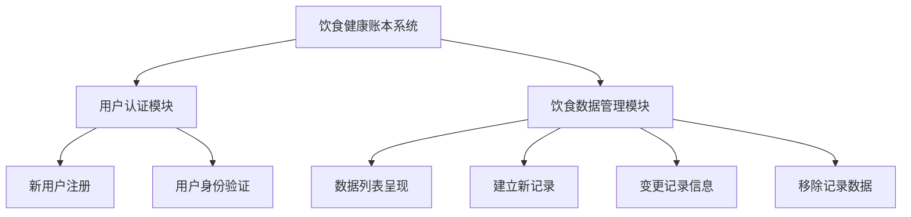
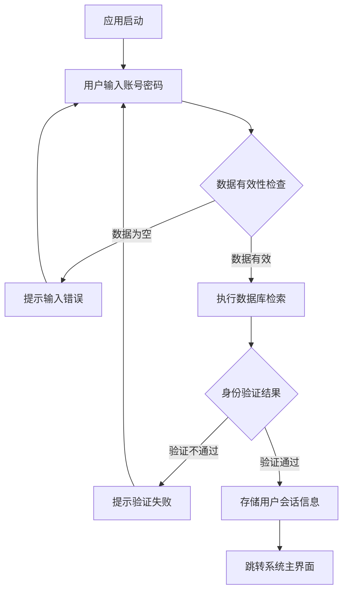
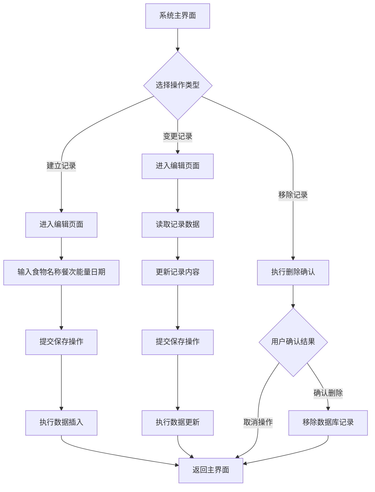

# 《移动终端系统实训》实训报告

## 1.1概述

### 1.1.1背景和意义

随着移动智能终端的广泛普及，移动应用已成为人们日常生活的重要工具。科学合理的饮食管理是维持身体健康的关键因素，传统的纸质记录方式在移动化场景中表现出明显的局限性。构建一款面向移动平台的饮食健康追踪应用，可以满足用户随时随地进行饮食信息记录的需求，辅助用户进行科学的健康管理，具有重要的现实意义。

### 1.1.2任务概述

本项目重点研究的技术领域包括：

(1) 用户身份认证：建立用户注册与登录体系，维护用户数据安全和隐私权益。

(2) 饮食数据管理：实现饮食记录的建立、变更、移除和检索功能，涵盖食物名称、餐次类型、能量数值和记录日期等数据项管理。

(3) 界面视觉呈现：运用当代设计思想，打造舒适友好的用户界面，采用暖橙色配色体系，创造温馨健康的视觉环境。

(4) 本地数据管理：采用Room持久化框架实现数据的本地存储管理。

### 1.1.3设计环境

(1) 硬件：Windows 11

(2) 软件：Android Studio

## 1.2需求分析

### 1.2.1需求描述

在移动互联网日益普及的今天，个人健康追踪需求持续上升。传统纸质饮食日志存在信息易丢失、查找效率低、便携性不足等缺陷。开发基于Android系统的饮食健康追踪应用，能够帮助用户便捷地进行饮食信息记录与管理，推动健康管理的智能化转型，具有显著的应用价值。

本系统致力于构建一个操作简便、功能完善的移动端饮食追踪平台，整合用户身份验证、饮食记录建立、历史数据浏览、记录信息变更和记录移除等基本功能。系统基于Android技术栈开发，采用Room数据库进行本地数据管理，保障数据安全可靠。融合现代设计思想和暖橙色主题风格，创造优秀的用户体验，帮助用户有效管理个人饮食数据，建立科学饮食习惯。

### 1.2.2功能需求

系统需要实现的关键功能包括：

**用户身份验证**：系统需要提供用户注册和登录服务。新用户注册时需要输入用户名和密码，系统需要验证用户名的唯一性。已注册用户通过用户名和密码进行登录，登录状态通过SharedPreferences进行持久化保存。

**饮食数据管理**：用户可以建立新的饮食记录，每条记录包含食物名称、餐次类型、能量数值、记录日期等数据项。用户可以浏览所有历史记录，记录按照日期倒序排列。用户可以变更已有记录，也可以移除不需要的记录。

**本地数据管理**：所有用户数据和饮食记录需要存储在本地数据库中，使用Room框架实现。数据库包含用户表和饮食记录表，通过外键关系保证数据关联性。

**用户界面交互**：系统界面需要符合现代设计规范，提供流畅的过渡效果和友好的交互体验。主界面使用RecyclerView组件展示记录列表，支持空数据状态提示。使用按钮组件提供快速创建功能入口。

## 2 系统设计与实现报告

### 2.1功能设计

#### 2.1.1功能模块

系统功能模块架构如下：



#### 2.1.2系统架构设计

系统采用标准的MVC架构模式，划分为三个核心层次：

**表现层（Presentation Layer）**：包含所有Activity组件和布局资源文件，负责用户界面的渲染和交互响应。主要Activity组件包括LoginActivity（身份验证界面）、RegisterActivity（用户注册界面）、MainActivity（系统主界面）、AddEditFoodRecordActivity（记录编辑界面）。

**业务逻辑层（Business Logic Layer）**：各Activity组件承担控制器职责，处理用户交互事件，调用数据访问层执行业务处理，并将处理结果呈现到用户界面。

**数据访问层（Data Access Layer）**：包括数据库实例、DAO数据访问接口、实体数据类和SharedPreferences工具类，负责数据的持久化存储和数据访问操作。

#### 2.1.3数据库设计

系统采用Room数据库框架，设计两个核心数据实体：

**User实体**：存储用户基本数据，数据项包括id（主键，自动递增）、username（用户名称）、password（用户密码）。

**FoodRecord实体**：存储饮食记录数据，数据项包括id（主键，自动递增）、userId（外键，关联User表）、foodName（食物名称）、mealType（餐次类型）、calories（能量数值）、date（记录日期）。

#### 2.1.4流程设计

**(1)用户身份验证流程：**



**(2)饮食数据管理流程：**



### 2.2 系统详细设计与实现

#### 2.2.1 登录功能实现

LoginActivity作为系统的入口Activity，用户首次启动系统将进入身份验证界面。身份验证界面采用温馨友好的设计风格，全屏暖橙色渐变背景，居中表单布局，整体设计温暖舒适。

身份验证功能的核心实现逻辑在login()方法中：

```java
private void login() {
    String username = binding.etUsername.getText().toString().trim();
    String password = binding.etPassword.getText().toString().trim();
    
    if (username.isEmpty()) {
        Toast.makeText(this, "请输入用户名", Toast.LENGTH_SHORT).show();
        return;
    }
    
    if (password.isEmpty()) {
        Toast.makeText(this, "请输入密码", Toast.LENGTH_SHORT).show();
        return;
    }
    
    User user = database.userDao().login(username, password);
    
    if (user != null) {
        prefsHelper.saveUser(user.getId(), user.getUsername());
        Toast.makeText(this, "登录成功", Toast.LENGTH_SHORT).show();
        
        Intent intent = new Intent(LoginActivity.this, MainActivity.class);
        startActivity(intent);
        finish();
    } else {
        Toast.makeText(this, "用户名或密码错误", Toast.LENGTH_SHORT).show();
    }
}
```

身份验证过程首先进行数据有效性检查，确保用户名和密码非空。随后通过UserDao接口查询数据库进行身份验证。验证成功后，将用户ID和用户名存储到SharedPreferences，并导航至系统主界面；验证失败则显示错误提示信息。

#### 2.2.2 注册功能实现

RegisterActivity提供用户注册服务，界面包含用户名、密码和确认密码输入控件。注册功能的实现逻辑在register()方法中：

```java
private void register() {
    String username = binding.etUsername.getText().toString().trim();
    String password = binding.etPassword.getText().toString().trim();
    String confirmPassword = binding.etConfirmPassword.getText().toString().trim();
    
    // 输入校验
    if (username.isEmpty()) {
        Toast.makeText(this, "请输入用户名", Toast.LENGTH_SHORT).show();
        return;
    }
    
    if (password.isEmpty()) {
        Toast.makeText(this, "请输入密码", Toast.LENGTH_SHORT).show();
        return;
    }
    
    if (!password.equals(confirmPassword)) {
        Toast.makeText(this, "两次输入的密码不一致", Toast.LENGTH_SHORT).show();
        return;
    }
    
    // 用户名唯一性检查
    if (database.userDao().findByUsername(username) != null) {
        Toast.makeText(this, "用户名已存在", Toast.LENGTH_SHORT).show();
        return;
    }
    
    // 创建用户
    User user = new User(username, password);
    long userId = database.userDao().insertUser(user);
    
    if (userId > 0) {
        Toast.makeText(this, "注册成功", Toast.LENGTH_SHORT).show();
        finish();
    } else {
        Toast.makeText(this, "注册失败", Toast.LENGTH_SHORT).show();
    }
}
```

注册过程包括数据有效性检查、密码一致性验证、用户名重复性检查和用户账户创建。所有验证通过后，将新用户数据写入数据库，并返回注册操作结果。

SharedPreferencesHelper工具类负责管理用户会话状态，提供保存用户信息、获取用户ID、清除用户信息和检查登录状态等方法。身份验证成功后，用户信息会被持久化保存，系统重启后仍能保持登录状态。

#### 2.2.3 饮食记录列表展示功能

饮食记录列表通过FoodRecordAdapter适配器组件实现，使用RecyclerView组件进行展示。适配器在onBindViewHolder()方法中完成数据绑定操作：

```java
@Override
public void onBindViewHolder(@NonNull ViewHolder holder, int position) {
    FoodRecord record = foodRecords.get(position);
    holder.tvFoodName.setText(record.getFoodName());
    holder.tvMealType.setText(record.getMealType());
    holder.tvCalories.setText(record.getCalories() + " 卡路里");
    holder.tvDate.setText(record.getDate());
    
    holder.itemView.setOnClickListener(v -> {
        if (editListener != null) {
            editListener.onEditClick(record);
        }
    });
    
    holder.btnEdit.setOnClickListener(v -> {
        if (editListener != null) {
            editListener.onEditClick(record);
        }
    });
    
    holder.btnDelete.setOnClickListener(v -> {
        if (deleteListener != null) {
            deleteListener.onDeleteClick(record);
        }
    });
}
```

数据加载：

loadFoodRecords()方法负责从数据库获取当前用户的所有饮食记录，并按日期倒序排列：

```java
private void loadFoodRecords() {
    List<FoodRecord> records = foodRecordDao.getAllFoodRecordsByUser(userId);
    
    binding.tvRecordCount.setText("共 " + records.size() + " 条记录");
    
    if (records.isEmpty()) {
        binding.rvFoodRecords.setVisibility(View.GONE);
        binding.tvEmpty.setVisibility(View.VISIBLE);
    } else {
        binding.rvFoodRecords.setVisibility(View.VISIBLE);
        binding.tvEmpty.setVisibility(View.GONE);
        adapter.updateFoodRecords(records);
    }
}
```

当记录列表为空时，显示空数据状态提示；否则显示记录列表。在onResume()生命周期方法中调用loadFoodRecords()，确保从其他界面返回时数据能够及时刷新。

#### 2.2.4 新增饮食记录功能

新增功能通过AddEditFoodRecordActivity实现，用户点击添加按钮进入新增界面。新增功能的实现逻辑如下：

```java
binding.btnAdd.setOnClickListener(v -> {
    Intent intent = new Intent(MainActivity.this, AddEditFoodRecordActivity.class);
    startActivity(intent);
});
```

在AddEditFoodRecordActivity中，通过判断recordId是否为-1来识别新增模式：

```java
recordId = getIntent().getLongExtra("record_id", -1);
if (recordId != -1) {
    loadFoodRecord();
    binding.toolbar.setTitle("编辑记录");
} else {
    binding.toolbar.setTitle("新增记录");
}
```

新增模式下，界面显示空白表单，用户填写食物名称、选择餐次类型、输入能量数值和日期后保存。

#### 2.2.5 编辑饮食记录功能

编辑功能同样通过AddEditFoodRecordActivity实现，用户从记录列表点击编辑按钮进入编辑界面。编辑功能的实现逻辑如下：

```java
private void editFoodRecord(FoodRecord record) {
    Intent intent = new Intent(MainActivity.this, AddEditFoodRecordActivity.class);
    intent.putExtra("record_id", record.getId());
    startActivity(intent);
}
```

在AddEditFoodRecordActivity中，通过Intent获取record_id参数，如果recordId不为-1，则进入编辑模式：

```java
if (recordId != -1) {
    loadFoodRecord();
    binding.toolbar.setTitle("编辑记录");
}
```

编辑模式下，调用loadFoodRecord()方法从数据库加载记录数据并填充到界面：

```java
private void loadFoodRecord() {
    FoodRecord record = foodRecordDao.getFoodRecordById(recordId);
    if (record != null) {
        binding.etFoodName.setText(record.getFoodName());
        binding.etCalories.setText(record.getCalories());
        binding.etDate.setText(record.getDate());
        
        String[] mealTypes = {"早餐", "午餐", "晚餐", "加餐"};
        for (int i = 0; i < mealTypes.length; i++) {
            if (mealTypes[i].equals(record.getMealType())) {
                binding.spinnerMealType.setSelection(i);
                break;
            }
        }
    }
}
```

用户修改内容后，点击保存按钮执行更新操作。

#### 2.2.6 删除饮食记录功能

删除功能通过AlertDialog确认对话框实现，防止误操作：

```java
private void deleteFoodRecord(FoodRecord record) {
    new AlertDialog.Builder(this)
        .setTitle("确认删除")
        .setMessage("确定要删除这条饮食记录吗？")
        .setPositiveButton("删除", (dialog, which) -> {
            foodRecordDao.deleteFoodRecord(record);
            Toast.makeText(this, "删除成功", Toast.LENGTH_SHORT).show();
            loadFoodRecords();
        })
        .setNegativeButton("取消", null)
        .show();
}
```

用户点击删除按钮后，弹出确认对话框，确认后调用DAO的deleteFoodRecord()方法删除记录，并刷新列表显示。

#### 2.2.7 数据保存功能

saveFoodRecord()方法实现饮食记录的保存逻辑，包含完整的数据校验：

```java
private void saveFoodRecord() {
    String foodName = binding.etFoodName.getText().toString().trim();
    String calories = binding.etCalories.getText().toString().trim();
    String date = binding.etDate.getText().toString().trim();
    String mealType = binding.spinnerMealType.getSelectedItem().toString();
    
    if (foodName.isEmpty()) {
        Toast.makeText(this, "请输入食物名称", Toast.LENGTH_SHORT).show();
        return;
    }
    
    if (calories.isEmpty()) {
        Toast.makeText(this, "请输入热量", Toast.LENGTH_SHORT).show();
        return;
    }
    
    if (date.isEmpty()) {
        Toast.makeText(this, "请输入日期", Toast.LENGTH_SHORT).show();
        return;
    }
    
    if (recordId != -1) {
        // 更新操作
        FoodRecord record = foodRecordDao.getFoodRecordById(recordId);
        if (record != null) {
            record.setFoodName(foodName);
            record.setMealType(mealType);
            record.setCalories(calories);
            record.setDate(date);
            foodRecordDao.updateFoodRecord(record);
            Toast.makeText(this, "更新成功", Toast.LENGTH_SHORT).show();
        }
    } else {
        // 新增操作
        FoodRecord record = new FoodRecord(userId, foodName, mealType, calories, date);
        foodRecordDao.insertFoodRecord(record);
        Toast.makeText(this, "保存成功", Toast.LENGTH_SHORT).show();
    }
    
    finish();
}
```

保存过程包括数据校验、数据库操作和结果反馈。食物名称、能量数值和日期为必填项，餐次类型通过下拉框选择，确保数据完整性。

## 3 总结

本系统成功构建了一个功能完善的Android饮食健康追踪应用，采用Room数据库实现本地数据管理，遵循现代设计规范提供良好的用户体验。系统实现了用户身份验证、饮食记录的增删改查等核心功能，满足了个人健康管理的基本需求。

系统架构采用MVC模式实现层次分离，代码结构清晰，便于维护和扩展。数据库设计遵循关系型数据库规范，通过外键关系保证数据完整性。用户界面设计温馨美观，采用暖橙色主题和现代设计，交互流畅，符合现代移动应用的设计标准。

在开发过程中，系统实现了完整的数据校验机制，确保数据的准确性和完整性。通过SharedPreferences实现登录状态持久化，提升了用户体验。使用RecyclerView高效展示数据，使用按钮组件提供便捷的操作入口，这些都是Android开发的最佳实践。

未来可以考虑增加的功能包括：能量统计分析、营养成分分析、饮食建议推荐、体重变化追踪、数据可视化展示、记录信息检索等高级功能，进一步提升系统的实用价值。同时，可以考虑添加数据备份恢复功能，以及云端同步功能，提高数据安全性。

## 参考文献

[1] Google Developers. Room Persistence Library[EB/OL]. https://developer.android.com/training/data-storage/room, 2024.

[2] Google Developers. Material Design Guidelines[EB/OL]. https://material.io/design, 2024.

[3] 郭霖. 第一行代码Android（第3版）[M]. 北京：人民邮电出版社，2020:156-189.

[4] 任玉刚. Android开发艺术探索[M]. 北京：电子工业出版社，2015:234-267.

[5] 李宁. Android应用开发实战[M]. 北京：清华大学出版社，2018:312-345.

[6] 欧阳燊. Android Room数据库框架应用研究[J]. 计算机工程与应用，2019,55(12):89-94.

[7] 张明. 基于Android的健康管理应用设计与实现[D]. 北京：北京理工大学，2021:45-67.

[8] Android Developers. RecyclerView Guide[EB/OL]. https://developer.android.com/guide/components/recyclerview, 2024.
