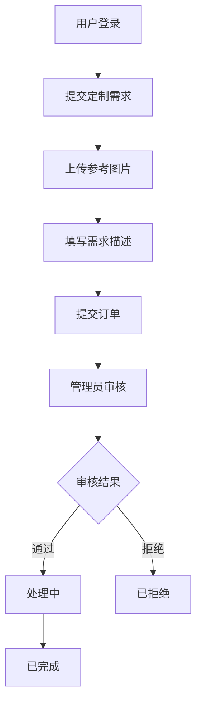

# 商品定制平台系统课程设计报告

## 1. 概述

### 1.1 课程设计目的

本课程设计旨在通过开发一个商品定制平台系统，深入理解和掌握Java Web开发技术，特别是定制化业务系统的开发模式。通过实际项目开发，学习定制需求管理、订单处理、状态流转等核心功能，提升系统设计和实现能力。

商品定制平台系统是一个典型的定制化服务系统，主要功能包括定制需求提交、定制订单管理、管理员审核等。系统采用MVC架构模式，实现了定制需求的完整生命周期管理。

登录界面如下图1所示：


### 1.2 表的描述

数据表user如下表1所示：

**表1 用户表**

| 字段名 | 类型 | 说明 |
|--------|------|------|
| id | INT | 主键，自增 |
| username | VARCHAR(50) | 用户名，唯一 |
| nickname | VARCHAR(50) | 昵称 |
| password | VARCHAR(50) | 密码 |
| email | VARCHAR(100) | 邮箱 |
| phone | VARCHAR(20) | 手机号 |
| role | VARCHAR(20) | 角色（user/admin） |
| create_time | DATETIME | 创建时间 |

数据表custom_order如下表2所示：

**表2 定制订单表**

| 字段名 | 类型 | 说明 |
|--------|------|------|
| id | INT | 主键，自增 |
| user_id | INT | 用户ID |
| title | VARCHAR(200) | 标题 |
| description | TEXT | 需求描述 |
| image_url | VARCHAR(500) | 参考图片URL |
| category | VARCHAR(50) | 分类 |
| status | VARCHAR(20) | 状态（pending/processing/completed/rejected） |
| admin_reply | TEXT | 管理员回复 |
| create_time | DATETIME | 创建时间 |
| update_time | DATETIME | 更新时间 |

### 1.3 课程设计内容

本课程设计完成了一个完整的商品定制平台系统，包括用户管理、定制需求提交、定制订单管理、管理员审核等核心功能。系统实现了定制需求的完整生命周期管理，从需求提交到审核处理，再到完成或拒绝，为用户提供了便捷的定制化服务体验。

## 2. 需求分析

### 2.1 系统目标

商品定制平台系统旨在为企业和个人提供定制化服务，主要目标包括：

1. 提供便捷的定制需求提交功能，支持图片上传
2. 实现定制订单的完整生命周期管理
3. 支持管理员审核和处理定制需求
4. 提供订单状态跟踪功能，方便用户查看订单进度
5. 实现分类管理，方便定制需求的分类展示

### 2.2 主体功能

系统主要功能模块包括：

1. **用户管理模块**：用户注册、登录、个人信息管理
2. **定制需求模块**：定制需求提交、需求列表查看、需求详情查看
3. **订单管理模块**：我的定制订单、订单状态查看
4. **后台管理模块**：定制订单审核、订单状态更新、管理员回复

### 2.3 开发环境

- **开发工具**：IntelliJ IDEA
- **JDK版本**：JDK 8
- **Web服务器**：Tomcat 9.0
- **数据库**：MySQL 8.0
- **构建工具**：Maven
- **前端技术**：JSP、HTML、CSS、JavaScript

## 3. 系统概要设计

### 3.1 系统的功能模块介绍

系统采用MVC三层架构设计：

1. **表示层（View）**：JSP页面，负责用户界面展示
2. **控制层（Controller）**：Servlet，负责请求处理和业务逻辑调用
3. **模型层（Model）**：Entity实体类、DAO数据访问层、Service业务逻辑层

主要功能模块：

- **用户模块**：UserServlet处理用户相关请求
- **定制订单模块**：CustomOrderServlet处理定制需求提交和查看请求
- **我的定制模块**：MyCustomServlet处理用户个人定制订单查询
- **管理模块**：AdminCustomOrderServlet处理定制订单审核和管理请求

### 3.2 系统流程图

系统主要业务流程如下：



## 4. 系统详细设计

### 4.1 主要代码

#### 定制订单提交Servlet

```java
@WebServlet("/custom/action/*")
public class CustomOrderServlet extends HttpServlet {
    private CustomOrderService customOrderService = new CustomOrderService();

    private void add(HttpServletRequest request, HttpServletResponse response)
            throws IOException, ServletException {
        HttpSession session = request.getSession();
        User user = (User) session.getAttribute("user");

        if (user == null) {
            response.sendRedirect(request.getContextPath() + "/login.jsp");
            return;
        }

        try {
            String realPath = request.getServletContext().getRealPath("/");
            Map<String, String> params = FileUploadUtil.uploadFile(request, realPath);

            String title = params.get("title");
            String description = params.get("description");
            String imageUrl = params.get("imageUrl");
            String category = params.get("category");

            CustomOrder order = new CustomOrder();
            order.setUserId(user.getId());
            order.setTitle(title);
            order.setDescription(description);
            order.setImageUrl(imageUrl);
            order.setCategory(category);
            order.setStatus("pending");

            customOrderService.save(order);
            response.sendRedirect(request.getContextPath() + "/custom/action/my");
        } catch (Exception e) {
            request.setAttribute("error", "提交失败: " + e.getMessage());
            showAddForm(request, response);
        }
    }
}
```

#### 定制订单列表Servlet

```java
private void list(HttpServletRequest request, HttpServletResponse response)
        throws ServletException, IOException {
    String pageStr = request.getParameter("page");
    String keyword = request.getParameter("keyword");
    String category = request.getParameter("category");

    int currentPage = 1;
    if (pageStr != null && !pageStr.isEmpty()) {
        currentPage = Integer.parseInt(pageStr);
    }

    PageUtil<CustomOrder> page = customOrderService.findPage(currentPage, 10, keyword, category, null);
    List<String> categories = customOrderService.findAllCategories();

    request.setAttribute("page", page);
    request.setAttribute("categories", categories);
    request.getRequestDispatcher("/custom/list.jsp").forward(request, response);
}
```

#### 定制订单实体类

```java
public class CustomOrder {
    private Integer id;
    private Integer userId;
    private String title;
    private String description;
    private String imageUrl;
    private String category;
    private String status;
    private String adminReply;
    private Date createTime;
    private Date updateTime;
    
    // getter和setter方法
}
```

### 4.2 具体实现

系统实现了以下关键技术：

1. **文件上传**：使用FileUploadUtil工具类处理参考图片上传，支持文件类型验证
2. **订单状态管理**：实现了pending、processing、completed、rejected四种状态的流转
3. **管理员回复**：支持管理员对定制需求进行回复和说明
4. **分类管理**：支持定制需求的分类展示和筛选
5. **权限控制**：通过LoginFilter过滤器区分普通用户和管理员权限

## 5. 测试

### 5.1 测试方案

测试采用黑盒测试方法，主要测试以下方面：

1. **功能测试**：测试用户注册、登录、定制需求提交、订单管理等核心功能
2. **文件上传测试**：测试图片上传功能，验证文件类型和大小限制
3. **状态流转测试**：测试订单状态从pending到processing、completed或rejected的流转
4. **权限测试**：测试普通用户和管理员的功能权限

### 5.2 测试结果

经过全面测试，系统各项功能运行正常：

1. 用户注册登录功能正常
2. 定制需求提交功能正常，图片上传成功
3. 订单列表显示正常，分类筛选功能正常
4. 订单状态更新功能正常，状态流转正确
5. 管理员审核功能正常，回复功能正常

## 6. 小结

通过本次课程设计，深入学习了定制化业务系统的开发模式，掌握了需求管理、订单处理、状态流转等核心业务逻辑。在开发过程中，学会了如何处理文件上传、状态管理、权限控制等实际业务场景。

本次课程设计不仅提升了编程能力，也加深了对定制化业务的理解。在今后的学习中，将继续深入学习业务流程设计、状态机设计等相关技术，不断提升自己的技术水平。

## 参考文献

1. 孙卫琴. Java面向对象编程[M]. 电子工业出版社, 2017.
2. 王珊, 萨师煊. 数据库系统概论[M]. 高等教育出版社, 2014.
3. 张孝祥. Java Web从入门到精通[M]. 清华大学出版社, 2018.
4. 明日科技. Java Web从入门到精通[M]. 清华大学出版社, 2019.

