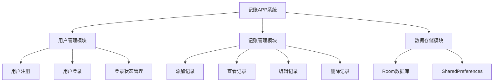
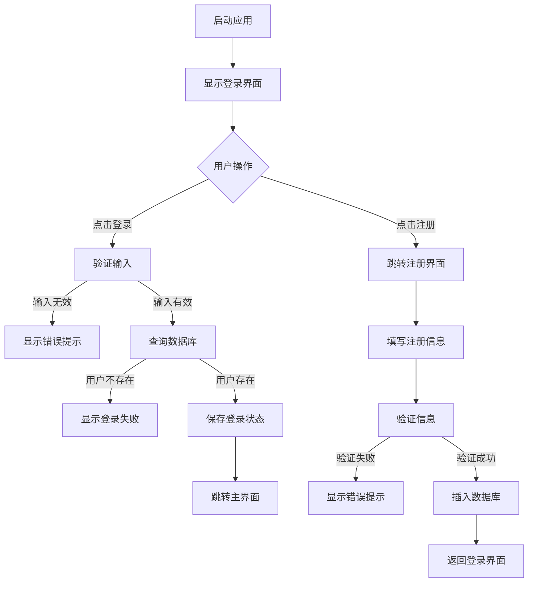
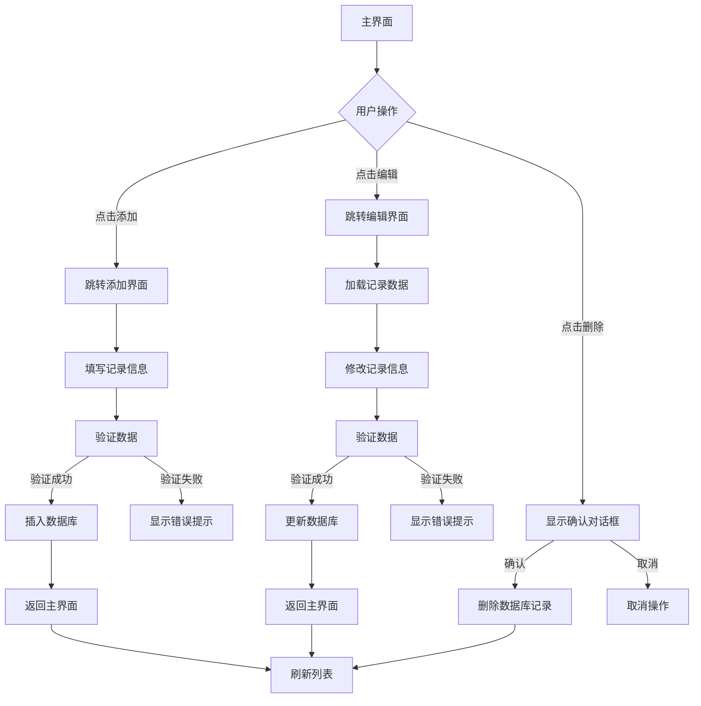

# 记账APP系统设计与实现报告

## 1 需求分析

### 1.1 需求描述

随着移动互联网的快速发展，个人财务管理需求日益增长。传统的纸质记账方式存在易丢失、查询不便、统计分析困难等问题。因此，开发一款基于Android平台的个人记账应用系统，能够帮助用户便捷地记录日常收支情况，实现个人财务的数字化管理，具有重要的实用价值。

本系统旨在为用户提供一个简洁、易用的移动端记账解决方案，支持用户注册登录、记录收支明细、查看历史记录、编辑和删除记录等核心功能。系统采用Android原生开发技术，使用Room数据库进行本地数据持久化存储，确保数据安全可靠。通过Material Design设计规范，提供良好的用户体验，让用户能够轻松管理个人财务，培养良好的理财习惯。

### 1.2 功能需求

系统主要功能需求包括以下几个方面：

**用户管理功能**：系统需要支持用户注册和登录功能。新用户可以通过输入用户名和密码进行注册，系统会验证用户名唯一性。已注册用户可以通过用户名和密码登录系统，登录状态通过SharedPreferences进行持久化保存。

**记账记录管理功能**：用户能够添加新的收支记录，每条记录包含类型（收入/消费）、金额、分类、项目、支付方式、备注和日期等信息。用户可以查看所有历史记录，记录按日期倒序排列。用户可以对已有记录进行编辑修改，也可以删除不需要的记录。

**数据持久化功能**：所有用户数据和记账记录需要持久化存储在本地数据库中，使用Room数据库框架实现。数据库设计包含用户表和记账记录表，通过外键关联确保数据完整性。

**界面交互功能**：系统界面需要遵循Material Design设计规范，提供流畅的动画效果和友好的交互体验。主界面采用RecyclerView展示记录列表，支持空状态提示。使用FloatingActionButton快速添加新记录。

## 2 系统设计与实现

### 2.1 功能设计

#### 2.1.1 功能模块

系统功能模块结构如下：



#### 2.1.2 系统架构设计

系统采用经典的Android MVC架构模式，主要分为以下几个层次：

**表现层（View Layer）**：包括所有Activity和布局文件，负责用户界面的展示和交互。主要Activity包括LoginActivity（登录界面）、RegisterActivity（注册界面）、MainActivity（主界面）、AddEditRecordActivity（添加/编辑记录界面）。

**控制层（Controller Layer）**：各Activity作为控制器，处理用户交互逻辑，调用数据访问层进行数据操作，并将结果反馈给用户界面。

**数据层（Data Layer）**：包括Room数据库、DAO接口、实体类和SharedPreferences工具类，负责数据的持久化存储和访问。

#### 2.1.3 数据库设计

系统使用Room数据库框架，包含两个主要实体：

**User实体**：存储用户信息，包含id（主键，自增）、username（用户名）、password（密码）字段。

**AccountRecord实体**：存储记账记录，包含id（主键，自增）、userId（外键，关联User表）、type（类型：收入/消费）、amount（金额）、category（分类）、item（项目）、paymentMethod（支付方式）、note（备注）、date（日期）字段。通过外键约束确保数据完整性，当用户被删除时，其所有记录也会级联删除。

### 2.2 系统详细设计与实现

#### 2.2.1 用户注册登录模块

用户注册登录模块是系统的入口，负责用户身份验证和会话管理。

**登录功能实现**：

LoginActivity是应用的启动Activity，用户首次打开应用会进入登录界面。登录界面采用Material Design风格，包含用户名和密码输入框，以及登录和注册按钮。

核心登录逻辑在`login()`方法中实现：

```java
private void login() {
    String username = binding.etUsername.getText().toString().trim();
    String password = binding.etPassword.getText().toString().trim();
    
    if (username.isEmpty()) {
        Toast.makeText(this, getString(R.string.username_empty), Toast.LENGTH_SHORT).show();
        return;
    }
    
    if (password.isEmpty()) {
        Toast.makeText(this, getString(R.string.password_empty), Toast.LENGTH_SHORT).show();
        return;
    }
    
    User user = database.userDao().login(username, password);
    
    if (user != null) {
        prefsHelper.saveUser(user.getId(), user.getUsername());
        Toast.makeText(this, "登录成功", Toast.LENGTH_SHORT).show();
        
        Intent intent = new Intent(LoginActivity.this, MainActivity.class);
        startActivity(intent);
        finish();
    } else {
        Toast.makeText(this, getString(R.string.login_failed), Toast.LENGTH_SHORT).show();
    }
}
```

登录流程首先进行输入验证，确保用户名和密码不为空。然后通过UserDao查询数据库，验证用户凭据。如果验证成功，将用户ID和用户名保存到SharedPreferences，并跳转到主界面；否则显示登录失败提示。

**注册功能实现**：

RegisterActivity提供用户注册功能，界面包含用户名、密码和确认密码输入框。注册逻辑在`register()`方法中实现：

```java
private void register() {
    String username = binding.etUsername.getText().toString().trim();
    String password = binding.etPassword.getText().toString().trim();
    String confirmPassword = binding.etConfirmPassword.getText().toString().trim();
    
    // 验证输入
    if (username.isEmpty() || password.isEmpty()) {
        Toast.makeText(this, "请填写完整信息", Toast.LENGTH_SHORT).show();
        return;
    }
    
    if (!password.equals(confirmPassword)) {
        Toast.makeText(this, getString(R.string.password_mismatch), Toast.LENGTH_SHORT).show();
        return;
    }
    
    // 检查用户名是否已存在
    User existingUser = database.userDao().findByUsername(username);
    if (existingUser != null) {
        Toast.makeText(this, getString(R.string.user_exists), Toast.LENGTH_SHORT).show();
        return;
    }
    
    // 创建新用户
    User user = new User(username, password);
    long userId = database.userDao().insertUser(user);
    
    if (userId > 0) {
        Toast.makeText(this, getString(R.string.register_success), Toast.LENGTH_SHORT).show();
        finish();
    } else {
        Toast.makeText(this, "注册失败，请重试", Toast.LENGTH_SHORT).show();
    }
}
```

注册流程包括输入验证、密码确认验证、用户名唯一性检查和用户创建。所有验证通过后，将新用户信息插入数据库，并返回注册结果。

**登录状态管理**：

SharedPreferencesHelper工具类负责管理用户登录状态，提供保存用户信息、获取用户ID、清除用户信息和判断登录状态等方法。登录成功后，用户信息会被持久化保存，应用重启后仍能保持登录状态。

#### 2.2.2 主界面模块

MainActivity是系统的核心界面，展示用户的记账记录列表，并提供添加、编辑、删除记录的功能入口。

**界面布局**：

主界面采用CoordinatorLayout作为根布局，包含AppBarLayout（工具栏）、NestedScrollView（可滚动内容区域）和FloatingActionButton（浮动添加按钮）。记录列表使用RecyclerView实现，支持空状态提示。

**记录列表展示**：

记录列表通过RecordAdapter适配器实现，使用RecyclerView展示。适配器在`onBindViewHolder()`方法中绑定数据，根据记录类型（收入/消费）设置不同的颜色和样式：

```java
public void bind(AccountRecord record) {
    tvCategory.setText(record.getCategory());
    tvType.setText(record.getType());
    tvDate.setText(record.getDate());
    tvAmount.setText(String.format("¥%.2f", record.getAmount()));
    
    // 根据类型设置颜色和样式
    if ("收入".equals(record.getType())) {
        viewTypeIndicator.setBackgroundColor(
            itemView.getContext().getColor(R.color.income_color));
        tvAmount.setTextColor(itemView.getContext().getColor(R.color.income_color));
    } else {
        viewTypeIndicator.setBackgroundColor(
            itemView.getContext().getColor(R.color.expense_color));
        tvAmount.setTextColor(itemView.getContext().getColor(R.color.expense_color));
    }
    
    // 设置编辑和删除按钮点击事件
    btnEdit.setOnClickListener(v -> listener.onEditClick(record));
    btnDelete.setOnClickListener(v -> listener.onDeleteClick(record));
}
```

**数据加载**：

`loadRecords()`方法负责从数据库加载当前用户的所有记录，并按日期倒序排列：

```java
private void loadRecords() {
    List<AccountRecord> records = recordDao.getAllRecordsByUser(userId);
    
    // 更新记录数量显示
    binding.tvRecordCount.setText(records.size() + " 条");
    
    if (records.isEmpty()) {
        binding.rvRecords.setVisibility(View.GONE);
        binding.tvEmpty.setVisibility(View.VISIBLE);
    } else {
        binding.rvRecords.setVisibility(View.VISIBLE);
        binding.tvEmpty.setVisibility(View.GONE);
        adapter.updateRecords(records);
    }
}
```

当记录列表为空时，显示空状态提示；否则显示记录列表。在`onResume()`生命周期方法中调用`loadRecords()`，确保从其他界面返回时数据能够及时更新。

**删除记录功能**：

删除功能通过AlertDialog确认对话框实现，防止误操作：

```java
private void deleteRecord(AccountRecord record) {
    new AlertDialog.Builder(this)
        .setTitle("确认删除")
        .setMessage("确定要删除这条记录吗？")
        .setPositiveButton("删除", (dialog, which) -> {
            recordDao.deleteRecord(record);
            Toast.makeText(this, "删除成功", Toast.LENGTH_SHORT).show();
            loadRecords();
        })
        .setNegativeButton("取消", null)
        .show();
}
```

用户点击删除按钮后，弹出确认对话框，确认后调用DAO的`deleteRecord()`方法删除记录，并刷新列表。

#### 2.2.3 添加编辑记录模块

AddEditRecordActivity实现了添加和编辑记录的统一界面，通过Intent参数区分是新增还是编辑模式。

**界面设计**：

界面包含以下输入控件：金额输入框、分类输入框、项目输入框、支付方式输入框、备注输入框、日期选择器，以及收入/消费单选按钮组。日期选择器使用DatePickerDialog实现，默认显示当前日期。

**编辑模式判断**：

Activity通过Intent获取`record_id`参数判断是否为编辑模式：

```java
recordId = getIntent().getLongExtra("record_id", -1);
if (recordId != -1) {
    loadRecord();
    binding.toolbar.setTitle("编辑记录");
} else {
    binding.toolbar.setTitle("添加记录");
    binding.rbExpense.setChecked(true); // 默认选择消费
}
```

如果是编辑模式，调用`loadRecord()`方法从数据库加载记录数据并填充到界面；如果是新增模式，设置默认值。

**数据保存**：

`saveRecord()`方法实现记录的保存逻辑，包含完整的数据验证：

```java
private void saveRecord() {
    String amountStr = binding.etAmount.getText().toString().trim();
    String category = binding.etCategory.getText().toString().trim();
    // ... 获取其他字段
    
    // 验证金额
    if (amountStr.isEmpty()) {
        Toast.makeText(this, "请输入金额", Toast.LENGTH_SHORT).show();
        return;
    }
    
    double amount;
    try {
        amount = Double.parseDouble(amountStr);
        if (amount <= 0) {
            Toast.makeText(this, "金额必须大于0", Toast.LENGTH_SHORT).show();
            return;
        }
    } catch (NumberFormatException e) {
        Toast.makeText(this, "请输入有效的金额", Toast.LENGTH_SHORT).show();
        return;
    }
    
    // 验证分类和日期
    if (category.isEmpty() || date.isEmpty()) {
        Toast.makeText(this, "请填写必填项", Toast.LENGTH_SHORT).show();
        return;
    }
    
    String type = binding.rbIncome.isChecked() ? "收入" : "消费";
    
    if (recordId == -1) {
        // 新增记录
        AccountRecord record = new AccountRecord(userId, type, amount, category, item, paymentMethod, note, date);
        long id = recordDao.insertRecord(record);
        if (id > 0) {
            Toast.makeText(this, "添加成功", Toast.LENGTH_SHORT).show();
            finish();
        }
    } else {
        // 更新记录
        AccountRecord record = recordDao.getRecordById(recordId);
        if (record != null) {
            record.setType(type);
            record.setAmount(amount);
            // ... 更新其他字段
            recordDao.updateRecord(record);
            Toast.makeText(this, "更新成功", Toast.LENGTH_SHORT).show();
            finish();
        }
    }
}
```

保存流程包括数据验证、类型判断、数据库操作和结果反馈。所有必填字段都进行验证，金额字段进行数值格式和范围验证，确保数据完整性。

#### 2.2.4 数据库设计实现

系统使用Room数据库框架实现数据持久化，数据库设计包含以下核心组件：

**AppDatabase类**：

AppDatabase是Room数据库的主类，继承自RoomDatabase，使用单例模式确保整个应用只有一个数据库实例：

```java
@Database(entities = {User.class, AccountRecord.class}, version = 3, exportSchema = false)
public abstract class AppDatabase extends RoomDatabase {
    private static AppDatabase instance;
    
    public abstract UserDao userDao();
    public abstract AccountRecordDao accountRecordDao();
    
    public static synchronized AppDatabase getInstance(Context context) {
        if (instance == null) {
            instance = Room.databaseBuilder(
                context.getApplicationContext(),
                AppDatabase.class,
                "accounting_database"
            ).allowMainThreadQueries()
             .fallbackToDestructiveMigration()
             .build();
        }
        return instance;
    }
}
```

数据库配置允许在主线程执行查询（开发阶段），并设置版本升级时删除旧数据库的策略。

**DAO接口设计**：

UserDao接口提供用户相关的数据库操作：

```java
@Dao
public interface UserDao {
    @Insert
    long insertUser(User user);
    
    @Query("SELECT * FROM users WHERE username = :username AND password = :password")
    User login(String username, String password);
    
    @Query("SELECT * FROM users WHERE username = :username")
    User findByUsername(String username);
}
```

AccountRecordDao接口提供记账记录相关的数据库操作，包括插入、更新、删除和查询方法，支持按用户ID查询所有记录、按ID查询单条记录等操作。

**实体类设计**：

AccountRecord实体类使用Room注解定义表结构，通过外键关联User表：

```java
@Entity(
    tableName = "account_records",
    indices = {@Index("userId")},
    foreignKeys = @ForeignKey(
        entity = User.class,
        parentColumns = "id",
        childColumns = "userId",
        onDelete = ForeignKey.CASCADE
    )
)
public class AccountRecord {
    @PrimaryKey(autoGenerate = true)
    private long id;
    private long userId;
    private String type;
    private double amount;
    private String category;
    private String item;
    private String paymentMethod;
    private String note;
    private String date;
    // ... getter和setter方法
}
```

外键约束设置为CASCADE删除，确保当用户被删除时，其所有记账记录也会自动删除，维护数据一致性。

#### 2.2.5 系统流程设计

系统主要业务流程如下：

**用户登录流程**：



**记账记录管理流程**：



系统流程设计清晰，每个功能模块都有明确的输入验证和错误处理机制，确保系统的稳定性和用户体验。

## 3 总结

本系统成功实现了一个功能完整的Android记账应用，采用Room数据库进行本地数据持久化，使用Material Design设计规范提供良好的用户体验。系统主要功能包括用户注册登录、记账记录的增删改查等核心功能，满足了个人财务管理的基本需求。

系统架构设计合理，采用MVC模式分层清晰，代码结构良好，便于维护和扩展。数据库设计遵循关系型数据库规范，通过外键约束保证数据完整性。用户界面简洁美观，交互流畅，符合现代移动应用的设计标准。

在开发过程中，系统实现了完整的输入验证机制，确保数据的正确性和完整性。通过SharedPreferences实现登录状态持久化，提升了用户体验。使用RecyclerView高效展示大量数据，使用FloatingActionButton提供便捷的操作入口，这些都是Android开发的最佳实践。

未来可以考虑增加的功能包括：数据统计分析、图表展示、数据导出、多账户管理、预算设置等高级功能，进一步提升系统的实用价值。同时，可以考虑添加数据备份和恢复功能，以及云端同步功能，提高数据安全性。

## 参考文献

[1] Google Developers. Room Persistence Library[EB/OL]. https://developer.android.com/training/data-storage/room, 2024.

[2] Google Developers. Material Design Guidelines[EB/OL]. https://material.io/design, 2024.

[3] 郭霖. 第一行代码Android（第3版）[M]. 北京：人民邮电出版社，2020:156-189.

[4] 任玉刚. Android开发艺术探索[M]. 北京：电子工业出版社，2015:234-267.

[5] 李宁. Android应用开发实战[M]. 北京：清华大学出版社，2018:312-345.

[6] 欧阳燊. Android Room数据库框架应用研究[J]. 计算机工程与应用，2019,55(12):89-94.

[7] 张明. 基于Android的个人财务管理应用设计与实现[D]. 北京：北京理工大学，2021:45-67.

[8] Android Developers. RecyclerView Guide[EB/OL]. https://developer.android.com/guide/components/recyclerview, 2024.

